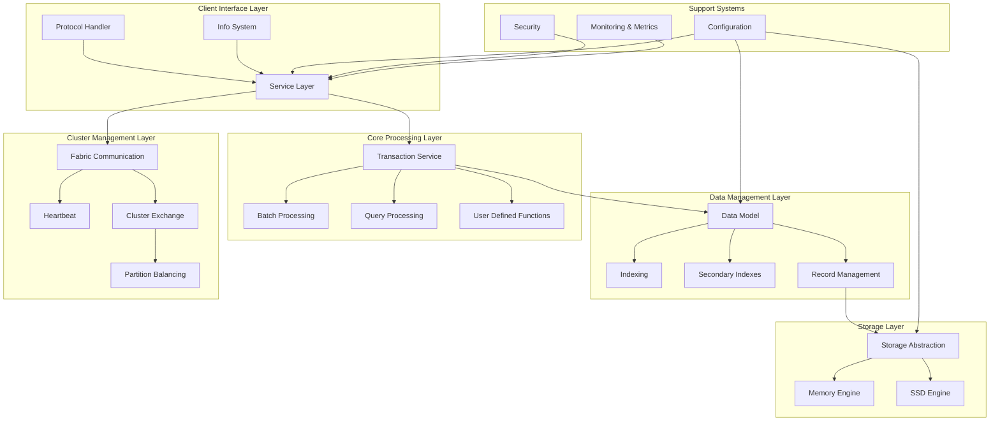
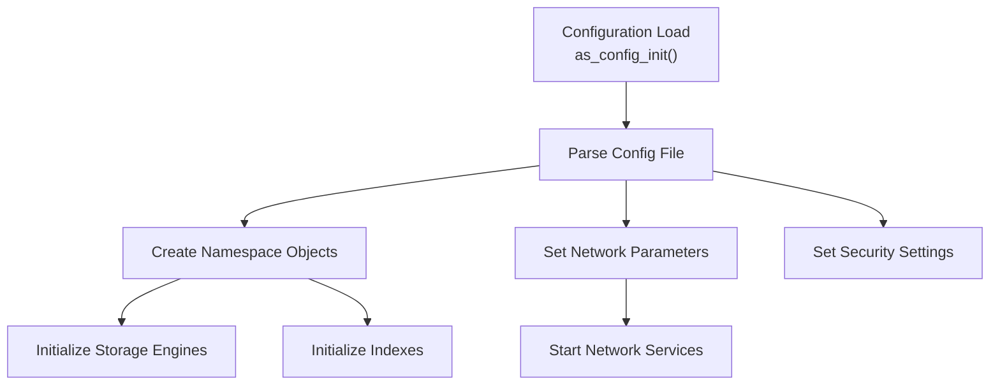
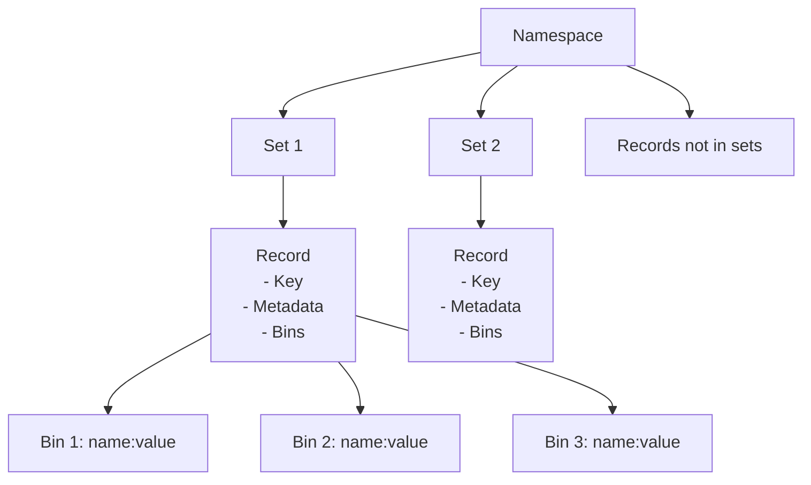
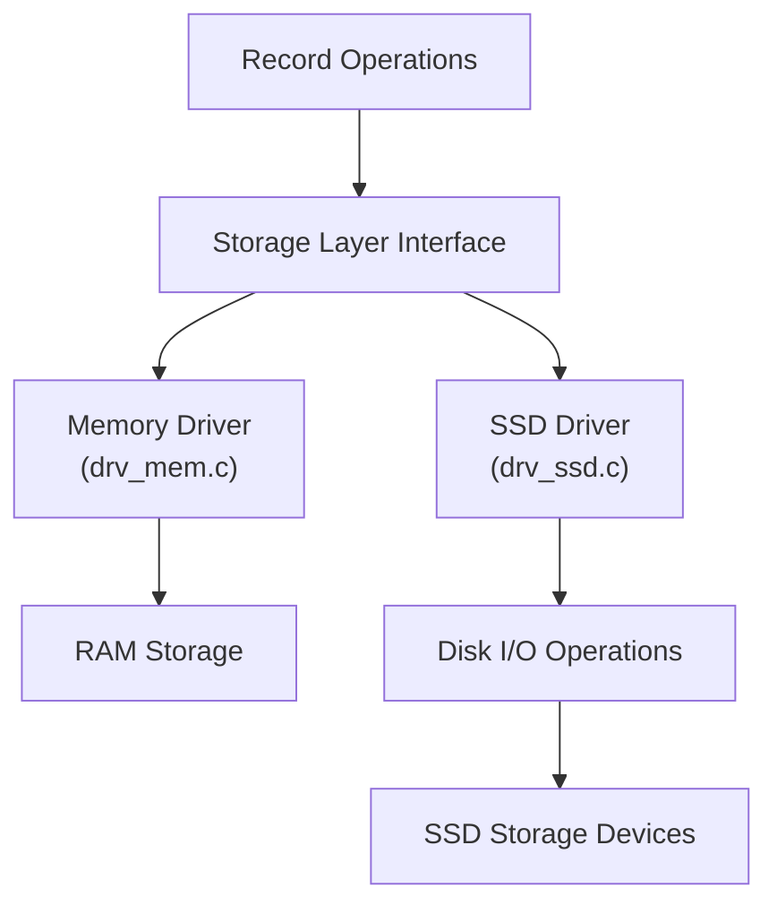
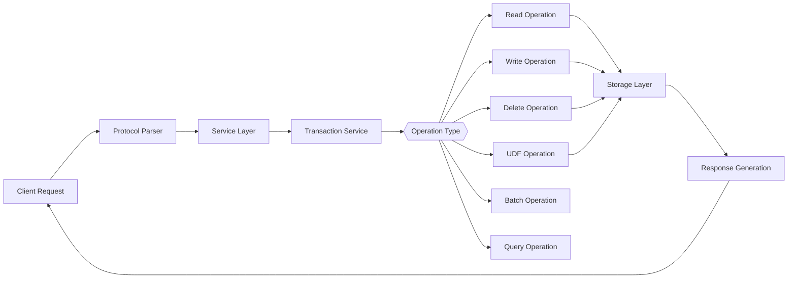
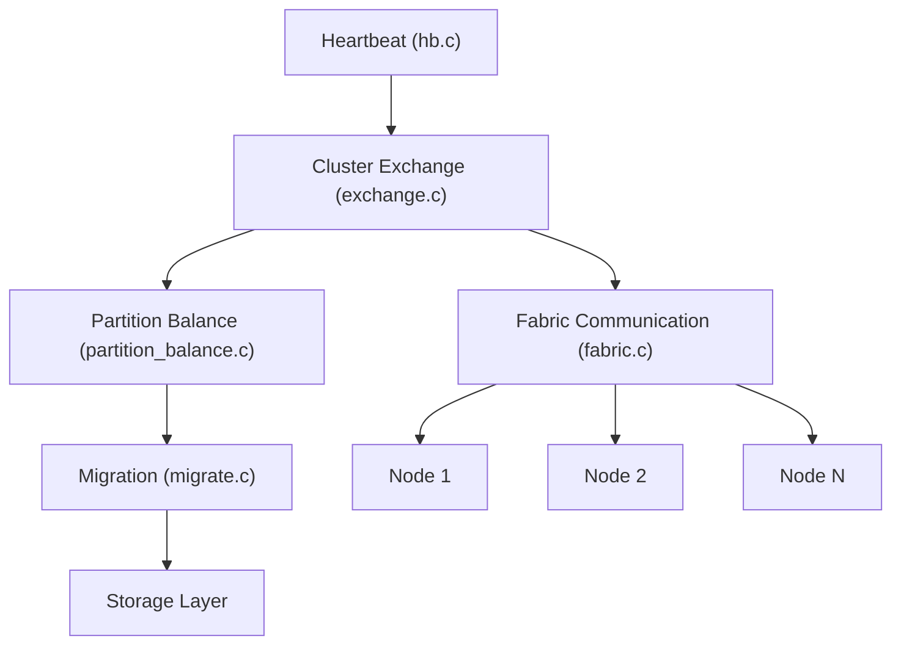
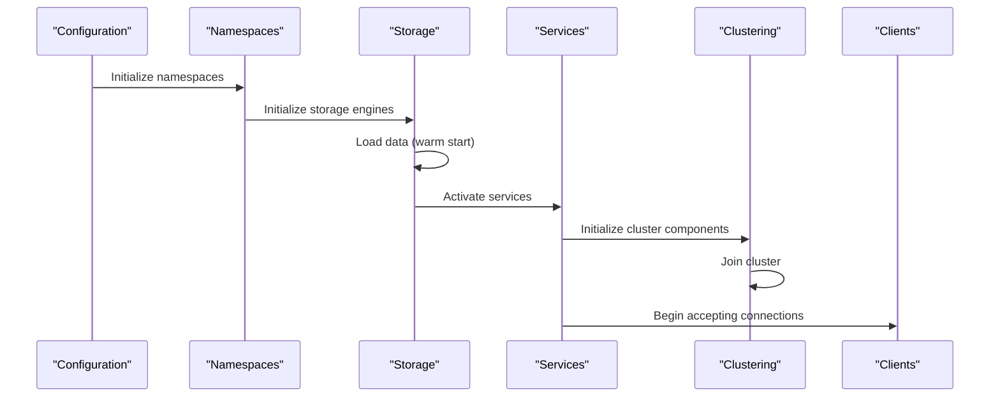

# Overview

Relevant source files

The following files were used as context for generating this wiki page:

- [.build.yml](https://github.com/aerospike/aerospike-server/blob/8311b29d/.build.yml)
- [.github/ISSUE_TEMPLATE.md](https://github.com/aerospike/aerospike-server/blob/8311b29d/.github/ISSUE_TEMPLATE.md)
- [README.md](https://github.com/aerospike/aerospike-server/blob/8311b29d/README.md)
- [as/include/base/cfg.h](https://github.com/aerospike/aerospike-server/blob/8311b29d/as/include/base/cfg.h)
- [as/src/Makefile](https://github.com/aerospike/aerospike-server/blob/8311b29d/as/src/Makefile)
- [as/src/base/as.c](https://github.com/aerospike/aerospike-server/blob/8311b29d/as/src/base/as.c)
- [as/src/base/cfg_ce.c](https://github.com/aerospike/aerospike-server/blob/8311b29d/as/src/base/cfg_ce.c)
- [bin/install-dependencies.sh](https://github.com/aerospike/aerospike-server/blob/8311b29d/bin/install-dependencies.sh)
- [build/os_version](https://github.com/aerospike/aerospike-server/blob/8311b29d/build/os_version)

The Aerospike Database Server is a distributed, high-performance NoSQL database system designed for reliability and operational efficiency at scale. This document provides an introduction to the server's architecture and core components.

For detailed information about specific subsystems, please refer to their respective wiki pages, such as [Data Model](#3), [Storage Engine](#4), or [Transaction Processing](#5).

## Purpose and Design Goals

Aerospike is architected with three key objectives:

- Creating a high-performance, scalable platform to meet the needs of web-scale applications
- Providing robust reliability and ACID properties expected from traditional databases
- Ensuring operational efficiency with minimal manual involvement

The server is primarily written in C (conforming to ANSI C99), with some C++ code for specialized components like geospatial indexing.

Sources: [README.md:5-9](https://github.com/aerospike/aerospike-server/blob/8311b29d/README.md#L5-L9)

## Server Architecture Overview

Aerospike follows a modular architecture with several interconnected subsystems. At a high level, the system consists of:

**Core System Architecture**

Sources: [as/include/base/cfg.h:73-209](https://github.com/aerospike/aerospike-server/blob/8311b29d/as/include/base/cfg.h#L73-L209), [as/src/base/as.c:385-425](https://github.com/aerospike/aerospike-server/blob/8311b29d/as/src/base/as.c#L385-L425)

## Core Components

### Configuration System

The configuration system initializes all operating parameters for the server. It parses a configuration file (default: `/etc/aerospike/aerospike.conf`) and sets up:

- Namespaces and storage engines
- Network services (client, fabric, heartbeat)
- Security settings
- Memory allocation parameters
- Runtime tuning parameters

**Configuration and Initialization Flow**

Sources: [as/include/base/cfg.h:216-224](https://github.com/aerospike/aerospike-server/blob/8311b29d/as/include/base/cfg.h#L216-L224), [as/src/base/as.c:274-277](https://github.com/aerospike/aerospike-server/blob/8311b29d/as/src/base/as.c#L274-L277)

### Namespaces and Data Model

Aerospike organizes data into namespaces, which are similar to databases in traditional RDBMS systems. Each namespace:

- Has its own configuration for storage, replication, and consistency
- Contains records (similar to rows) identified by a key
- Stores data in bins (similar to columns) which are name-value pairs
- Can have optional sets (similar to tables) for organizing records

**Namespace Data Organization**

Sources: [as/include/base/cfg.h:201-204](https://github.com/aerospike/aerospike-server/blob/8311b29d/as/include/base/cfg.h#L201-L204), [as/src/base/as.c:346-355](https://github.com/aerospike/aerospike-server/blob/8311b29d/as/src/base/as.c#L346-L355)

### Storage Engines

Aerospike provides multiple storage engines to handle different use cases:

- **Memory Storage Engine**: Stores all data in RAM for highest performance
- **SSD Storage Engine**: Uses solid-state drives for persistence and larger datasets

Each namespace is configured to use a specific storage engine. The storage subsystem manages:

- Reading and writing records
- Managing indexes
- Handling device I/O
- Data persistence and recovery

**Storage Engine Architecture**

Sources: [as/src/Makefile:174-178](https://github.com/aerospike/aerospike-server/blob/8311b29d/as/src/Makefile#L174-L178), [as/src/base/as.c:359-375](https://github.com/aerospike/aerospike-server/blob/8311b29d/as/src/base/as.c#L359-L375)

### Transaction Processing

Aerospike processes client requests through a transaction pipeline that includes:

- Network protocol parsing
- Request routing
- Record operations (read, write, delete, UDF)
- Response generation

The transaction service (`thr_tsvc.c`) handles the core processing of client requests.

**Transaction Processing Flow**

Sources: [as/src/base/as.c:398-404](https://github.com/aerospike/aerospike-server/blob/8311b29d/as/src/base/as.c#L398-L404), [as/src/Makefile:203-222](https://github.com/aerospike/aerospike-server/blob/8311b29d/as/src/Makefile#L203-L222)

### Cluster Management

For distributed deployments, Aerospike includes powerful clustering capabilities:

- **Heartbeat Subsystem**: Detects node availability and cluster membership
- **Fabric Communication**: Inter-node messaging system
- **Partition Balancing**: Manages data distribution across nodes
- **Data Migration**: Moves data when cluster membership changes

**Cluster Management Components**

Sources: [as/src/base/as.c:391-397](https://github.com/aerospike/aerospike-server/blob/8311b29d/as/src/base/as.c#L391-L397), [as/src/Makefile:119-129](https://github.com/aerospike/aerospike-server/blob/8311b29d/as/src/Makefile#L119-L129)

## Server Initialization Sequence

The server initialization sequence illustrates how components are started and their dependencies:

1. **Configuration Loading**: Parse config and set up global state
2. **Namespace Setup**: Initialize namespaces and data structures
3. **Storage Initialization**: Prepare storage engines
4. **Service Initialization**: Start network services, clustering, and transaction processing
5. **Ready State**: Begin accepting client connections

**Server Initialization Sequence**

Sources: [as/src/base/as.c:386-428](https://github.com/aerospike/aerospike-server/blob/8311b29d/as/src/base/as.c#L386-L428)

## Deployment Options

Aerospike Server can be deployed on various Linux distributions:

- Red Hat Enterprise Linux 8/9
- Amazon Linux 2023
- Debian 11/12
- Ubuntu 20.04/22.04/24.04

The server can be installed from packages (RPM, DEB) or built from source.

Sources: [README.md:15-17](https://github.com/aerospike/aerospike-server/blob/8311b29d/README.md#L15-L17), [build/os_version:106-125](https://github.com/aerospike/aerospike-server/blob/8311b29d/build/os_version#L106-L125), [bin/install-dependencies.sh:71-116](https://github.com/aerospike/aerospike-server/blob/8311b29d/bin/install-dependencies.sh#L71-L116)

## Community and Enterprise Editions

Aerospike is available in both Community and Enterprise editions. The Community Edition is open-source, while the Enterprise Edition includes additional features for production deployments.

Sources: [as/src/Makefile:90-102](https://github.com/aerospike/aerospike-server/blob/8311b29d/as/src/Makefile#L90-L102), [as/src/base/cfg_ce.c:54-66](https://github.com/aerospike/aerospike-server/blob/8311b29d/as/src/base/cfg_ce.c#L54-L66), [.build.yml:33-60](https://github.com/aerospike/aerospike-server/blob/8311b29d/.build.yml#L33-L60)

---