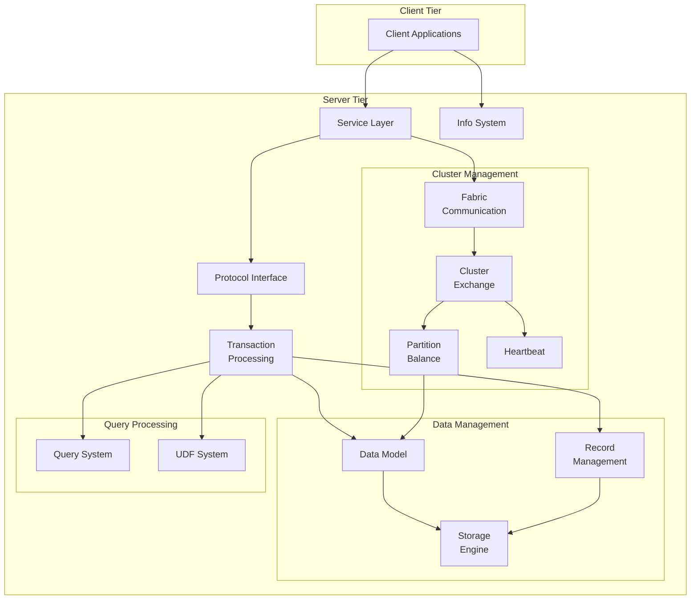
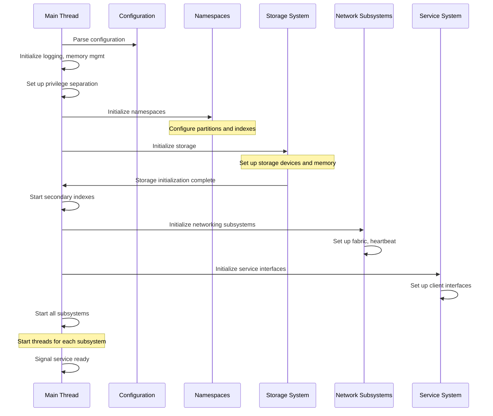
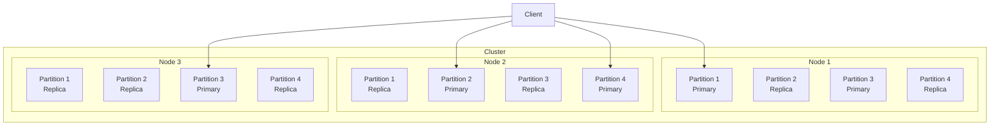
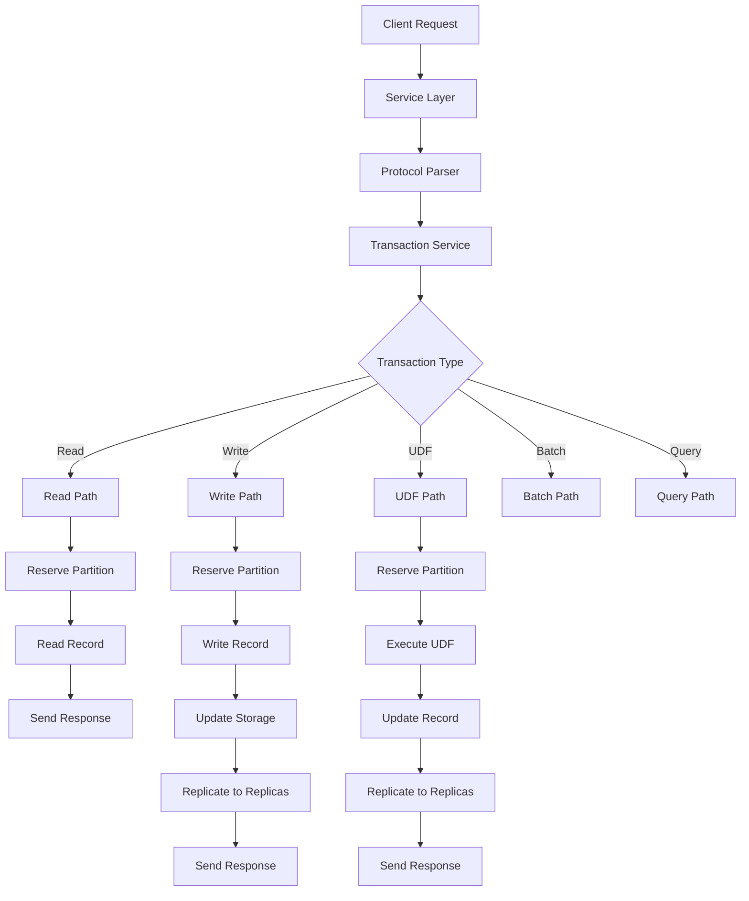
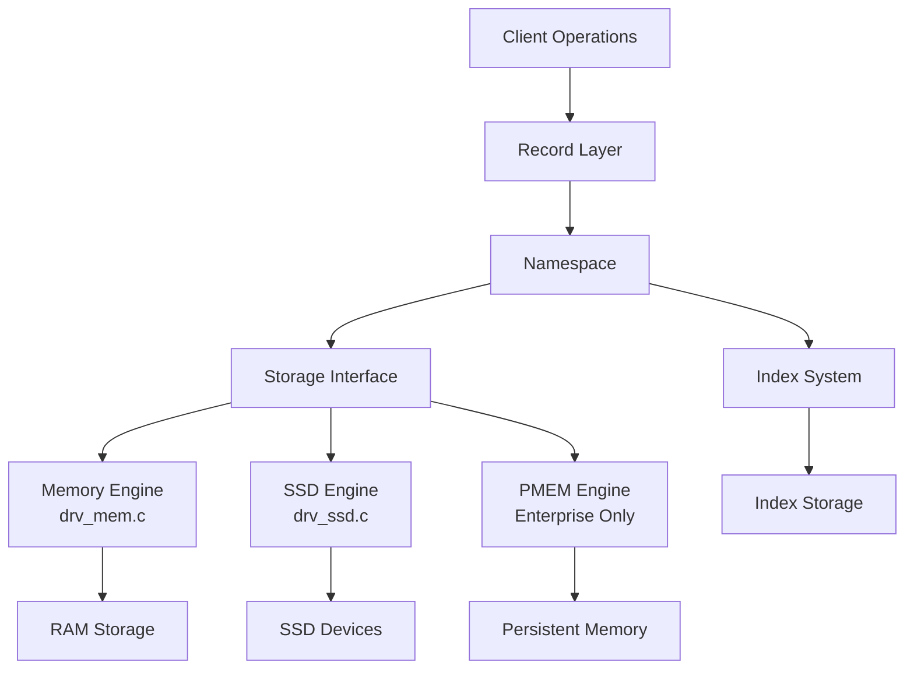
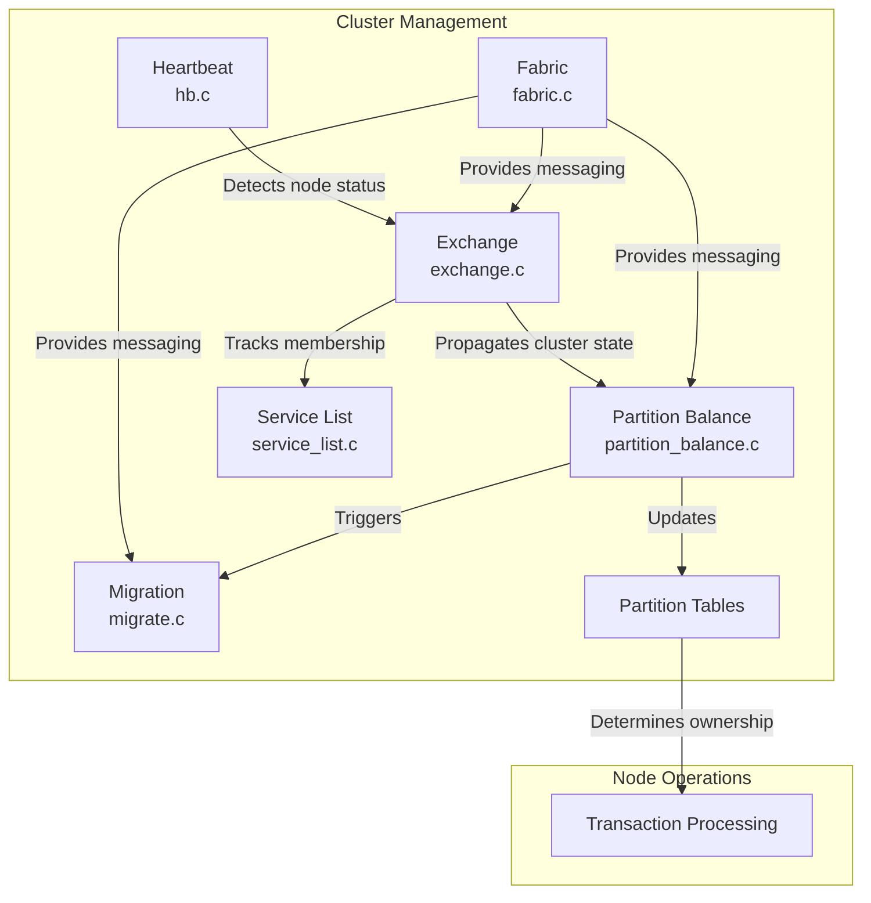
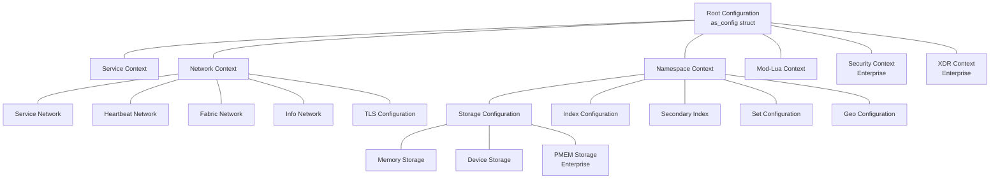
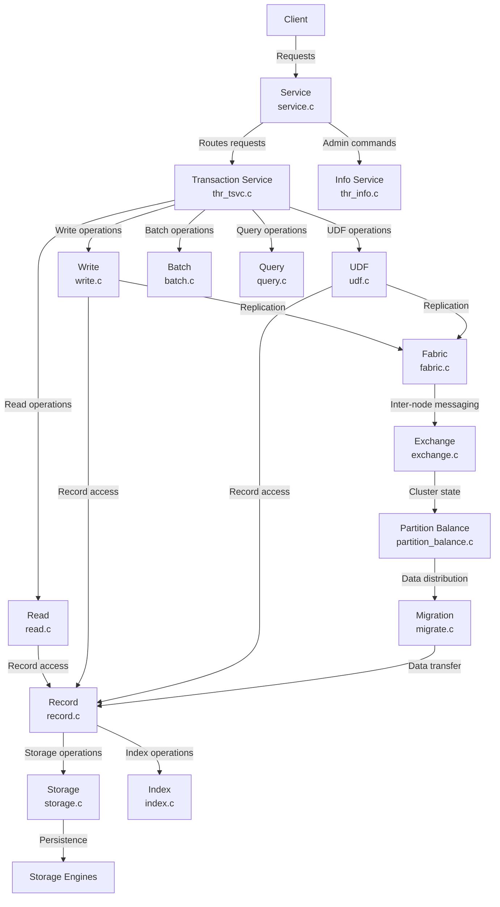

# Architecture

Relevant source files

The following files were used as context for generating this wiki page:

- [as/include/base/cfg.h](https://github.com/aerospike/aerospike-server/blob/8311b29d/as/include/base/cfg.h)
- [as/include/base/datamodel.h](https://github.com/aerospike/aerospike-server/blob/8311b29d/as/include/base/datamodel.h)
- [as/src/Makefile](https://github.com/aerospike/aerospike-server/blob/8311b29d/as/src/Makefile)
- [as/src/base/as.c](https://github.com/aerospike/aerospike-server/blob/8311b29d/as/src/base/as.c)
- [as/src/base/cfg.c](https://github.com/aerospike/aerospike-server/blob/8311b29d/as/src/base/cfg.c)
- [as/src/base/cfg_ce.c](https://github.com/aerospike/aerospike-server/blob/8311b29d/as/src/base/cfg_ce.c)
- [as/src/base/thr_info.c](https://github.com/aerospike/aerospike-server/blob/8311b29d/as/src/base/thr_info.c)

This document explains the core architectural components and design patterns of the Aerospike Server. It covers the high-level system organization, component interactions, initialization sequence, and the key subsystems that make up the Aerospike database.

For details about server configuration options, see [Configuration System](#2.2). For in-depth information about the data model, see [Data Model](#3).

## Overview

Aerospike is a distributed NoSQL database that provides a scalable, high-performance data storage and retrieval system. The server architecture is designed for reliability, performance, and operational efficiency in distributed environments.

Sources: [as/src/base/as.c:387-424](https://github.com/aerospike/aerospike-server/blob/8311b29d/as/src/base/as.c#L387-L424). [as/src/base/thr_info.c:33-101](https://github.com/aerospike/aerospike-server/blob/8311b29d/as/src/base/thr_info.c#L33-L101). [as/include/base/datamodel.h:592-749](https://github.com/aerospike/aerospike-server/blob/8311b29d/as/include/base/datamodel.h#L592-L749).

## Core Architectural Components

The Aerospike server architecture consists of several interacting subsystems:

### Service and Protocol Layer

The service layer acts as the entry point for client requests, managing connections and dispatching incoming requests to appropriate handling subsystems.

- **Service** - Handles client connections and request routing
- **Protocol Interface** - Implements the Aerospike wire protocol for client-server communication
- **Info System** - Provides an administrative interface for monitoring and management

### Transaction Processing

The transaction processing subsystem handles read, write, and query operations:

- **Transaction Service** - Coordinates transaction execution
- **Read/Write Operations** - Implement core database operations
- **UDF Operations** - Handle User-Defined Function execution
- **Proxy Service** - Facilitates transactions between nodes
- **Batch Processing** - Manages group operations

### Data Model and Storage

The data model and storage subsystems manage data organization and persistence:

- **Data Model** - Defines the structure for namespaces, sets, records, and bins
- **Record Management** - Handles record operations including creation, retrieval, and deletion
- **Storage Engine** - Provides persistence implementations (memory, SSD, PMEM)
- **Namespace Supervisor** - Performs background tasks like expiration and eviction

### Distributed Systems

The distributed systems components enable cluster operations:

- **Fabric Communication** - Provides inter-node messaging
- **Cluster Exchange** - Manages cluster state and membership
- **Partition Balance** - Handles data distribution and migration
- **Heartbeat** - Monitors node health and cluster membership

### Additional Subsystems

- **Query Processing** - Processes queries and aggregations
- **Secondary Indexes** - Provides additional access paths to data
- **User Defined Functions** - Enables custom server-side logic execution
- **Monitoring & Statistics** - Collects operational metrics

Sources: [as/src/base/thr_info.c:353-469](https://github.com/aerospike/aerospike-server/blob/8311b29d/as/src/base/thr_info.c#L353-L469). [as/include/base/cfg.h:74-209](https://github.com/aerospike/aerospike-server/blob/8311b29d/as/include/base/cfg.h#L74-L209).

## Initialization Sequence

The Aerospike server follows a well-defined initialization sequence during startup:

The initialization sequence in `as_run()` follows these major steps:

1. Parse command-line options and configuration file
2. Initialize basic subsystems (logging, memory management, signal handling)
3. Load and apply configuration
4. Initialize namespaces and indexes
5. Initialize storage subsystems
6. Load data (for cold starts)
7. Initialize service interfaces
8. Initialize distributed system components
9. Start all subsystems
10. Signal that the service is ready

Sources: [as/src/base/as.c:202-448](https://github.com/aerospike/aerospike-server/blob/8311b29d/as/src/base/as.c#L202-L448). [as/src/base/as.c:340-421](https://github.com/aerospike/aerospike-server/blob/8311b29d/as/src/base/as.c#L340-L421).

## Data Distribution Architecture

Aerospike uses a shared-nothing architecture with data distributed across the cluster using partitions:

Key characteristics:

1. **Partitioning** - Data is divided into 4,096 logical partitions, distributed across nodes
2. **Replication** - Each partition has a configurable replication factor
3. **Partition Ownership** - Each node owns a subset of partitions as primary or replica
4. **Partition Balance** - The system rebalances partitions during node addition/removal
5. **Smart Client** - Clients are partition-aware and can route requests directly to the right node

Sources: [as/include/base/datamodel.h:597](https://github.com/aerospike/aerospike-server/blob/8311b29d/as/include/base/datamodel.h#L597). [as/include/fabric/partition.h](https://github.com/aerospike/aerospike-server/blob/8311b29d/as/include/fabric/partition.h).

## Transaction Processing Flow

Transactions in Aerospike follow a well-defined path from client request to completion:

Transaction processing involves several key phases:

1. **Request Reception** - Incoming requests are received by the service layer
2. **Protocol Parsing** - Requests are parsed according to the Aerospike protocol
3. **Transaction Creation** - A transaction object is created to track the operation
4. **Partition Reservation** - The appropriate partition is reserved for processing
5. **Record Operation** - The requested operation (read/write/etc.) is performed
6. **Consistency Enforcement** - For writes, consistency policies are applied
7. **Replication** - For writes, data is replicated to other nodes
8. **Response Generation** - A response is generated and sent to the client

Sources: [as/src/base/thr_info.c:353-469](https://github.com/aerospike/aerospike-server/blob/8311b29d/as/src/base/thr_info.c#L353-L469). [as/src/base/transaction.c](https://github.com/aerospike/aerospike-server/blob/8311b29d/as/src/base/transaction.c).

## Storage Engine Architecture

Aerospike supports multiple storage engines to handle different workload requirements:

Key storage engine components:

1. **Storage Interface** - Common interface for all storage implementations
2. **Memory Storage Engine** - Stores data in RAM with optional persistence
3. **SSD Storage Engine** - Uses solid-state drives for persistence
4. **PMEM Storage Engine** - Utilizes persistent memory (Enterprise Edition)
5. **Index Storage** - Separate system for storing and managing indexes

Each namespace is configured to use a specific storage engine. The storage engines handle data persistence, defragmentation, and efficient retrieval.

Sources: [as/src/base/storage.c](https://github.com/aerospike/aerospike-server/blob/8311b29d/as/src/base/storage.c), [as/src/base/drv_ssd.c](https://github.com/aerospike/aerospike-server/blob/8311b29d/as/src/base/drv_ssd.c), [as/src/base/drv_mem.c](https://github.com/aerospike/aerospike-server/blob/8311b29d/as/src/base/drv_mem.c).

## Cluster Management Architecture

Aerospike's cluster management ensures consistent distributed operations:

The cluster management system consists of:

1. **Heartbeat** - Monitors node health and detects failures
2. **Exchange** - Manages cluster membership and state changes
3. **Fabric** - Provides inter-node communication
4. **Partition Balance** - Determines partition ownership and triggers migrations
5. **Migration** - Moves data between nodes during rebalancing
6. **Service List** - Maintains the list of available services in the cluster

When cluster membership changes (nodes added or removed), the system rebalances partitions to maintain data distribution according to the configured replication factor.

Sources: [as/src/fabric/exchange.c](https://github.com/aerospike/aerospike-server/blob/8311b29d/as/src/fabric/exchange.c), [as/src/fabric/partition_balance.c](https://github.com/aerospike/aerospike-server/blob/8311b29d/as/src/fabric/partition_balance.c), [as/src/fabric/hb.c](https://github.com/aerospike/aerospike-server/blob/8311b29d/as/src/fabric/hb.c).

## Configuration System

The Aerospike server is highly configurable through a configuration file and command-line options. The configuration system is organized into hierarchical contexts:

Configuration parameters are defined in `as_config` structure and are used to control various aspects of the server's behavior, including:

1. **Service Configuration** - General server settings
2. **Network Configuration** - Network interfaces and protocols
3. **Namespace Configuration** - Data organization and storage
4. **Storage Engine Configuration** - Persistence and memory management
5. **Security Configuration** - Authentication and access control (Enterprise)
6. **XDR Configuration** - Cross-datacenter replication (Enterprise)

The configuration is loaded during server initialization and applied to the various subsystems.

Sources: [as/include/base/cfg.h:74-209](https://github.com/aerospike/aerospike-server/blob/8311b29d/as/include/base/cfg.h#L74-L209), [as/src/base/cfg.c:152-234](https://github.com/aerospike/aerospike-server/blob/8311b29d/as/src/base/cfg.c#L152-L234).

## Component Interactions

The components of the Aerospike server interact in complex ways to provide the complete database functionality:

Key interactions include:

1. **Client-Service Interaction** - Client requests are received by the service layer and routed
2. **Transaction Processing** - Operations are handled by specialized subsystems
3. **Record Operations** - Access and modification of records and their data
4. **Storage Operations** - Persistence and retrieval of data
5. **Cluster Operations** - Coordination between nodes for distributed operations
6. **Replication** - Data duplication for fault tolerance

These interactions ensure that Aerospike functions as a cohesive distributed database system.

Sources: [as/src/base/thr_info.c:353-469](https://github.com/aerospike/aerospike-server/blob/8311b29d/as/src/base/thr_info.c#L353-L469), [as/src/base/service.c](https://github.com/aerospike/aerospike-server/blob/8311b29d/as/src/base/service.c), [as/src/base/record.c](https://github.com/aerospike/aerospike-server/blob/8311b29d/as/src/base/record.c).

## Conclusion

The Aerospike server architecture provides a robust, high-performance distributed database system. Its modular design allows for flexibility in configuration and deployment, while its distributed nature ensures scalability and fault tolerance.

Key architectural strengths include:

1. **Modular Design** - Clearly separated subsystems with well-defined interfaces
2. **Scalable Distribution** - Partition-based data distribution for linear scalability
3. **Storage Flexibility** - Multiple storage engine options for different workloads
4. **High Performance** - Optimized data paths and minimal latency overhead
5. **Operational Reliability** - Built-in replication and cluster management

This architecture enables Aerospike to deliver high throughput, low latency, and high availability for demanding database workloads.