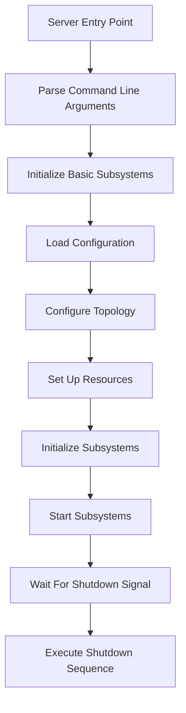
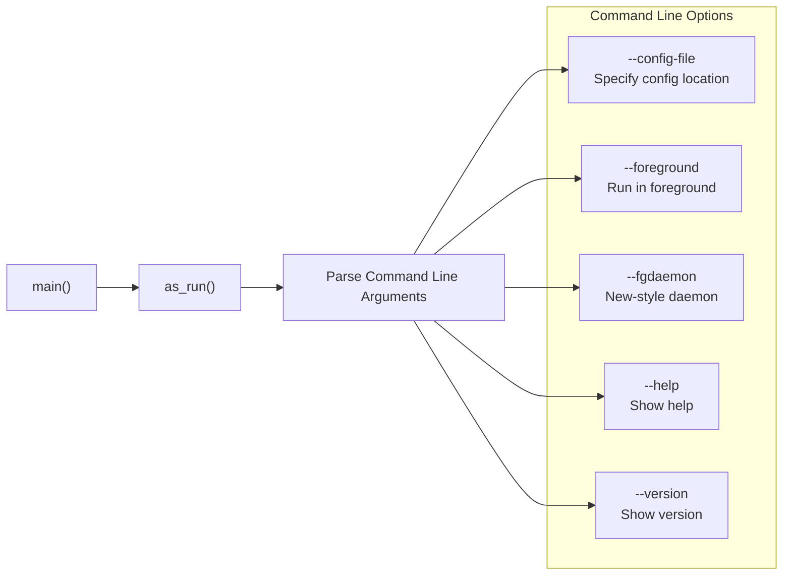
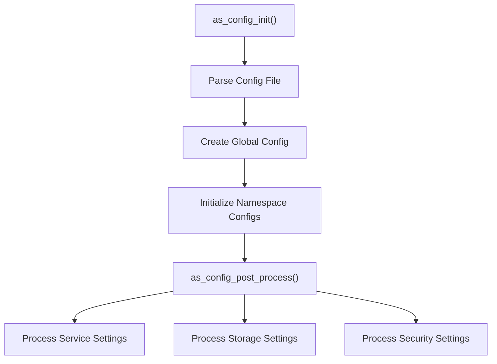
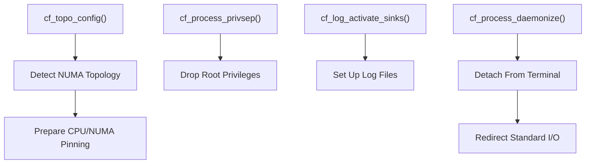
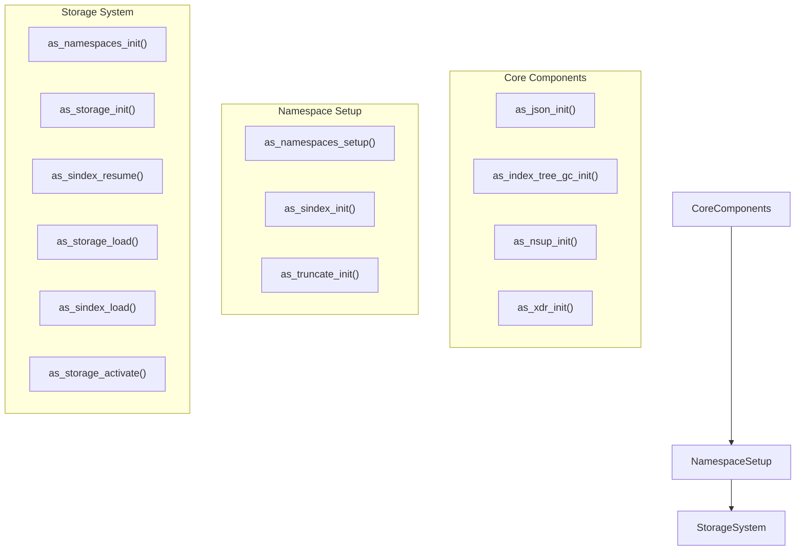
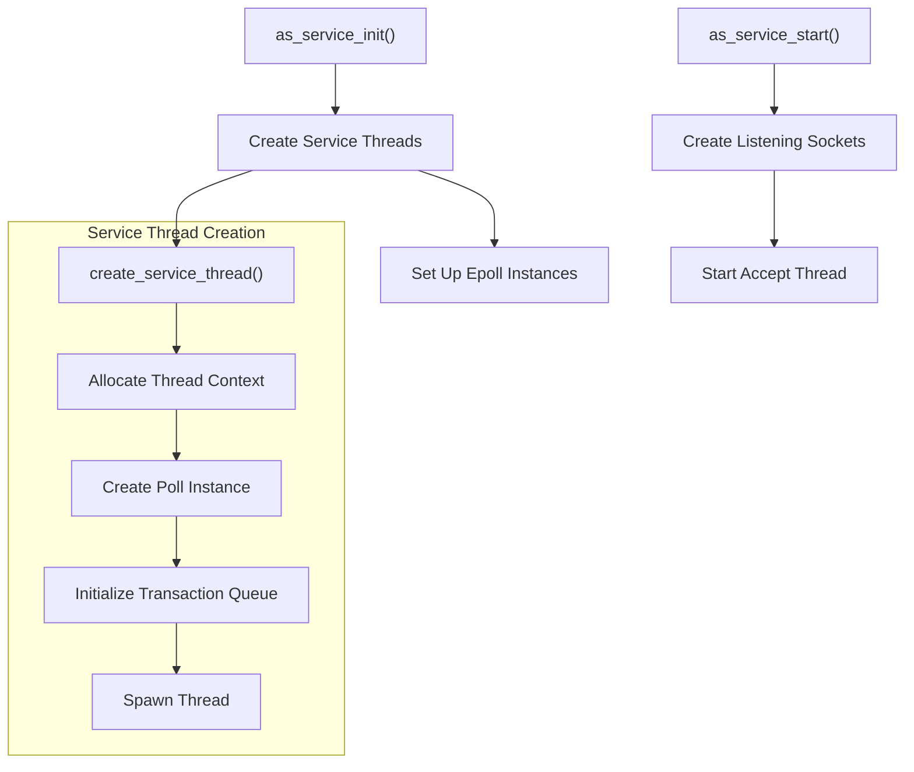
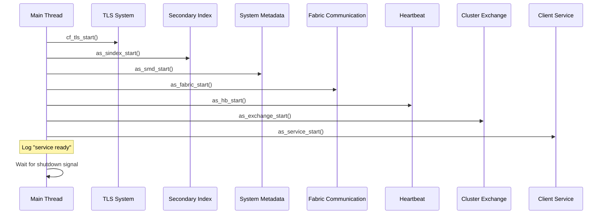
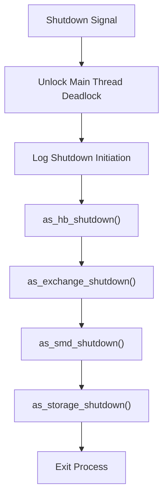

# Server Initialization

<details>
<summary>Relevant source files</summary>

The following files were used as context for generating this wiki page:

- [as/include/base/cfg.h](https://github.com/aerospike/aerospike-server/blob/8311b29d/as/include/base/cfg.h)
- [as/include/base/service.h](https://github.com/aerospike/aerospike-server/blob/8311b29d/as/include/base/service.h)
- [as/include/base/xdr.h](https://github.com/aerospike/aerospike-server/blob/8311b29d/as/include/base/xdr.h)
- [as/src/Makefile](https://github.com/aerospike/aerospike-server/blob/8311b29d/as/src/Makefile)
- [as/src/base/as.c](https://github.com/aerospike/aerospike-server/blob/8311b29d/as/src/base/as.c)
- [as/src/base/cfg_ce.c](https://github.com/aerospike/aerospike-server/blob/8311b29d/as/src/base/cfg_ce.c)
- [as/src/base/service.c](https://github.com/aerospike/aerospike-server/blob/8311b29d/as/src/base/service.c)
- [as/src/base/xdr_ce.c](https://github.com/aerospike/aerospike-server/blob/8311b29d/as/src/base/xdr_ce.c)

</details>


This document describes the initialization sequence of the Aerospike Database Server, covering the startup process from command-line argument parsing through subsystem initialization to the final "service ready" state. For information about the configuration system specifically, see [Configuration System](#2.2).

## Overview

The Aerospike server initialization process follows a carefully orchestrated sequence to bring up all server components in the correct order, ensuring dependencies are satisfied. This includes command-line processing, configuration loading, resource allocation, service initialization, and starting various subsystems like storage, fabric communication, and query processing.



Sources: [as/src/base/as.c:201-482](https://github.com/aerospike/aerospike-server/blob/8311b29d/as/src/base/as.c#L201-L482)

## Entry Point and Command Line Handling

The server process begins in the `as_run()` function, which serves as the main entry point for the Aerospike server. This function processes command-line arguments using `getopt_long()` to handle options like:

- `--config-file`: Specify custom configuration file location
- `--foreground`: Run in foreground (don't daemonize)
- `--fgdaemon`: Run as a "new-style" foreground daemon
- `--help`: Display help information
- `--version`: Display version information



Sources: [as/src/base/as.c:201-260](https://github.com/aerospike/aerospike-server/blob/8311b29d/as/src/base/as.c#L201-L260), [as/src/base/as.c:96-106](https://github.com/aerospike/aerospike-server/blob/8311b29d/as/src/base/as.c#L96-L106)

## Early Initialization Phase

Before loading the configuration file, several critical subsystems are initialized to establish basic functionality:

1. Logging (`cf_log_init`) - Sets up initial logging capability
2. Memory allocator (`cf_alloc_init`) - Initializes the memory allocation system
3. Trace facility (`cf_trace_init`) - Sets up tracing for debugging
4. Thread management (`cf_thread_init`) - Prepares thread handling
5. Signal handling (`as_signal_setup`) - Establishes signal handlers
6. FIPS and TLS initialization (`cf_fips_init`, `cf_tls_init`) - Prepares security components

This early initialization ensures core services are available before configuration parsing begins.

Sources: [as/src/base/as.c:261-270](https://github.com/aerospike/aerospike-server/blob/8311b29d/as/src/base/as.c#L261-L270)

## Configuration Loading

Configuration loading is a two-step process:

1. `as_config_init()` parses the configuration file and initializes the global configuration structure
2. `as_config_post_process()` performs additional processing after parsing

The global configuration `g_config` is populated with settings from the configuration file, which includes:

- Network service settings
- Storage configurations
- Security settings
- Namespace definitions
- Operational parameters



Sources: [as/src/base/as.c:271-274](https://github.com/aerospike/aerospike-server/blob/8311b29d/as/src/base/as.c#L271-L274), [as/src/base/as.c:313-314](https://github.com/aerospike/aerospike-server/blob/8311b29d/as/src/base/as.c#L313-L314), [as/include/base/cfg.h:74-209](https://github.com/aerospike/aerospike-server/blob/8311b29d/as/include/base/cfg.h#L74-L209)

## Privilege Separation and Resource Setup

After loading the configuration, the server:

1. Detects NUMA topology and prepares for CPU/NUMA pinning
2. Performs privilege separation if configured user/group doesn't have root privileges
3. Activates configured log sinks
4. Daemonizes the process if specified and not running in foreground



Sources: [as/src/base/as.c:275-329](https://github.com/aerospike/aerospike-server/blob/8311b29d/as/src/base/as.c#L275-L329)

## Subsystem Initialization

The server initializes its subsystems in a specific order to manage dependencies:

1. **Core Components**:
   - JSON API for metadata (`as_json_init()`)
   - Index tree garbage collection (`as_index_tree_gc_init()`)
   - Namespace supervision (`as_nsup_init()`)
   - Cross-datacenter replication (`as_xdr_init()`) 

2. **Namespace Setup**:
   - `as_namespaces_setup()` - Prepares namespaces (warm or cold start)
   - `as_sindex_init()` - Initializes secondary indexes
   - `as_truncate_init()` - Sets up data truncation

3. **Storage System**:
   - `as_namespaces_init()` - Initializes namespace structures
   - `as_storage_init()` - Initializes the storage subsystem
   - `as_sindex_resume()` - Resumes secondary indexes
   - `as_storage_load()` - Loads data (full scan for cold start)
   - `as_sindex_load()` - Loads secondary indexes
   - `as_storage_activate()` - Activates the storage subsystem



Sources: [as/src/base/as.c:339-385](https://github.com/aerospike/aerospike-server/blob/8311b29d/as/src/base/as.c#L339-L385)

## Network and Service Initialization

After the storage system is initialized, the server initializes networking and services:

1. `cf_dns_init()` - DNS resolver
2. `as_security_init()` - Security features
3. `as_service_init()` - Client service (transaction processing)
4. `as_hb_init()` - Inter-node heartbeat
5. `as_fabric_init()` - Inter-node communication fabric
6. `as_clustering_init()` - Cluster management
7. `as_info_init()` - Info transaction handling
8. `as_migrate_init()` - Data migration between nodes
9. `as_query_manager_init()` - Query processing
10. `as_batch_init()` - Batch transaction handling

The service initialization (`as_service_init()`) creates threads to handle client connections:



Sources: [as/src/base/as.c:387-405](https://github.com/aerospike/aerospike-server/blob/8311b29d/as/src/base/as.c#L387-L405), [as/src/base/service.c:161-176](https://github.com/aerospike/aerospike-server/blob/8311b29d/as/src/base/service.c#L161-L176), [as/src/base/service.c:177-201](https://github.com/aerospike/aerospike-server/blob/8311b29d/as/src/base/service.c#L177-L201), [as/src/base/service.c:339-361](https://github.com/aerospike/aerospike-server/blob/8311b29d/as/src/base/service.c#L339-L361)

## Starting Subsystems

After initialization, the server starts each subsystem:

1. `cf_tls_start()` - TLS certificate refresh thread
2. `as_sindex_start()` - Secondary index garbage collection
3. `as_smd_start()` - System metadata distribution
4. `as_health_start()` - Health monitoring
5. `as_fabric_start()` - Inter-node fabric communication
6. `as_xdr_start()` - Cross-datacenter replication
7. `as_hb_start()` - Inter-node heartbeat
8. `as_exchange_start()` - Cluster exchange subsystem
9. `as_clustering_start()` - Cluster management
10. `as_nsup_start()` - Namespace supervision
11. `as_service_start()` - Client service
12. `as_info_port_start()` - Info service 
13. `as_ticker_start()` - Statistics ticker

The server is now fully initialized and announces "service ready".



Sources: [as/src/base/as.c:409-422](https://github.com/aerospike/aerospike-server/blob/8311b29d/as/src/base/as.c#L409-L422), [as/src/base/as.c:428](https://github.com/aerospike/aerospike-server/blob/8311b29d/as/src/base/as.c#L428)

## Main Thread Behavior

After initialization, the main thread intentionally deadlocks itself using a mutex, waiting for a shutdown signal:

```c
pthread_mutex_lock(&g_main_deadlock);
g_startup_complete = true;
pthread_mutex_lock(&g_main_deadlock);
```

When a shutdown signal is received, the signal handler unlocks the mutex, allowing the main thread to continue and perform a clean shutdown sequence.

Sources: [as/src/base/as.c:435-447](https://github.com/aerospike/aerospike-server/blob/8311b29d/as/src/base/as.c#L435-L447)

## Shutdown Sequence

When a shutdown signal is received, the server:

1. Logs the shutdown initiation
2. Shuts down the heartbeat subsystem (`as_hb_shutdown()`)
3. Blocks partition rebalance (`as_exchange_shutdown()`)
4. Synchronizes system metadata (`as_smd_shutdown()`)
5. Performs storage shutdown (`as_storage_shutdown()`)
6. Exits the process



Sources: [as/src/base/as.c:453-478](https://github.com/aerospike/aerospike-server/blob/8311b29d/as/src/base/as.c#L453-L478)

## Key Data Structures

During initialization, several key data structures are created and populated:

### Global Configuration

The `g_config` global configuration structure holds all server settings:

| Member | Description |
|--------|-------------|
| `cluster_name` | Name of the cluster |
| `auto_pin` | CPU pinning configuration |
| `n_service_threads` | Number of service threads |
| `namespaces` | Array of namespace configurations |
| `n_namespaces` | Number of namespaces |
| `service` | Client service binding |
| `fabric` | Fabric service binding |
| `hb_config` | Heartbeat configuration |
| `mod_lua` | Lua module configuration |
| `sec_cfg` | Security configuration |
| `xdr_cfg` | Cross-datacenter replication configuration |

Sources: [as/include/base/cfg.h:74-209](https://github.com/aerospike/aerospike-server/blob/8311b29d/as/include/base/cfg.h#L74-L209)

### Service Context

The thread context structure for service threads:

| Member | Description |
|--------|-------------|
| `i_cpu` | CPU index for pinning |
| `lock` | Thread lock for synchronization |
| `poll` | Poll instance for event handling |
| `trans_q` | Transaction queue |

Sources: [as/src/base/service.c:77-82](https://github.com/aerospike/aerospike-server/blob/8311b29d/as/src/base/service.c#L77-L82)

## Conclusion

The Aerospike server initialization follows a well-defined sequence that ensures all components are properly initialized and started in the correct order. The process begins with basic subsystem initialization, loads configuration, sets up resources, initializes and starts all subsystems, and finally enters a wait state for shutdown signals.