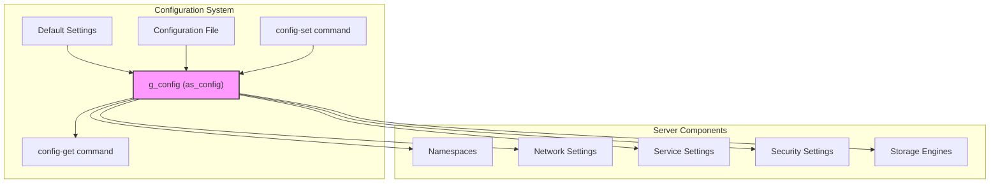
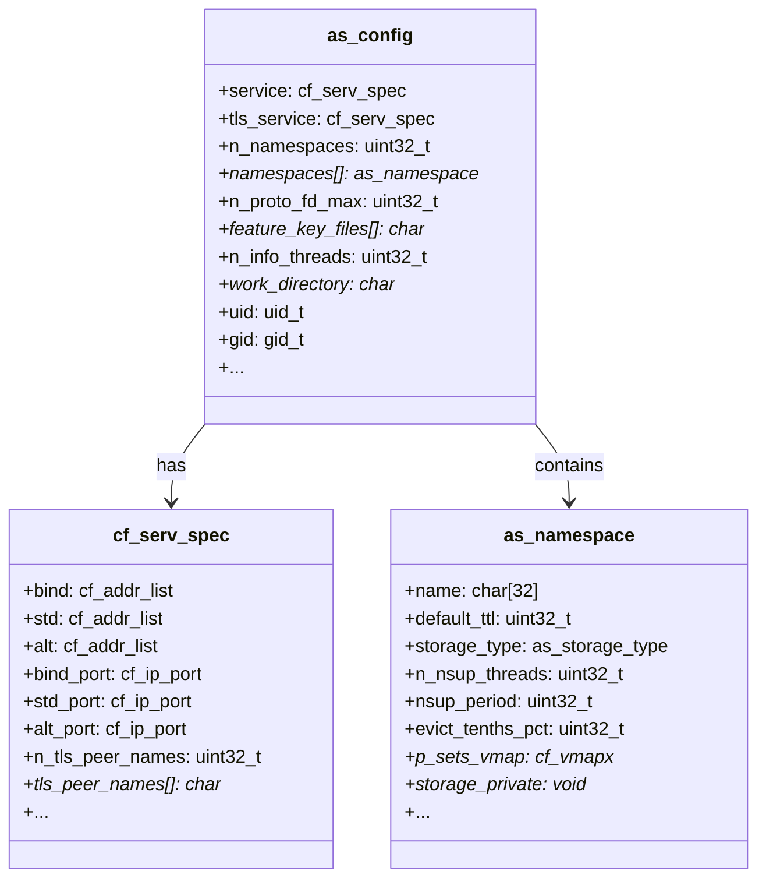
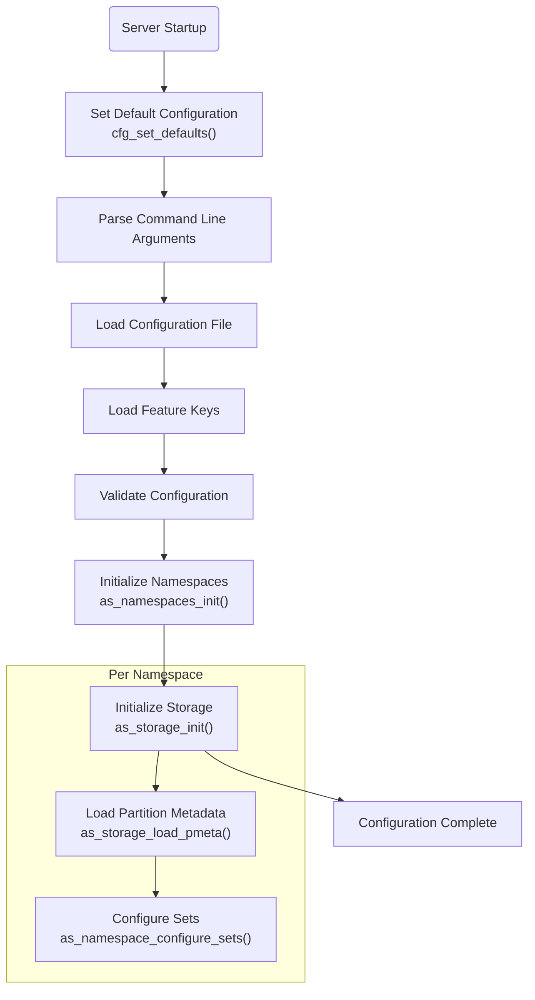

# Configuration System

<details>
<summary>Relevant source files</summary>

The following files were used as context for generating this wiki page:

- [as/include/base/datamodel.h](https://github.com/aerospike/aerospike-server/blob/8311b29d/as/include/base/datamodel.h)
- [as/include/storage/storage.h](https://github.com/aerospike/aerospike-server/blob/8311b29d/as/include/storage/storage.h)
- [as/src/base/cfg.c](https://github.com/aerospike/aerospike-server/blob/8311b29d/as/src/base/cfg.c)
- [as/src/base/cfg_info.c](https://github.com/aerospike/aerospike-server/blob/8311b29d/as/src/base/cfg_info.c)
- [as/src/base/namespace.c](https://github.com/aerospike/aerospike-server/blob/8311b29d/as/src/base/namespace.c)
- [as/src/base/nsup.c](https://github.com/aerospike/aerospike-server/blob/8311b29d/as/src/base/nsup.c)
- [as/src/base/thr_info.c](https://github.com/aerospike/aerospike-server/blob/8311b29d/as/src/base/thr_info.c)
- [as/src/storage/storage.c](https://github.com/aerospike/aerospike-server/blob/8311b29d/as/src/storage/storage.c)

</details>


## Purpose and Scope

This document details the configuration system of the Aerospike Server, which is responsible for managing all server settings. It covers how configurations are defined, loaded, accessed, and modified at runtime. The configuration system enables both static configuration through a configuration file and dynamic configuration through the info protocol.

For information about configuring specific subsystems like storage engines or security, see their respective documentation pages.

## Overview

The Aerospike configuration system is built around a central `as_config` structure that holds all server settings. Configuration is initialized with default values, then populated from a configuration file at startup, and can be modified at runtime through info commands.



Sources: [as/src/base/cfg.c:151-234](https://github.com/aerospike/aerospike-server/blob/8311b29d/as/src/base/cfg.c#L151-L234), [as/src/base/cfg_info.c:110-178](https://github.com/aerospike/aerospike-server/blob/8311b29d/as/src/base/cfg_info.c#L110-L178)

## Configuration Structure

The main configuration is stored in a global structure `g_config` of type `as_config`. This structure contains all the server's configuration settings, ranging from basic service settings to detailed namespace configurations.



Sources: [as/include/base/datamodel.h:592-748](https://github.com/aerospike/aerospike-server/blob/8311b29d/as/include/base/datamodel.h#L592-L748), [as/src/base/cfg.c:92-94](https://github.com/aerospike/aerospike-server/blob/8311b29d/as/src/base/cfg.c#L92-L94)

## Configuration Initialization

During server startup, the configuration system initializes in the following sequence:

1. Default settings are applied through `cfg_set_defaults()`
2. Command-line options override defaults
3. Configuration file is parsed and applied
4. Feature keys are loaded
5. Post-configuration validation and processing



Sources: [as/src/base/cfg.c:151-234](https://github.com/aerospike/aerospike-server/blob/8311b29d/as/src/base/cfg.c#L151-L234), [as/src/base/namespace.c:64-152](https://github.com/aerospike/aerospike-server/blob/8311b29d/as/src/base/namespace.c#L64-L152)

### Default Configuration

Default values are set for all configuration parameters during initialization. This ensures that the server can function with sensible defaults even if no configuration file is provided or if the configuration file is incomplete.

Key default values include:

| Parameter | Default Value | Description |
|-----------|---------------|-------------|
| n_proto_fd_max | 15000 | Maximum number of protocol file descriptors |
| n_info_threads | 16 | Number of info threads |
| transaction_max_ns | 1,000,000,000 | Maximum transaction time (1 second) |
| work_directory | "/opt/aerospike" | Working directory |
| mod_lua.user_path | "/opt/aerospike/usr/udf/lua" | Path for Lua UDFs |
| namespace.max_record_size | 1MB | Maximum record size |
| namespace.replication_factor | 2 | Replication factor |

Sources: [as/src/base/cfg.c:151-234](https://github.com/aerospike/aerospike-server/blob/8311b29d/as/src/base/cfg.c#L151-L234)

## Configuration File Parsing

The configuration file is parsed using an extensive enumeration (`cfg_case_id`) that maps configuration tokens to corresponding handlers. The parsing is context-sensitive, allowing for sections like `namespace` that have their own set of valid parameters.

### Configuration Options Structure

Configuration options are defined in the `cfg_opt` structure:

```c
typedef struct cfg_opt_s {
    const char* tok;
    cfg_case_id case_id;
} cfg_opt;
```

These options are organized into arrays for different contexts, like `GLOBAL_OPTS`, `SERVICE_OPTS`, `NETWORK_OPTS`, etc.

Sources: [as/src/base/cfg.c:826-840](https://github.com/aerospike/aerospike-server/blob/8311b29d/as/src/base/cfg.c#L826-L840)

### Configuration File Format

The configuration file follows a hierarchical structure with sections and parameters:

```
service {
    user username
    group groupname
    pidfile /var/run/aerospike/asd.pid
    proto-fd-max 15000
}

logging {
    file /var/log/aerospike/aerospike.log {
        context any info
    }
}

network {
    service {
        address any
        port 3000
    }
    
    heartbeat {
        mode multicast
        address 239.1.99.222
        port 9918
        interval 150
        timeout 10
    }
}

namespace test {
    replication-factor 2
    memory-size 4G
    default-ttl 30d

    storage-engine memory
}
```

Sources: [as/src/base/cfg.c:242-816](https://github.com/aerospike/aerospike-server/blob/8311b29d/as/src/base/cfg.c#L242-L816)

## Configuration Categories

The Aerospike configuration is organized into several main categories:

### Service Configuration

Basic server settings like process management, resource limits, and general behavior.

### Network Configuration

Settings for all network components:
- Service: Client-facing interfaces and ports
- Heartbeat: Cluster membership protocols
- Fabric: Inter-node communication
- Info: Management interface

### Namespace Configuration

Detailed settings for each namespace, including:
- Data durability and persistence
- Eviction and expiration policies
- Storage engine configuration
- Memory allocation
- Secondary index settings

### Security Configuration

Authentication, authorization, and encryption settings.

### XDR Configuration

Cross-datacenter replication settings.

Sources: [as/src/base/cfg.c:832-839](https://github.com/aerospike/aerospike-server/blob/8311b29d/as/src/base/cfg.c#L832-L839), [as/src/base/cfg_info.c:199-281](https://github.com/aerospike/aerospike-server/blob/8311b29d/as/src/base/cfg_info.c#L199-L281), [as/src/base/cfg_info.c:371-459](https://github.com/aerospike/aerospike-server/blob/8311b29d/as/src/base/cfg_info.c#L371-L459)

## Dynamic Configuration

Aerospike allows many configuration parameters to be changed at runtime using the info protocol. The `config-set` and `config-get` commands provide interfaces to modify and retrieve configuration values.

```mermaid
sequenceDiagram
    participant Client
    participant InfoThread as "Info Thread"
    participant ConfigSystem as "Configuration System"
    participant Component as "Affected Component"
    
    Client->>InfoThread: "config-set:context=service;variable=value;"
    InfoThread->>ConfigSystem: as_cfg_info_cmd_config_set()
    ConfigSystem->>ConfigSystem: cfg_set() with mutex lock
    ConfigSystem->>ConfigSystem: Validate new value
    ConfigSystem->>Component: Update configuration
    ConfigSystem->>InfoThread: Return result
    InfoThread->>Client: OK/ERROR response
    
    Client->>InfoThread: "config-get:context=service;"
    InfoThread->>ConfigSystem: as_cfg_info_cmd_config_get()
    ConfigSystem->>ConfigSystem: cfg_get_service()
    ConfigSystem->>InfoThread: Return current values
    InfoThread->>Client: Configuration values
```

Sources: [as/src/base/cfg_info.c:110-191](https://github.com/aerospike/aerospike-server/blob/8311b29d/as/src/base/cfg_info.c#L110-L191), [as/src/base/thr_info.c:375-464](https://github.com/aerospike/aerospike-server/blob/8311b29d/as/src/base/thr_info.c#L375-L464)

### Info Protocol Commands

The primary configuration commands are:

- `config-get` - Retrieves current configuration values
- `config-set` - Modifies configuration values at runtime

Examples:

```
# Get service configuration
config-get:context=service

# Set the number of info threads
config-set:context=service;info-threads=32

# Get namespace configuration
config-get:context=namespace;id=test
```

Sources: [as/src/base/cfg_info.c:110-191](https://github.com/aerospike/aerospike-server/blob/8311b29d/as/src/base/cfg_info.c#L110-L191), [as/src/base/thr_info.c:654-751](https://github.com/aerospike/aerospike-server/blob/8311b29d/as/src/base/thr_info.c#L654-L751)

### Configuration Change Handling

Configuration changes are processed through a mutex-protected path to ensure thread safety:

1. The `as_cfg_info_cmd_config_set` function receives the change request
2. A mutex (`g_set_cfg_lock`) is acquired to prevent concurrent changes
3. The appropriate configuration setter is called based on the context
4. The configuration is updated in memory
5. Affected components are notified as needed

Sources: [as/src/base/cfg_info.c:183-191](https://github.com/aerospike/aerospike-server/blob/8311b29d/as/src/base/cfg_info.c#L183-L191), [as/src/base/cfg_info.c:88-96](https://github.com/aerospike/aerospike-server/blob/8311b29d/as/src/base/cfg_info.c#L88-L96)

## Configuration Access

Throughout the codebase, configuration values are accessed directly from the global `g_config` structure or from namespace-specific structures. The configuration system does not provide getter/setter methods; instead, values are accessed directly by reference.

Example for accessing service configuration:
```c
uint32_t max_fds = g_config.n_proto_fd_max;
```

Example for accessing namespace configuration:
```c
as_namespace* ns = as_namespace_get_byname("test");
uint32_t ttl = ns->default_ttl;
```

Sources: [as/src/base/cfg.c:92-94](https://github.com/aerospike/aerospike-server/blob/8311b29d/as/src/base/cfg.c#L92-L94), [as/src/base/namespace.c:213-225](https://github.com/aerospike/aerospike-server/blob/8311b29d/as/src/base/namespace.c#L213-L225)

## Best Practices

Aerospike can perform configuration validation through the `enforce-best-practices` flag, which checks for potentially problematic configurations. When enabled, it will generate warnings or prevent startup if configurations might lead to performance issues or data loss.

Some enforced best practices include:
- Minimum and maximum limits for memory allocations
- Appropriate settings for namespace TTL and eviction policies
- Correct disk and memory configurations for storage engines
- Proper network timeouts and buffer sizes

Sources: [as/src/base/cfg.c:131-144](https://github.com/aerospike/aerospike-server/blob/8311b29d/as/src/base/cfg.c#L131-L144)

## Configuration Persistence

Most configuration changes are not persisted to the configuration file automatically. Changes made via `config-set` will remain in memory until the server is restarted, at which point the original configuration file is read again.

Some specific configurations, such as eviction settings, can be persisted through System Metadata (SMD) to survive restarts.