# Data Model

Relevant source files

The following files were used as context for generating this wiki page:

- [as/include/storage/storage.h](https://github.com/aerospike/aerospike-server/blob/8311b29d/as/include/storage/storage.h)
- [as/include/transaction/rw_utils.h](https://github.com/aerospike/aerospike-server/blob/8311b29d/as/include/transaction/rw_utils.h)
- [as/src/base/cfg_info.c](https://github.com/aerospike/aerospike-server/blob/8311b29d/as/src/base/cfg_info.c)
- [as/src/base/namespace.c](https://github.com/aerospike/aerospike-server/blob/8311b29d/as/src/base/namespace.c)
- [as/src/base/nsup.c](https://github.com/aerospike/aerospike-server/blob/8311b29d/as/src/base/nsup.c)
- [as/src/base/record.c](https://github.com/aerospike/aerospike-server/blob/8311b29d/as/src/base/record.c)
- [as/src/base/record_ce.c](https://github.com/aerospike/aerospike-server/blob/8311b29d/as/src/base/record_ce.c)
- [as/src/storage/storage.c](https://github.com/aerospike/aerospike-server/blob/8311b29d/as/src/storage/storage.c)
- [as/src/transaction/rw_utils.c](https://github.com/aerospike/aerospike-server/blob/8311b29d/as/src/transaction/rw_utils.c)
- [as/src/transaction/rw_utils_ce.c](https://github.com/aerospike/aerospike-server/blob/8311b29d/as/src/transaction/rw_utils_ce.c)

The Aerospike Data Model describes how data is organized and structured within the Aerospike database. This document explains the core components of the data model, including namespaces, sets, records, bins, and how they relate to each other. For information about storage engines and physical data storage, see [Storage Engine](#4).

## Overview

Aerospike's data model is designed to provide high performance and scalability while maintaining flexibility for different use cases. The data model uses a hierarchical organization with a simple, flat structure that maps efficiently to distributed systems.

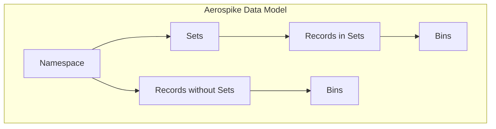

Sources: [as/src/base/datamodel.h](https://github.com/aerospike/aerospike-server/blob/8311b29d/as/src/base/datamodel.h), [as/src/base/namespace.c](https://github.com/aerospike/aerospike-server/blob/8311b29d/as/src/base/namespace.c)

## Core Components

### Namespaces

A namespace is the highest-level container in Aerospike's data model. Namespaces are similar to databases in traditional RDBMS systems and provide isolation between different application data. Each namespace has its own configuration for:

- Storage engine type (memory, SSD, persistent memory)
- Replication factor
- Data expiration and eviction policies
- Memory allocation for indexes
- Read/write policies

Namespaces are defined in the Aerospike configuration file and are created at server startup.

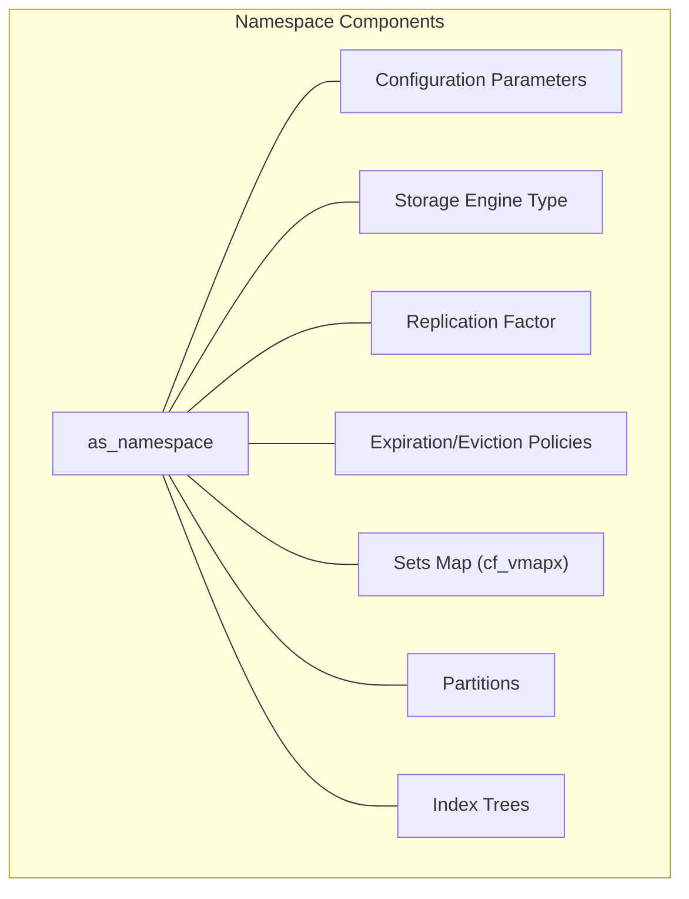

Sources: [as/src/base/namespace.c:64-153](https://github.com/aerospike/aerospike-server/blob/8311b29d/as/src/base/namespace.c#L64-L153), [as/src/base/cfg_info.c:372-624](https://github.com/aerospike/aerospike-server/blob/8311b29d/as/src/base/cfg_info.c#L372-L624)

Key characteristics of namespaces:
- Each namespace can have different storage backends
- Default TTL can be configured per namespace
- Every record belongs to exactly one namespace
- Namespaces have their own independent sets

From the code, we can see that namespaces have various configurable parameters:

| Parameter | Default | Description |
|-----------|---------|-------------|
| default-ttl | Set during initialization | Default time-to-live for records (in seconds) |
| replication-factor | 2 | Number of copies of each record |
| max-record-size | 1MB | Maximum size of a single record |
| storage-engine | Configurable | Type of storage (memory, SSD, PMEM) |
| conflict-resolution-policy | UNDEF (defaults based on edition) | Policy for resolving conflicts between replicas |

Sources: [as/src/base/namespace.c:98-147](https://github.com/aerospike/aerospike-server/blob/8311b29d/as/src/base/namespace.c#L98-L147)

### Sets

Sets are collections of records within a namespace, similar to tables in a relational database. Sets provide a way to group related records together and can have their own properties.

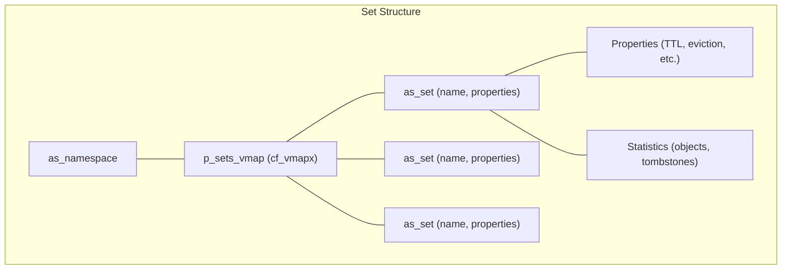

Sources: [as/src/base/namespace.c:177-209](https://github.com/aerospike/aerospike-server/blob/8311b29d/as/src/base/namespace.c#L177-L209), [as/src/base/namespace.c:607-665](https://github.com/aerospike/aerospike-server/blob/8311b29d/as/src/base/namespace.c#L607-L665)

Key characteristics of sets:
- Sets are optional - records can exist without belonging to a set
- Set membership is identified using a set-ID in the record index
- Sets have configurable properties like default TTL
- Sets can be indexed for quicker access

The set structure includes properties that can be configured separately from the namespace:

| Property | Description |
|----------|-------------|
| default-ttl | Default TTL for records in this set |
| default-read-touch-ttl-pct | Percentage of TTL to use when a record is read |
| disable-eviction | Prevent records in this set from being evicted |
| enable-index | Whether secondary indexes are enabled for this set |
| stop-writes-count | Maximum number of records in the set |

Sources: [as/src/base/namespace.c:642-664](https://github.com/aerospike/aerospike-server/blob/8311b29d/as/src/base/namespace.c#L642-L664)

### Records

Records are the fundamental unit of data in Aerospike. Each record is uniquely identified by a key and contains bins (name-value pairs). Records also include metadata such as generation (version), time-to-live, and last update time.

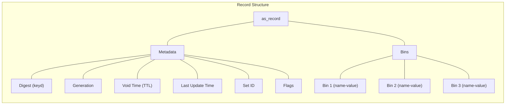

Sources: [as/src/base/datamodel.h](https://github.com/aerospike/aerospike-server/blob/8311b29d/as/src/base/datamodel.h), [as/src/base/record.c:86-96](https://github.com/aerospike/aerospike-server/blob/8311b29d/as/src/base/record.c#L86-L96), [as/src/base/record.c:137-148](https://github.com/aerospike/aerospike-server/blob/8311b29d/as/src/base/record.c#L137-L148)

Key characteristics of records:
- Each record belongs to exactly one namespace
- Records may optionally belong to a set
- Records have a generation counter that increases with each modification
- Records can have a time-to-live (TTL) after which they expire
- Record size is limited by the namespace's max-record-size setting

Record lifecycle operations include:

- Creating a record (`as_record_get_create`)
- Reading a record (`as_record_get`)
- Updating a record (through the transaction system)
- Deleting a record
- Expiration (based on void_time)
- Eviction (based on memory/storage constraints)

Sources: [as/src/base/record.c:86-149](https://github.com/aerospike/aerospike-server/blob/8311b29d/as/src/base/record.c#L86-L149), [as/src/transaction/rw_utils.h:127-179](https://github.com/aerospike/aerospike-server/blob/8311b29d/as/src/transaction/rw_utils.h#L127-L179)

### Bins

Bins are name-value pairs within a record. Each bin has a name and a value of a specific data type (called a "particle" in Aerospike terminology).

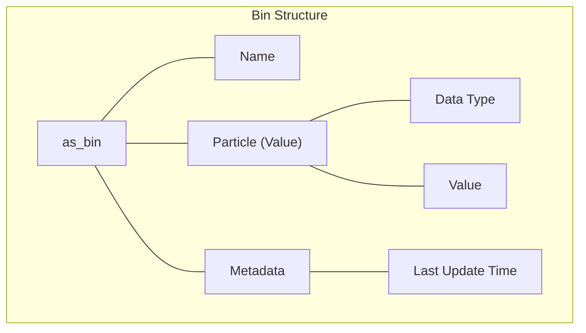

Sources: [as/src/base/datamodel.h](https://github.com/aerospike/aerospike-server/blob/8311b29d/as/src/base/datamodel.h)

Key characteristics of bins:
- Bin names are limited to 15 characters (in the open-source version)
- Different records in the same set can have different bins
- Bins support various data types: integers, strings, lists, maps, geospatial, etc.
- Bins can be added, modified, or removed individually
- Different records in the same set can have different numbers of bins

### Keys and Digests

Each record in Aerospike is uniquely identified by a key. Internally, Aerospike uses a digest (hash of the key) for efficient storage and lookup.

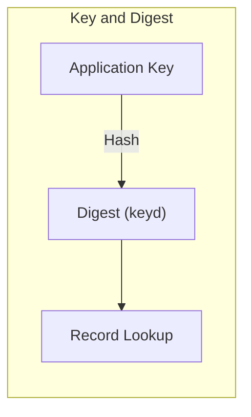

Sources: [as/src/transaction/rw_utils.c:292-332](https://github.com/aerospike/aerospike-server/blob/8311b29d/as/src/transaction/rw_utils.c#L292-L332)

Key characteristics:
- The application provides a key which is hashed to create a digest
- The digest is used for record storage and lookup
- Keys can optionally be stored with the record
- If a key is not stored, only the digest is kept

## Data Operations and Consistency

### Operations

Aerospike supports various operations on records:

1. **Read** - Retrieve a record or specific bins
2. **Write** - Create or update a record
3. **Delete** - Remove a record
4. **Operate** - Perform multiple bin operations in a single transaction
5. **UDF** - Execute user-defined functions on records

### Consistency Control

Aerospike provides mechanisms to ensure data consistency:

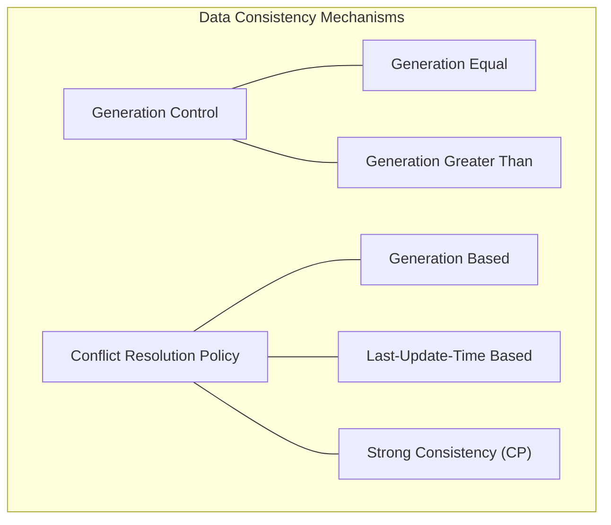

Sources: [as/src/transaction/rw_utils.c:118-130](https://github.com/aerospike/aerospike-server/blob/8311b29d/as/src/transaction/rw_utils.c#L118-L130), [as/src/base/record.c:448-478](https://github.com/aerospike/aerospike-server/blob/8311b29d/as/src/base/record.c#L448-L478)

Key aspects of consistency control:
- Generation value increments with each write
- Operations can specify generation requirements
- Conflict resolution policies determine which record version "wins" during replication conflicts
- Different namespaces can have different conflict resolution policies

## TTL and Data Expiration

Aerospike provides mechanisms for managing data lifecycle through TTL (Time To Live) settings:

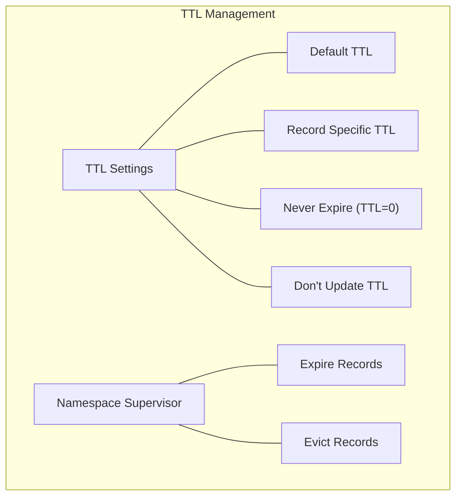

Sources: [as/src/transaction/rw_utils.h:173-205](https://github.com/aerospike/aerospike-server/blob/8311b29d/as/src/transaction/rw_utils.h#L173-L205), [as/src/base/nsup.c:397-405](https://github.com/aerospike/aerospike-server/blob/8311b29d/as/src/base/nsup.c#L397-L405)

Key aspects of TTL and expiration:
- TTL can be specified at the namespace, set, or record level
- Special TTL values like TTL_NEVER_EXPIRE and TTL_DONT_UPDATE provide control
- The Namespace Supervisor (nsup) handles record expiration based on void_time
- Eviction policies help manage memory/storage usage

## System Flow

The following diagram shows how data flows through the Aerospike data model during typical operations:

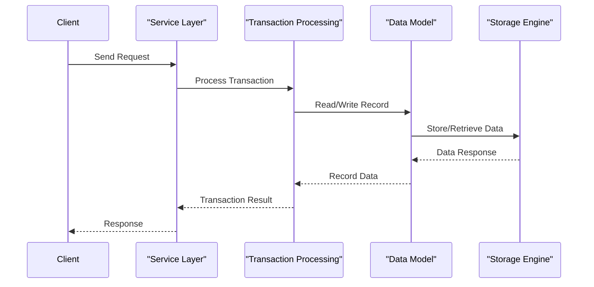

Sources: [as/src/base/datamodel.h](https://github.com/aerospike/aerospike-server/blob/8311b29d/as/src/base/datamodel.h), [as/src/storage/storage.h:182-268](https://github.com/aerospike/aerospike-server/blob/8311b29d/as/src/storage/storage.h#L182-L268)

## Physical Data Representation

At the physical level, record data is serialized into a "flat" format for storage:

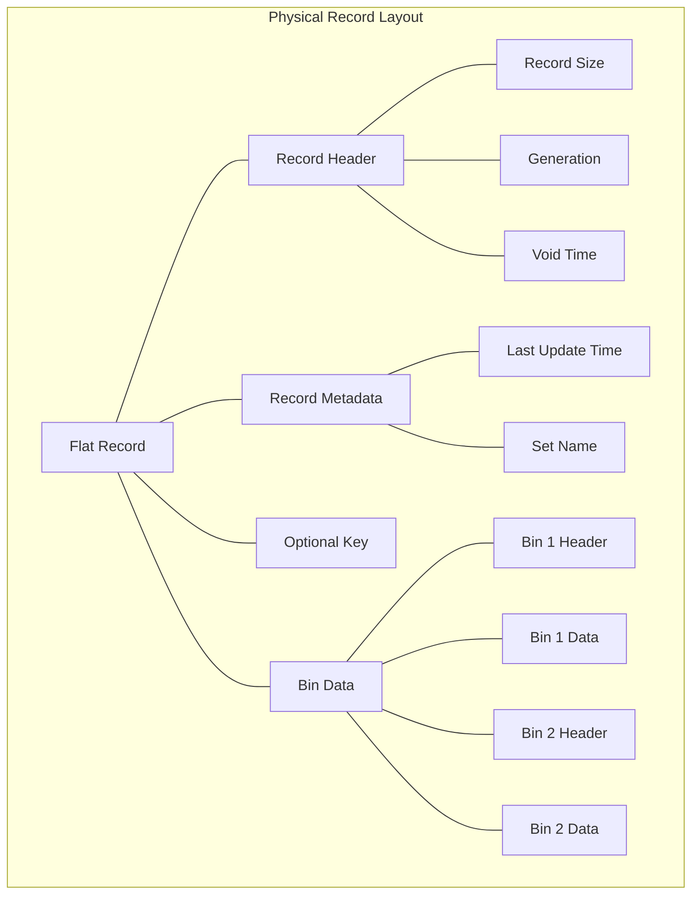

Sources: [as/src/storage/storage.h:108-157](https://github.com/aerospike/aerospike-server/blob/8311b29d/as/src/storage/storage.h#L108-L157)

## Index Structure

Aerospike uses an in-memory index to locate records quickly:

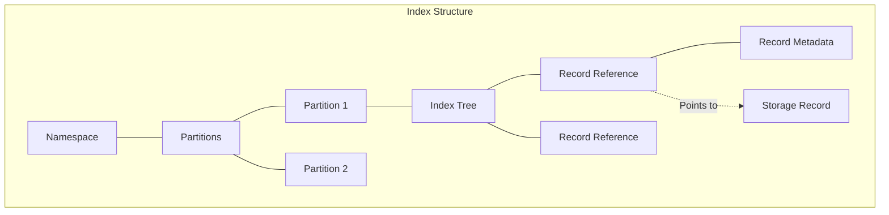

Sources: [as/src/base/datamodel.h](https://github.com/aerospike/aerospike-server/blob/8311b29d/as/src/base/datamodel.h), [as/src/base/index.h](https://github.com/aerospike/aerospike-server/blob/8311b29d/as/src/base/index.h)

The index contains:
- Record digest (key hash)
- Record metadata (generation, TTL, etc.)
- Storage location reference
- Set membership information

Records are physically distributed across partitions based on their digest.

## Secondary Indexes

Aerospike supports secondary indexes for faster querying based on bin values:

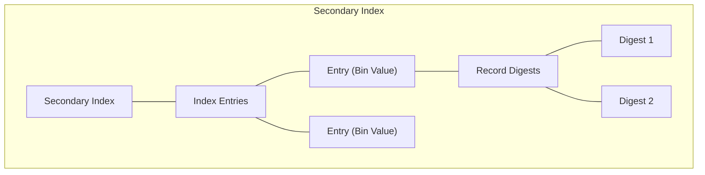

Sources: [as/src/transaction/rw_utils.c:424-549](https://github.com/aerospike/aerospike-server/blob/8311b29d/as/src/transaction/rw_utils.c#L424-L549)