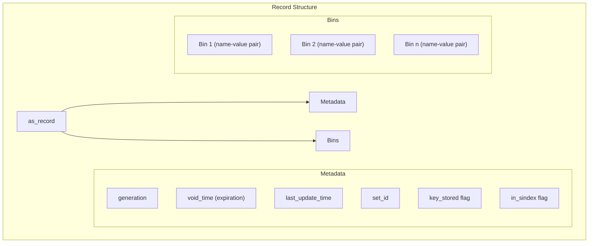
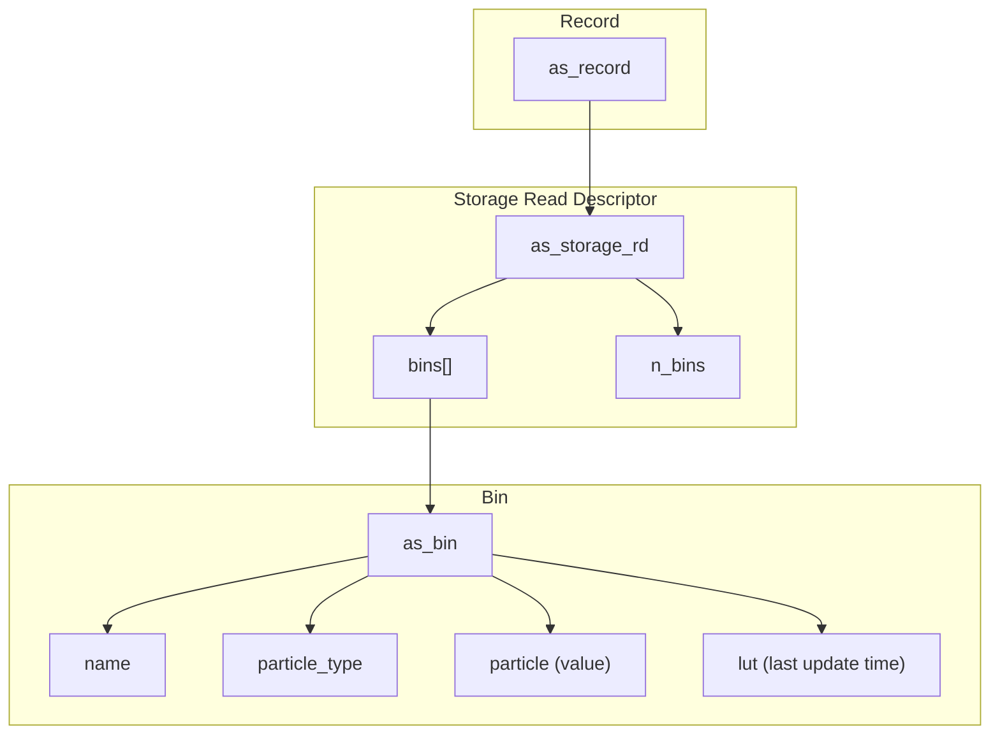
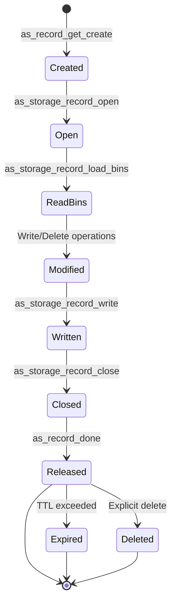
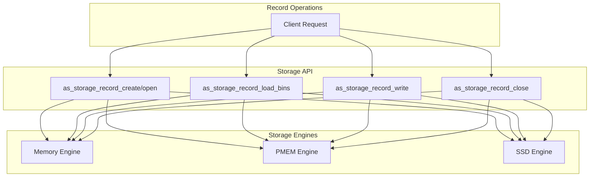
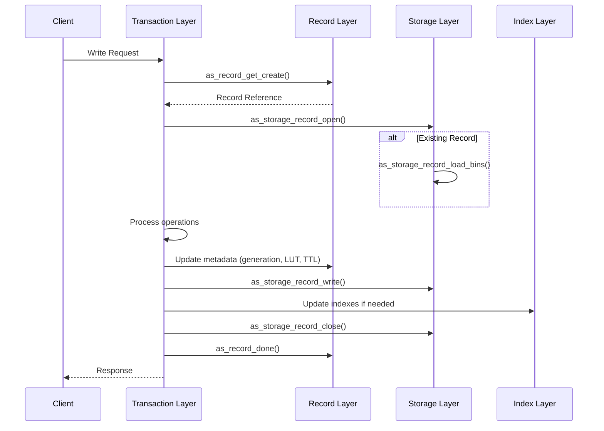

# Records and Bins

<details>
<summary>Relevant source files</summary>

The following files were used as context for generating this wiki page:

- [as/include/storage/storage.h](https://github.com/aerospike/aerospike-server/blob/8311b29d/as/include/storage/storage.h)
- [as/include/transaction/rw_utils.h](https://github.com/aerospike/aerospike-server/blob/8311b29d/as/include/transaction/rw_utils.h)
- [as/src/base/cfg_info.c](https://github.com/aerospike/aerospike-server/blob/8311b29d/as/src/base/cfg_info.c)
- [as/src/base/namespace.c](https://github.com/aerospike/aerospike-server/blob/8311b29d/as/src/base/namespace.c)
- [as/src/base/nsup.c](https://github.com/aerospike/aerospike-server/blob/8311b29d/as/src/base/nsup.c)
- [as/src/base/record.c](https://github.com/aerospike/aerospike-server/blob/8311b29d/as/src/base/record.c)
- [as/src/base/record_ce.c](https://github.com/aerospike/aerospike-server/blob/8311b29d/as/src/base/record_ce.c)
- [as/src/storage/storage.c](https://github.com/aerospike/aerospike-server/blob/8311b29d/as/src/storage/storage.c)
- [as/src/transaction/rw_utils.c](https://github.com/aerospike/aerospike-server/blob/8311b29d/as/src/transaction/rw_utils.c)
- [as/src/transaction/rw_utils_ce.c](https://github.com/aerospike/aerospike-server/blob/8311b29d/as/src/transaction/rw_utils_ce.c)

</details>


This document describes the structure and lifecycle of records and bins in the Aerospike database. Records are the fundamental data storage unit in Aerospike, while bins are name-value pairs within records that store the actual data. This document covers record structure, bin organization, and the various operations that can be performed on records and bins.

For information about data types that can be stored within bins, see [Data Types](#3.2).

## Record Structure

A record in Aerospike is identified by a digest key and consists of metadata and data (stored in bins). Each record belongs to a namespace and optionally to a set within that namespace.



Sources:
- [as/src/base/record.c:79-129](https://github.com/aerospike/aerospike-server/blob/8311b29d/as/src/base/record.c#L79-L129)
- [as/src/base/record.c:137-149](https://github.com/aerospike/aerospike-server/blob/8311b29d/as/src/base/record.c#L137-L149)
- [as/src/transaction/rw_utils.c:370-411](https://github.com/aerospike/aerospike-server/blob/8311b29d/as/src/transaction/rw_utils.c#L370-L411)

### Key Record Attributes

Records contain several important attributes:

| Attribute | Description |
|-----------|-------------|
| `generation` | Counter that increments with each modification; used for optimistic concurrency control |
| `void_time` | Expiration time of the record (TTL); 0 means never expire |
| `last_update_time` | Timestamp of the last update; used for conflict resolution |
| `set_id` | Identifier of the set to which the record belongs (if any) |
| `key_stored` | Flag indicating whether the original key is stored with the record |
| `in_sindex` | Flag indicating the record is referenced by a secondary index |

Sources:
- [as/src/base/record_ce.c:64-81](https://github.com/aerospike/aerospike-server/blob/8311b29d/as/src/base/record_ce.c#L64-L81)
- [as/src/transaction/rw_utils.c:370-411](https://github.com/aerospike/aerospike-server/blob/8311b29d/as/src/transaction/rw_utils.c#L370-L411)

## Bin Structure

Bins are name-value pairs contained within a record. Each bin has a name and a value stored as a "particle" (Aerospike's internal data representation).



Sources:
- [as/src/storage/storage.h:108-157](https://github.com/aerospike/aerospike-server/blob/8311b29d/as/src/storage/storage.h#L108-L157)
- [as/src/transaction/rw_utils.c:422-463](https://github.com/aerospike/aerospike-server/blob/8311b29d/as/src/transaction/rw_utils.c#L422-L463)

### Bin Operations

The following operations can be performed on bins:

1. **Read**: Retrieve the value of a bin
2. **Write**: Create or update a bin with a new value
3. **Delete**: Remove a bin from a record

Bins can be added, modified, or deleted independently of other bins in the same record.

Sources:
- [as/src/transaction/rw_utils.c:213-236](https://github.com/aerospike/aerospike-server/blob/8311b29d/as/src/transaction/rw_utils.c#L213-L236)

## Record Lifecycle

Records in Aerospike go through several stages in their lifecycle, from creation to eventual deletion.



Sources:
- [as/src/base/record.c:85-129](https://github.com/aerospike/aerospike-server/blob/8311b29d/as/src/base/record.c#L85-L129)
- [as/src/storage/storage.c:304-440](https://github.com/aerospike/aerospike-server/blob/8311b29d/as/src/storage/storage.c#L304-L440)

### Record Creation and Retrieval

Records are created or retrieved using the `as_record_get_create` function, which attempts to find a record with the given key digest. If the record doesn't exist, a new one is created.

```c
int as_record_get_create(as_index_tree* tree, const cf_digest* keyd,
        as_index_ref* r_ref, as_namespace* ns);
```

When a record is no longer needed, `as_record_done` is called to release it and potentially destroy it if it's been marked for deletion.

Sources:
- [as/src/base/record.c:85-129](https://github.com/aerospike/aerospike-server/blob/8311b29d/as/src/base/record.c#L85-L129)

### Record Storage Operations

To read or write a record, a storage read descriptor (`as_storage_rd`) is used. This descriptor provides access to the record's bins and metadata.

#### Opening and Reading a Record

```c
// Start a storage operation
as_storage_record_open(ns, r, &rd);

// Load bins if needed
as_storage_record_load_bins(&rd);

// If the record contains a key, load it
if (r->key_stored) {
    as_storage_record_load_key(&rd);
}
```

#### Writing a Record

```c
// After modifying bins
as_storage_record_write(&rd);

// Close the storage operation
as_storage_record_close(&rd);
```

Sources:
- [as/src/storage/storage.c:304-440](https://github.com/aerospike/aerospike-server/blob/8311b29d/as/src/storage/storage.c#L304-L440)
- [as/src/base/record.c:192-207](https://github.com/aerospike/aerospike-server/blob/8311b29d/as/src/base/record.c#L192-L207)

### Record Expiration and Deletion

Records can expire based on their TTL (Time-To-Live) value, which is stored in the `void_time` field. A value of 0 means the record never expires.

The `as_record_is_expired` function checks if a record has expired:

```c
bool as_record_is_expired(const as_record* r)
{
    return r->void_time != 0 && r->void_time < as_record_void_time_get();
}
```

When a record is explicitly deleted or expires, resources associated with it are freed through `as_record_destroy`.

Sources:
- [as/src/base/record.c:144-148](https://github.com/aerospike/aerospike-server/blob/8311b29d/as/src/base/record.c#L144-L148)
- [as/src/base/nsup.c:470-502](https://github.com/aerospike/aerospike-server/blob/8311b29d/as/src/base/nsup.c#L470-L502)

## Setting and Updating Record Metadata

### Generation

Each time a record is modified, its generation value is incremented. This helps with optimistic concurrency control and conflict resolution.

```c
void as_record_increment_generation(as_record *r, const as_namespace* ns)
{
    // The generation might wrap - 0 is reserved as "uninitialized".
    if (++r->generation == 0) {
        r->generation = 1;
    }
}
```

### Last Update Time

The last update time is used for conflict resolution, especially in distributed environments:

```c
void as_record_set_lut(as_record *r, uint32_t regime, uint64_t now_ms,
        const as_namespace* ns)
{
    // Note - last-update-time is not allowed to go backwards!
    if (r->last_update_time < now_ms) {
        r->last_update_time = now_ms;
    }
}
```

### TTL (Time-To-Live)

When writing a record, the TTL can be specified in the message. The `void_time` is calculated based on the TTL:

```c
switch (m->record_ttl) {
case TTL_USE_DEFAULT:
    // Use namespace or set default TTL
    // ...
    break;
case TTL_NEVER_EXPIRE:
    // Set record to "never expire"
    r->void_time = 0;
    break;
case TTL_DONT_UPDATE:
    // Do not change record's void time
    break;
default:
    // Apply non-special TTL directly
    r->void_time = (now / 1000) + m->record_ttl;
    break;
}
```

Sources:
- [as/src/base/record_ce.c:64-81](https://github.com/aerospike/aerospike-server/blob/8311b29d/as/src/base/record_ce.c#L64-L81)
- [as/src/transaction/rw_utils.c:372-411](https://github.com/aerospike/aerospike-server/blob/8311b29d/as/src/transaction/rw_utils.c#L372-L411)

## Storage Interfaces

Records are stored using one of three storage engines: memory, persistent memory (PMEM), or solid-state drive (SSD). The storage interfaces provide a common API regardless of the underlying storage engine.



Sources:
- [as/src/storage/storage.h:57-66](https://github.com/aerospike/aerospike-server/blob/8311b29d/as/src/storage/storage.h#L57-L66)
- [as/src/storage/storage.c:70-440](https://github.com/aerospike/aerospike-server/blob/8311b29d/as/src/storage/storage.c#L70-L440)

### Storage Read Descriptor

The `as_storage_rd` structure is used for all storage operations on a record. It contains:

- Pointers to the record and namespace
- An array of bins and bin count
- Storage-specific information
- Flags for various operations

Sources:
- [as/src/storage/storage.h:108-157](https://github.com/aerospike/aerospike-server/blob/8311b29d/as/src/storage/storage.h#L108-L157)

## Record and Bin Management in Transactions

When a client submits a transaction that involves record operations, the server performs several steps:

1. Retrieve or create the record
2. Open the record for storage operations
3. Load existing bins if necessary
4. Perform the requested operations (read, write, delete)
5. Update indexes if necessary
6. Write the record back to storage
7. Close the storage operation
8. Release the record

### Write Transaction Flow



Sources:
- [as/src/base/record.c:85-129](https://github.com/aerospike/aerospike-server/blob/8311b29d/as/src/base/record.c#L85-L129)
- [as/src/transaction/rw_utils.c:370-411](https://github.com/aerospike/aerospike-server/blob/8311b29d/as/src/transaction/rw_utils.c#L370-L411)
- [as/src/transaction/rw_utils.c:422-463](https://github.com/aerospike/aerospike-server/blob/8311b29d/as/src/transaction/rw_utils.c#L422-L463)
- [as/src/transaction/rw_utils.c:550-607](https://github.com/aerospike/aerospike-server/blob/8311b29d/as/src/transaction/rw_utils.c#L550-L607)

## Conflict Resolution

When operating in a distributed environment or during record migrations, conflict resolution is necessary to determine which record version should prevail.

Aerospike provides different conflict resolution policies:

1. **Generation-based**: Compare record generations
2. **Last-Update-Time-based**: Compare the last update timestamps
3. **CP (Strong Consistency)**: Enterprise-only feature

```c
int as_record_resolve_conflict(conflict_resolution_pol policy, uint16_t left_gen,
        uint64_t left_lut, uint16_t right_gen, uint64_t right_lut)
{
    int result = 0;

    switch (policy) {
    case AS_NAMESPACE_CONFLICT_RESOLUTION_POLICY_GENERATION:
        // Compare generations, break ties with LUT
        // ...
        break;
    case AS_NAMESPACE_CONFLICT_RESOLUTION_POLICY_LAST_UPDATE_TIME:
        // Compare LUT, break ties with generation
        // ...
        break;
    case AS_NAMESPACE_CONFLICT_RESOLUTION_POLICY_CP:
        // Enterprise-only strong consistency
        // ...
        break;
    }

    return result; // -1 if left wins, 1 if right wins, 0 for tie
}
```

Sources:
- [as/src/base/record.c:448-479](https://github.com/aerospike/aerospike-server/blob/8311b29d/as/src/base/record.c#L448-L479)
- [as/src/base/record_ce.c:140-155](https://github.com/aerospike/aerospike-server/blob/8311b29d/as/src/base/record_ce.c#L140-L155)

## Record Indexing

Records in Aerospike are indexed in several ways:

1. **Primary Index**: Maps key digests to record references
2. **Set Index**: Tracks records belonging to a specific set
3. **Secondary Indexes (SIs)**: Index specific bin values for fast lookups

When a record is modified, all relevant indexes are updated.

```c
void update_sindex(as_namespace* ns, as_index_ref* r_ref, as_bin* old_bins,
        uint32_t n_old_bins, as_bin* new_bins, uint32_t n_new_bins)
{
    // Update secondary indexes based on bin changes
    // ...
    
    if (record_in_sindex) {
        // Mark record for sindex
        as_index_set_in_sindex(r);
    }
    else {
        // Unmark record for sindex
        as_index_clear_in_sindex(r);
    }
}
```

Sources:
- [as/src/transaction/rw_utils.c:424-607](https://github.com/aerospike/aerospike-server/blob/8311b29d/as/src/transaction/rw_utils.c#L424-L607)

## Summary

Records and bins form the core data structure in Aerospike. Records contain metadata and a collection of bins, where each bin is a name-value pair. The record lifecycle is managed through a series of operations from creation to deletion, with storage interfaces providing a unified API across different storage engines.

Key features of Aerospike's record and bin architecture include:

- Flexible bin management allowing independent operations on individual bins
- Support for record expiration through TTL
- Conflict resolution mechanisms for distributed environments
- Various indexing options for efficient data access