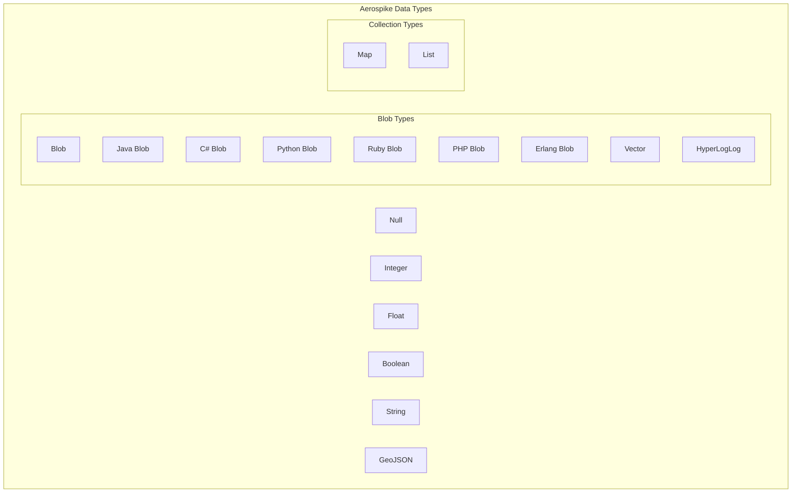
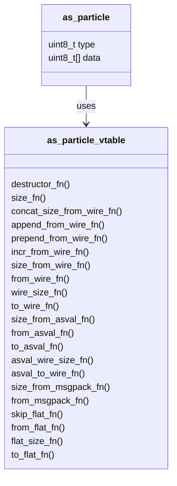
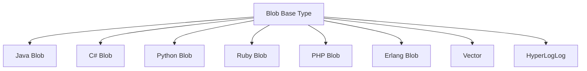
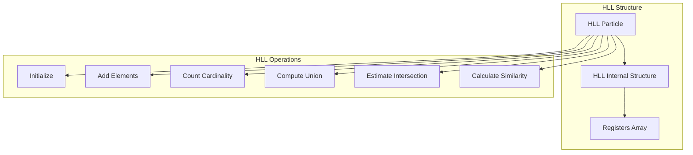
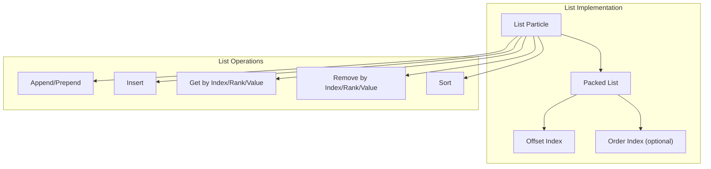
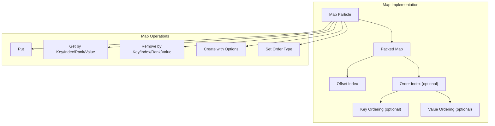
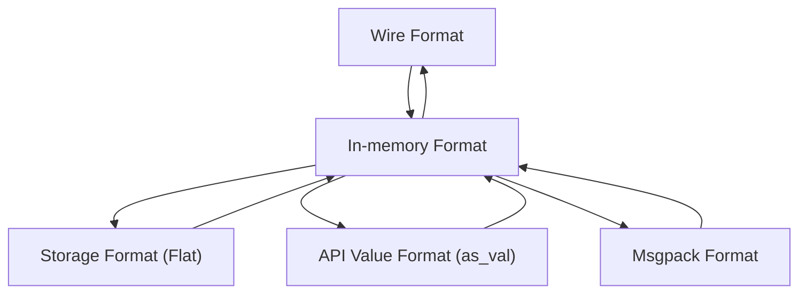
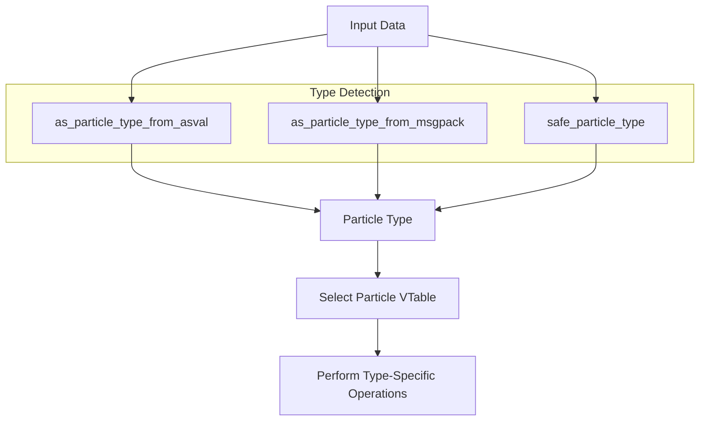
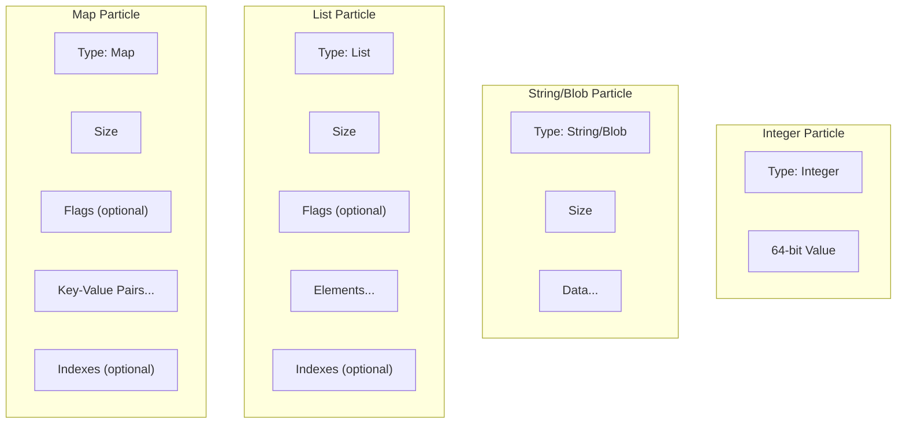
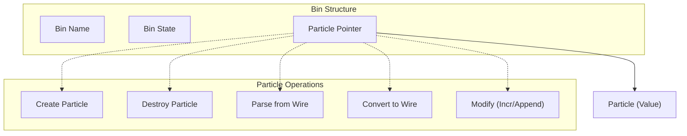

# Data Types

Relevant source files

The following files were used as context for generating this wiki page:

- [as/include/base/cdt.h](https://github.com/aerospike/aerospike-server/blob/8311b29d/as/include/base/cdt.h)
- [as/include/base/particle_blob.h](https://github.com/aerospike/aerospike-server/blob/8311b29d/as/include/base/particle_blob.h)
- [as/src/base/cdt.c](https://github.com/aerospike/aerospike-server/blob/8311b29d/as/src/base/cdt.c)
- [as/src/base/particle.c](https://github.com/aerospike/aerospike-server/blob/8311b29d/as/src/base/particle.c)
- [as/src/base/particle_blob.c](https://github.com/aerospike/aerospike-server/blob/8311b29d/as/src/base/particle_blob.c)
- [as/src/base/particle_hll.c](https://github.com/aerospike/aerospike-server/blob/8311b29d/as/src/base/particle_hll.c)
- [as/src/base/particle_list.c](https://github.com/aerospike/aerospike-server/blob/8311b29d/as/src/base/particle_list.c)
- [as/src/base/particle_map.c](https://github.com/aerospike/aerospike-server/blob/8311b29d/as/src/base/particle_map.c)

This document explains the data types supported by the Aerospike server, their internal representation, and how they are processed within the codebase. For information about how to use data types in client applications, refer to the client API documentation. For details on Collection Data Types (CDTs) implementation, see [Collection Data Types](#3.2.1).

## Overview of Aerospike Data Types

Aerospike supports a variety of data types that can be stored as values in bins. The server implements these types as "particles" - the internal representation of bin values. Each particle type has its own storage format, serialization methods, and operations.

Sources: [as/src/base/particle.c:67-86](https://github.com/aerospike/aerospike-server/blob/8311b29d/as/src/base/particle.c#L67-L86)

## Particle System

All data types in Aerospike are implemented using a common "particle" interface, which provides a consistent way to handle different types of data. Each particle type has a specific vtable (virtual function table) that defines how operations are performed on that type.

Sources: [as/src/base/particle.c:68-86](https://github.com/aerospike/aerospike-server/blob/8311b29d/as/src/base/particle.c#L68-L86), [as/include/base/particle_blob.h:32-61](https://github.com/aerospike/aerospike-server/blob/8311b29d/as/include/base/particle_blob.h#L32-L61)

## Basic Data Types

### Integer

Integers are stored as signed 64-bit values. They support basic arithmetic operations, including increment operations from client requests.

### Float

Float values are stored as 64-bit double-precision floating-point numbers.

### String

Strings are UTF-8 encoded character sequences. They support operations like append and prepend.

### Boolean

Boolean values are stored as simple true/false values.

Sources: [as/src/base/particle.c:98-113](https://github.com/aerospike/aerospike-server/blob/8311b29d/as/src/base/particle.c#L98-L113)

## Blob Data Types

The Blob type serves as a base for several specialized binary data types. All blob-based types share the same underlying implementation but have different type identifiers.

The blob-based data types include:

- **Blob**: Generic binary data
- **Java Blob**: Java-specific binary data
- **C# Blob**: C#-specific binary data
- **Python Blob**: Python-specific binary data
- **Ruby Blob**: Ruby-specific binary data
- **PHP Blob**: PHP-specific binary data
- **Erlang Blob**: Erlang-specific binary data
- **Vector**: Vector data
- **HyperLogLog**: Special structure for approximate counting (see below)

Sources: [as/src/base/particle_blob.c:54-96](https://github.com/aerospike/aerospike-server/blob/8311b29d/as/src/base/particle_blob.c#L54-L96), [as/src/base/particle_blob.c:231-293](https://github.com/aerospike/aerospike-server/blob/8311b29d/as/src/base/particle_blob.c#L231-L293)

## Specialized Data Types

### HyperLogLog (HLL)

HyperLogLog is a specialized data structure used for approximate cardinality counting. It allows efficient tracking of unique elements in a very large dataset with a fixed memory footprint. The HLL implementation in Aerospike includes operations for:

- Initialization
- Adding elements
- Counting unique elements
- Union operations
- Similarity estimation

HLL particles are based on the blob particle type but have their own specialized operations.

Sources: [as/src/base/particle_hll.c:70-96](https://github.com/aerospike/aerospike-server/blob/8311b29d/as/src/base/particle_hll.c#L70-L96), [as/src/base/particle_hll.c:109-124](https://github.com/aerospike/aerospike-server/blob/8311b29d/as/src/base/particle_hll.c#L109-L124)

### GeoJSON

GeoJSON is used for representing geographical data. It follows the GeoJSON standard format and supports geospatial queries and operations.

## Collection Data Types (CDTs)

Collection Data Types (CDTs) are complex data structures that can contain multiple values. Aerospike supports two CDTs: Lists and Maps.

### List

Lists are ordered collections that can contain elements of different types. They support various operations like append, prepend, insert, remove, get, and more specialized operations based on index, rank, or value.

The list implementation uses several internal structures:

- `packed_list`: The core structure for list operations
- `list_mem`: Memory representation of a list particle
- `offset_index`: Index for efficient element access
- `order_index`: For maintaining element order

Sources: [as/src/base/particle_list.c:82-108](https://github.com/aerospike/aerospike-server/blob/8311b29d/as/src/base/particle_list.c#L82-L108), [as/src/base/particle_list.c:119-133](https://github.com/aerospike/aerospike-server/blob/8311b29d/as/src/base/particle_list.c#L119-L133), [as/src/base/particle_list.c:177-187](https://github.com/aerospike/aerospike-server/blob/8311b29d/as/src/base/particle_list.c#L177-L187)

### Map

Maps are key-value collections where each key maps to a value. Maps support operations similar to lists, but with additional key-based operations. Maps can be ordered by key, value, or both.

The map implementation uses structures similar to lists:

- `packed_map`: Core structure for map operations
- `map_mem`: Memory representation of a map particle
- `offset_index`: Index for efficient element access
- `order_index`: For maintaining element order

Sources: [as/src/base/particle_map.c:81-107](https://github.com/aerospike/aerospike-server/blob/8311b29d/as/src/base/particle_map.c#L81-L107), [as/src/base/particle_map.c:126-133](https://github.com/aerospike/aerospike-server/blob/8311b29d/as/src/base/particle_map.c#L126-L133), [as/src/base/particle_map.c:213-232](https://github.com/aerospike/aerospike-server/blob/8311b29d/as/src/base/particle_map.c#L213-L232)

## Data Type Representation and Conversion

The Aerospike server needs to convert data between different representations:

1. **Wire Format**: How data is transmitted between client and server
2. **In-memory Format**: How data is represented in memory during operations
3. **Storage Format**: How data is stored on disk
4. **API Value Format**: How data is represented in the Aerospike API

Each particle type implements functions to handle these conversions:

1. **Wire Format Conversions**:
   - `size_from_wire_fn()`: Calculate size needed for a particle from wire format
   - `from_wire_fn()`: Create a particle from wire format data
   - `to_wire_fn()`: Convert a particle to wire format
   
2. **API Value Conversions** (as_val):
   - `size_from_asval_fn()`: Calculate size needed for a particle from an as_val
   - `from_asval_fn()`: Create a particle from an as_val
   - `to_asval_fn()`: Convert a particle to an as_val
   
3. **Storage Format Conversions**:
   - `from_flat_fn()`: Create a particle from flat (storage) format
   - `to_flat_fn()`: Convert a particle to flat format

Sources: [as/src/base/particle.c:285-593](https://github.com/aerospike/aerospike-server/blob/8311b29d/as/src/base/particle.c#L285-L593), [as/include/base/particle_blob.h:32-61](https://github.com/aerospike/aerospike-server/blob/8311b29d/as/include/base/particle_blob.h#L32-L61)

## Type Detection and Conversion

Aerospike can automatically detect the type of data from different sources:

- `as_particle_type_from_asval()`: Determine particle type from an as_val
- `as_particle_type_from_msgpack()`: Determine particle type from msgpack data
- `safe_particle_type()`: Validate and normalize a particle type

Sources: [as/src/base/particle.c:94-120](https://github.com/aerospike/aerospike-server/blob/8311b29d/as/src/base/particle.c#L94-L120), [as/src/base/particle.c:127-191](https://github.com/aerospike/aerospike-server/blob/8311b29d/as/src/base/particle.c#L127-L191)

## Particle Memory Layout

The memory layout for particles varies by type. Some types (like integers) store values directly in the particle structure, while others (like strings, blobs, and collections) store a header followed by the actual data.

Basic particles like integers and booleans have simple memory layouts with a type identifier and the value itself. More complex types like strings, blobs, and collections include additional information such as size and potentially metadata like indexes.

Sources: [as/src/base/particle_blob.c:87-92](https://github.com/aerospike/aerospike-server/blob/8311b29d/as/src/base/particle_blob.c#L87-L92), [as/src/base/particle_list.c:146-151](https://github.com/aerospike/aerospike-server/blob/8311b29d/as/src/base/particle_list.c#L146-L151), [as/src/base/particle_map.c:176-180](https://github.com/aerospike/aerospike-server/blob/8311b29d/as/src/base/particle_map.c#L176-L180), [as/src/base/particle_hll.c:104-116](https://github.com/aerospike/aerospike-server/blob/8311b29d/as/src/base/particle_hll.c#L104-L116)

## Bin-Particle Relationship

Bins in Aerospike are containers that hold particles. A bin has metadata (like name and state) and points to a particle that contains the actual value.

When operations are performed on a bin, the appropriate particle functions are called based on the particle's type.

Sources: [as/src/base/particle.c:265-406](https://github.com/aerospike/aerospike-server/blob/8311b29d/as/src/base/particle.c#L265-L406)

## Summary

Aerospike's data type system provides a flexible foundation for storing and manipulating various types of data. The particle-based architecture allows for consistent handling of different data types while supporting type-specific optimizations and operations. The system handles conversions between different representations (wire, memory, storage, API) seamlessly through a well-defined interface.