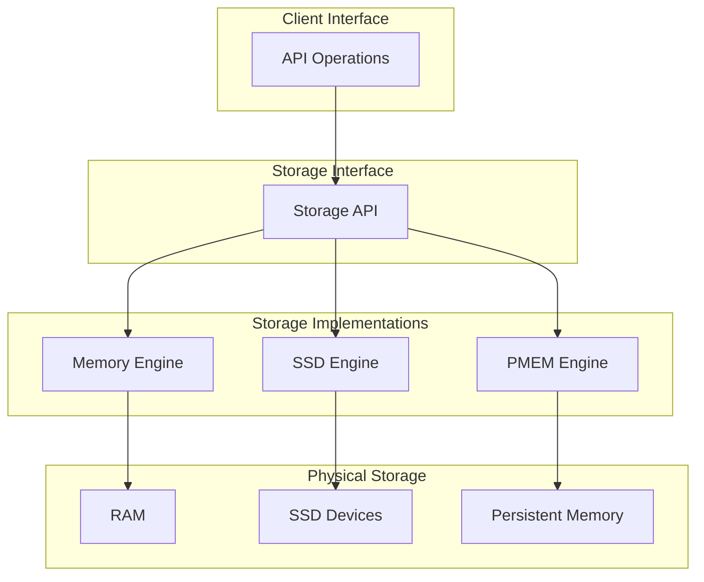
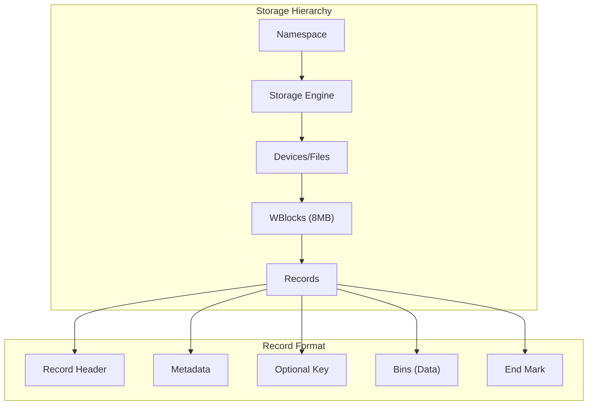
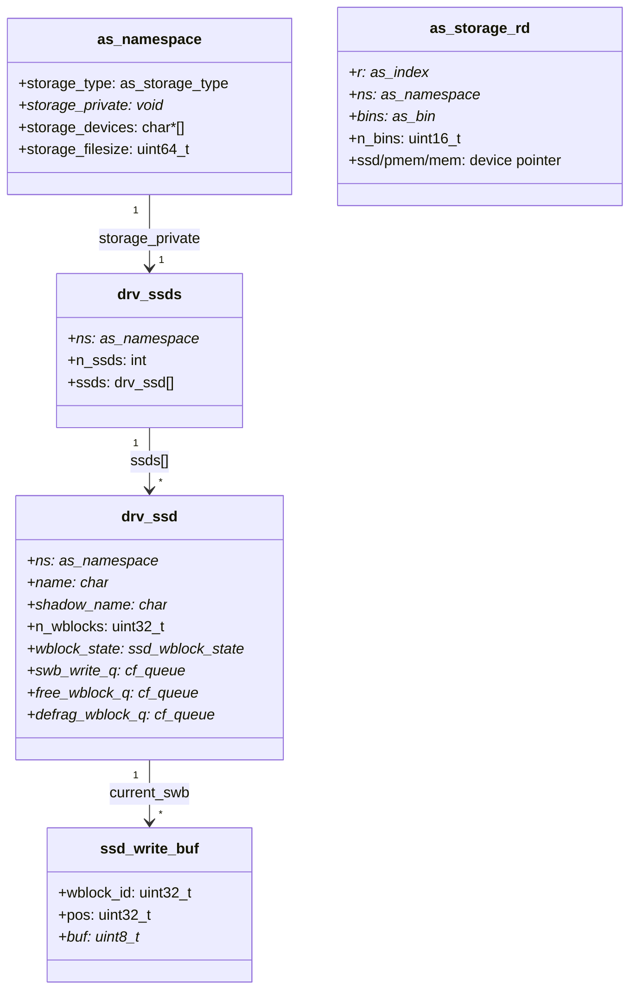
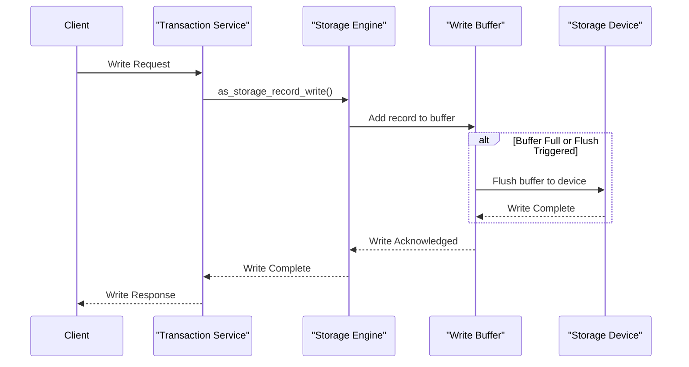
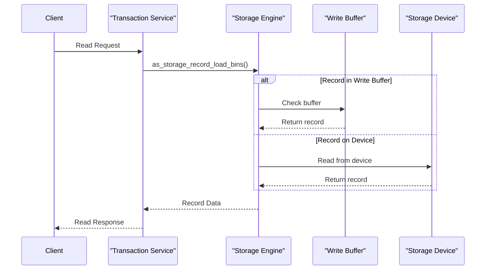
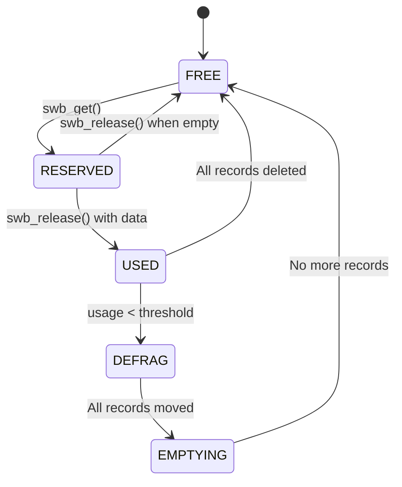
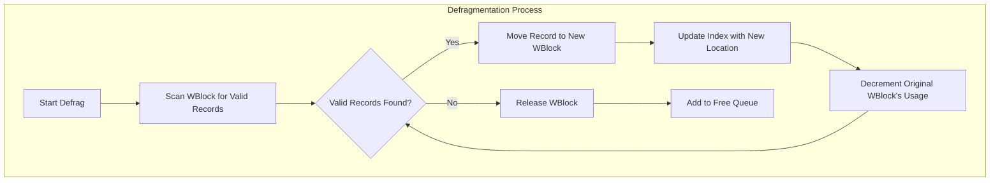
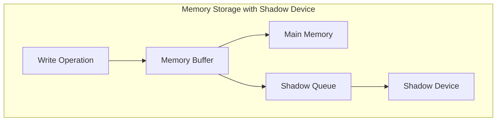
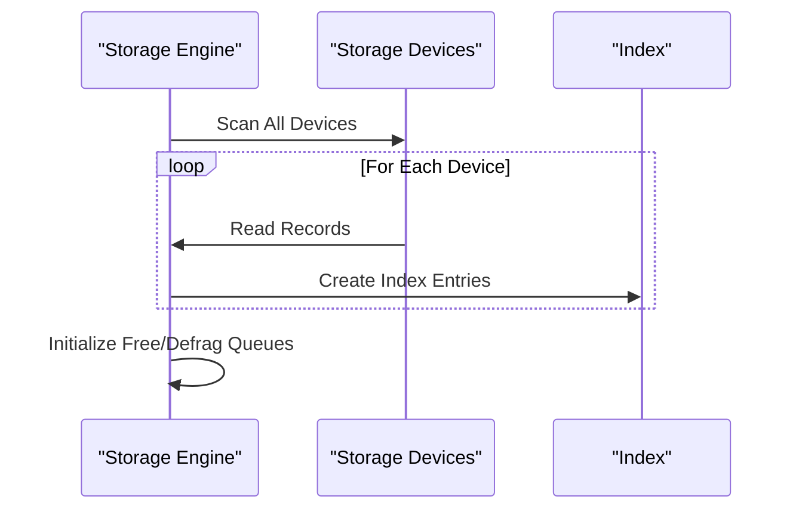

# Storage Engine

Relevant source files

The following files were used as context for generating this wiki page:

- [as/include/storage/drv_common.h](https://github.com/aerospike/aerospike-server/blob/8311b29d/as/include/storage/drv_common.h)
- [as/include/storage/drv_mem.h](https://github.com/aerospike/aerospike-server/blob/8311b29d/as/include/storage/drv_mem.h)
- [as/include/storage/drv_ssd.h](https://github.com/aerospike/aerospike-server/blob/8311b29d/as/include/storage/drv_ssd.h)
- [as/include/storage/storage.h](https://github.com/aerospike/aerospike-server/blob/8311b29d/as/include/storage/storage.h)
- [as/src/base/cfg_info.c](https://github.com/aerospike/aerospike-server/blob/8311b29d/as/src/base/cfg_info.c)
- [as/src/base/namespace.c](https://github.com/aerospike/aerospike-server/blob/8311b29d/as/src/base/namespace.c)
- [as/src/base/nsup.c](https://github.com/aerospike/aerospike-server/blob/8311b29d/as/src/base/nsup.c)
- [as/src/storage/drv_mem.c](https://github.com/aerospike/aerospike-server/blob/8311b29d/as/src/storage/drv_mem.c)
- [as/src/storage/drv_mem_ce.c](https://github.com/aerospike/aerospike-server/blob/8311b29d/as/src/storage/drv_mem_ce.c)
- [as/src/storage/drv_ssd.c](https://github.com/aerospike/aerospike-server/blob/8311b29d/as/src/storage/drv_ssd.c)
- [as/src/storage/drv_ssd_ce.c](https://github.com/aerospike/aerospike-server/blob/8311b29d/as/src/storage/drv_ssd_ce.c)
- [as/src/storage/storage.c](https://github.com/aerospike/aerospike-server/blob/8311b29d/as/src/storage/storage.c)

The Aerospike Storage Engine is responsible for the persistent storage and retrieval of record data. It provides an abstraction layer that allows Aerospike to support multiple storage backends while maintaining a consistent interface for the rest of the system. This page describes the architecture, components, and operation of the Aerospike storage subsystem.

For information about specific record formats, see [Data Model](#3).

## Storage Engine Types

Aerospike supports three distinct storage engines:

1. **Memory** - Records stored primarily in RAM with optional persistence to disk
2. **SSD** - Records stored directly on solid-state drives
3. **PMEM** - Records stored in persistent memory (Enterprise Edition feature)

Each namespace in Aerospike is configured to use one of these storage engines. Different namespaces in the same cluster can use different storage engines.

Sources: [as/include/storage/storage.h:55-66](https://github.com/aerospike/aerospike-server/blob/8311b29d/as/include/storage/storage.h#L55-L66), [as/src/storage/storage.c:60-85](https://github.com/aerospike/aerospike-server/blob/8311b29d/as/src/storage/storage.c#L60-L85)

## Storage Engine Architecture

Aerospike uses a pluggable storage engine architecture where each storage type implements a common interface defined in the storage API. This allows consistent behavior regardless of the underlying storage medium.

### Common Components

All storage engines share several core concepts:

1. **Namespaces** - Logical containers for data with their own storage configuration
2. **WBlocks** - Fixed-size (8MB) blocks for storing records
3. **Write Buffers** - In-memory buffers where records accumulate before being written to storage
4. **Defragmentation** - Process of reclaiming space from partially used blocks

Sources: [as/include/storage/drv_common.h:73-76](https://github.com/aerospike/aerospike-server/blob/8311b29d/as/include/storage/drv_common.h#L73-L76), [as/include/storage/storage.h:71-76](https://github.com/aerospike/aerospike-server/blob/8311b29d/as/include/storage/storage.h#L71-L76)

### Key Data Structures

Sources: [as/include/storage/drv_ssd.h:115-197](https://github.com/aerospike/aerospike-server/blob/8311b29d/as/include/storage/drv_ssd.h#L115-L197), [as/include/storage/storage.h:107-157](https://github.com/aerospike/aerospike-server/blob/8311b29d/as/include/storage/storage.h#L107-L157)

## Record Storage Process

### Write Path

When a record is written to storage, the following process occurs:

1. The appropriate storage engine is selected based on the namespace
2. A write buffer is allocated or reused from a pool
3. The record is serialized to the "flat" format 
4. The record is copied into the write buffer
5. When the buffer is full or flushed:
   - For Memory: The data is kept in memory and optionally written to shadow device
   - For SSD: The buffer is written to the SSD device
   - For PMEM: The buffer is persisted to persistent memory

Sources: [as/src/storage/drv_ssd.c:448-496](https://github.com/aerospike/aerospike-server/blob/8311b29d/as/src/storage/drv_ssd.c#L448-L496), [as/src/storage/storage.c:1080-1095](https://github.com/aerospike/aerospike-server/blob/8311b29d/as/src/storage/storage.c#L1080-L1095)

### Read Path

When a record is read from storage:

1. The storage engine retrieves record metadata from the index
2. The physical location (device, offset) is determined
3. If the record is in a write buffer, it's read directly from there
4. Otherwise, it's read from the physical storage device
5. The record is deserialized from the "flat" format

Sources: [as/src/storage/drv_ssd.c:1160-1319](https://github.com/aerospike/aerospike-server/blob/8311b29d/as/src/storage/drv_ssd.c#L1160-L1319), [as/src/storage/storage.c:1046-1080](https://github.com/aerospike/aerospike-server/blob/8311b29d/as/src/storage/storage.c#L1046-L1080)

## Write Buffer Management

Write buffers are a critical component of the storage engine, serving as an intermediary between memory and persistent storage.

### Write Buffer States

Each write buffer can be in one of several states:

1. **Current** - Being actively written to
2. **Flushing** - In the process of being written to storage
3. **Free** - Available for reuse

Each device maintains multiple queues for write buffers:
- `swb_write_q` - Buffers ready to be written to storage
- `swb_free_q` - Buffers available for reuse
- `post_write_q` - Buffers that have been written but are kept for caching (SSD only)

### WBlock Management

Storage is organized into fixed-size blocks called WBlocks (8MB by default). Each WBlock can be in one of several states:

1. **FREE** - Available for writing
2. **RESERVED** - Currently being written to
3. **USED** - Contains data but not full
4. **DEFRAG** - Being defragmented
5. **EMPTYING** - In the process of being freed

Sources: [as/src/storage/drv_ssd.c:401-445](https://github.com/aerospike/aerospike-server/blob/8311b29d/as/src/storage/drv_ssd.c#L401-L445), [as/include/storage/drv_common.h:167-171](https://github.com/aerospike/aerospike-server/blob/8311b29d/as/include/storage/drv_common.h#L167-L171)

## Defragmentation

As records are deleted or updated, WBlocks become partially filled with a mix of live and deleted records. Since each WBlock is a fixed size, this creates fragmentation, reducing storage efficiency.

### Defragmentation Process

1. WBlocks with usage below a configured threshold (`defrag_lwm_pct`) are added to a defrag queue
2. A defrag thread:
   - Reads valid records from these WBlocks
   - Writes them to new WBlocks
   - Marks the old WBlock as free once all valid records are moved
3. The freed WBlocks can then be reused for new data

Sources: [as/src/storage/drv_ssd.c:744-858](https://github.com/aerospike/aerospike-server/blob/8311b29d/as/src/storage/drv_ssd.c#L744-L858), [as/src/storage/drv_ssd.c:863-893](https://github.com/aerospike/aerospike-server/blob/8311b29d/as/src/storage/drv_ssd.c#L863-L893)

## Shadow Devices

The Memory storage engine can be configured with shadow devices, which provide persistence for in-memory data.

### Shadow Device Operation

1. Data is primarily stored in memory for fast access
2. Write buffers are also written to shadow devices for persistence
3. On restart, data can be loaded from shadow devices

This provides a balance between the performance of in-memory storage and the durability of persistent storage.

Sources: [as/src/storage/drv_mem.c:485-487](https://github.com/aerospike/aerospike-server/blob/8311b29d/as/src/storage/drv_mem.c#L485-L487), [as/src/storage/drv_mem.c:186-189](https://github.com/aerospike/aerospike-server/blob/8311b29d/as/src/storage/drv_mem.c#L186-L189)

## Cold Start and Warm Restart

### Cold Start

When Aerospike starts with empty indexes:

1. The storage engine scans all devices
2. Records are read and added to the index
3. Metadata like TTL and generation are preserved

### Warm Restart

When starting with persisted indexes:

1. The index is loaded from persistence
2. Storage devices are connected to the loaded index
3. This significantly reduces startup time

Sources: [as/src/storage/storage.c:109-164](https://github.com/aerospike/aerospike-server/blob/8311b29d/as/src/storage/storage.c#L109-L164), [as/src/storage/drv_ssd.c:873-893](https://github.com/aerospike/aerospike-server/blob/8311b29d/as/src/storage/drv_ssd.c#L873-L893)

## Configuration 

Key storage engine configuration parameters include:

| Parameter | Description | Default |
|-----------|-------------|---------|
| `storage-engine` | Storage engine type (memory, pmem, device) | - |
| `filesize` | Size of each data file for file-backed storage | - |
| `write-block-size` | Size of write blocks | 8MB |
| `defrag-lwm-pct` | Low water mark for defragmentation | 50% |
| `max-write-cache` | Maximum write cache size | 64MB |
| `flush-max-ms` | Maximum time before flushing inactive write buffer | 1000ms |
| `commit-to-device` | For memory storage, flush to device on transaction commit | false |

Sources: [as/src/base/cfg_info.c:486-487](https://github.com/aerospike/aerospike-server/blob/8311b29d/as/src/base/cfg_info.c#L486-L487), [as/src/base/namespace.c:131-140](https://github.com/aerospike/aerospike-server/blob/8311b29d/as/src/base/namespace.c#L131-L140)

## Performance Considerations

1. **Write Buffer Size**: Larger write buffers result in fewer, larger I/O operations but may increase latency
2. **Defragmentation**: Aggressive defragmentation recovers space more quickly but consumes more CPU and I/O resources
3. **Shadow Devices**: Provide durability for memory storage at the cost of additional I/O
4. **Direct I/O**: SSD storage uses direct I/O to bypass the operating system page cache for predictable performance