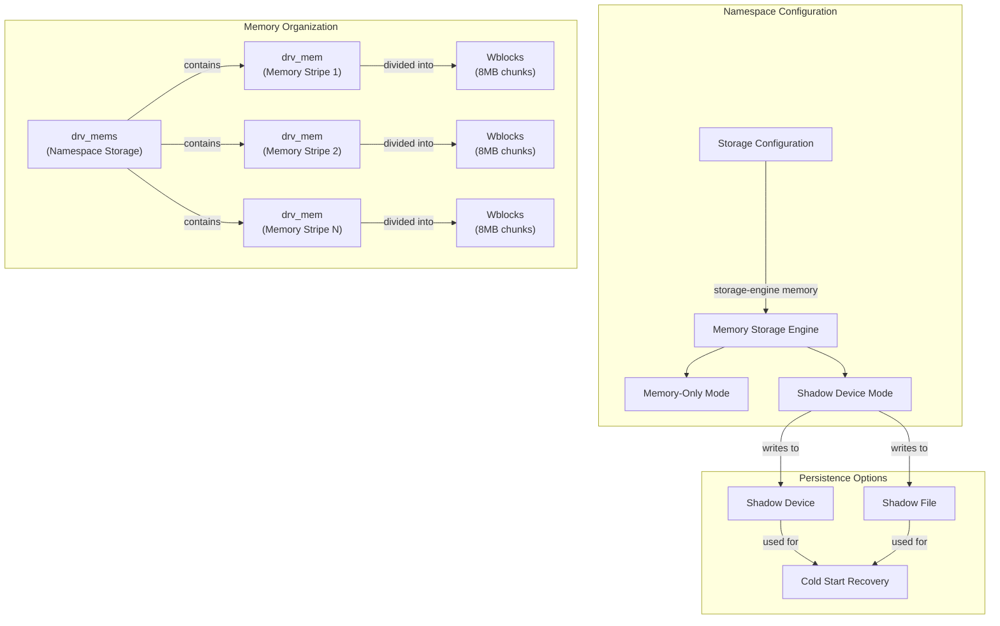
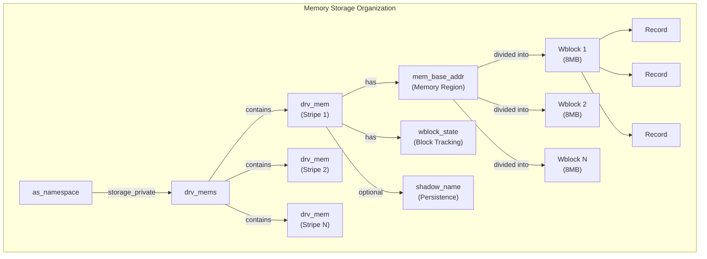
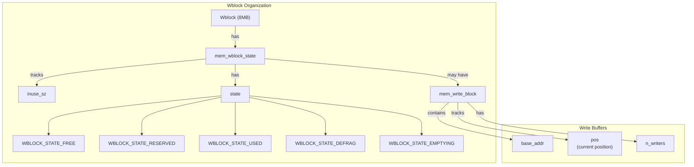
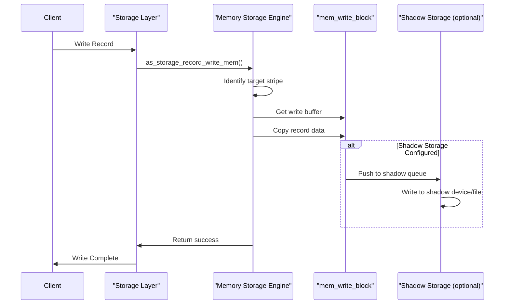
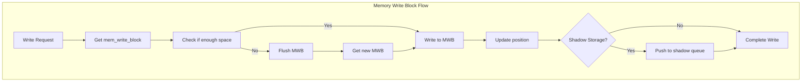
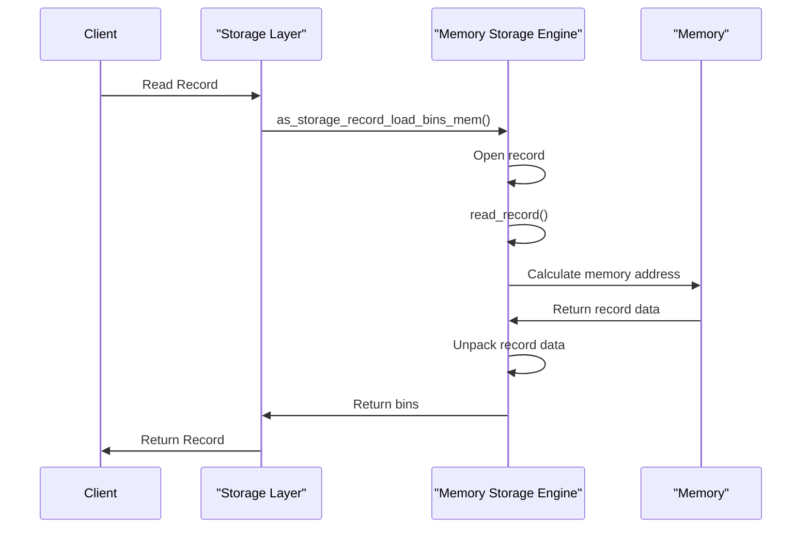
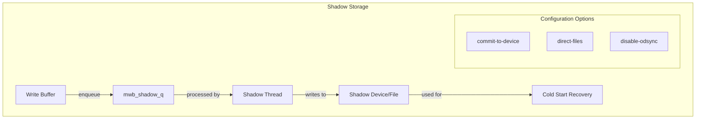
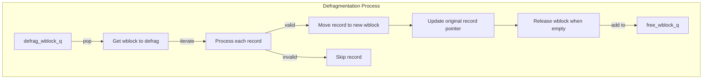
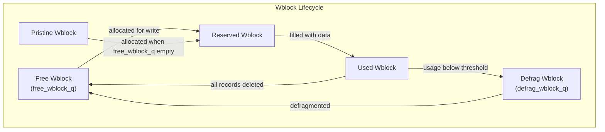
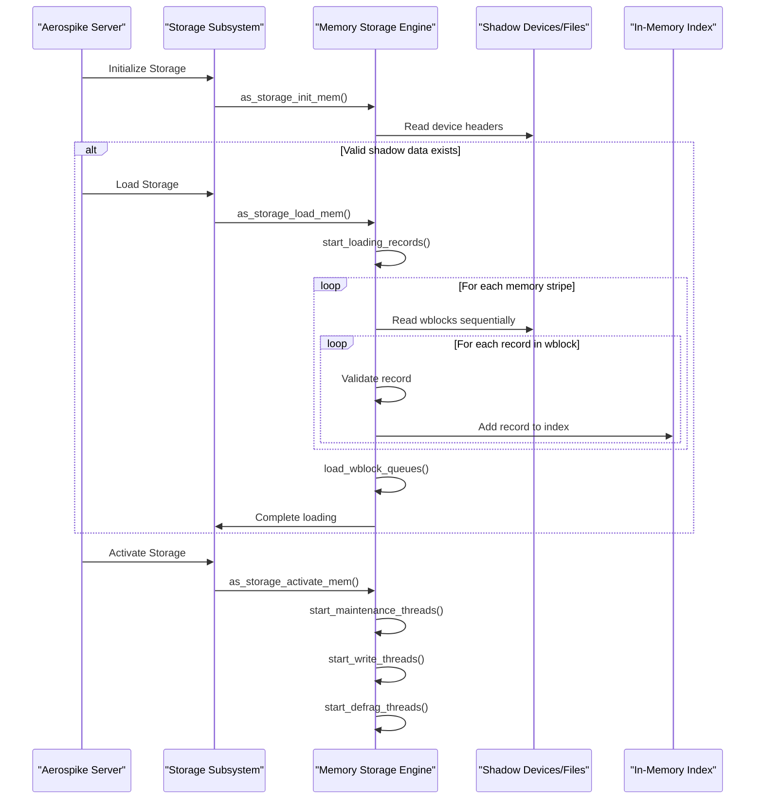

# Memory Storage

Relevant source files

The following files were used as context for generating this wiki page:

- [as/include/storage/drv_common.h](https://github.com/aerospike/aerospike-server/blob/8311b29d/as/include/storage/drv_common.h)
- [as/include/storage/drv_mem.h](https://github.com/aerospike/aerospike-server/blob/8311b29d/as/include/storage/drv_mem.h)
- [as/include/storage/drv_ssd.h](https://github.com/aerospike/aerospike-server/blob/8311b29d/as/include/storage/drv_ssd.h)
- [as/include/storage/storage.h](https://github.com/aerospike/aerospike-server/blob/8311b29d/as/include/storage/storage.h)
- [as/src/base/cfg_info.c](https://github.com/aerospike/aerospike-server/blob/8311b29d/as/src/base/cfg_info.c)
- [as/src/base/namespace.c](https://github.com/aerospike/aerospike-server/blob/8311b29d/as/src/base/namespace.c)
- [as/src/base/nsup.c](https://github.com/aerospike/aerospike-server/blob/8311b29d/as/src/base/nsup.c)
- [as/src/storage/drv_mem.c](https://github.com/aerospike/aerospike-server/blob/8311b29d/as/src/storage/drv_mem.c)
- [as/src/storage/drv_mem_ce.c](https://github.com/aerospike/aerospike-server/blob/8311b29d/as/src/storage/drv_mem_ce.c)
- [as/src/storage/drv_ssd.c](https://github.com/aerospike/aerospike-server/blob/8311b29d/as/src/storage/drv_ssd.c)
- [as/src/storage/drv_ssd_ce.c](https://github.com/aerospike/aerospike-server/blob/8311b29d/as/src/storage/drv_ssd_ce.c)
- [as/src/storage/storage.c](https://github.com/aerospike/aerospike-server/blob/8311b29d/as/src/storage/storage.c)

This document describes the Memory Storage engine implementation in Aerospike, which maintains record data entirely in memory with optional persistence to disk. For information about persistent storage engines, see [SSD Storage](#4.2) and [PMEM Storage](#4.3).

## Overview

The memory storage engine in Aerospike provides a high-performance option where all record data is stored in memory, with optional disk persistence through shadow devices or files. It's organized into wblocks (write blocks) - fixed-size segments of memory that contain records and their metadata. When configured with shadow storage, the memory storage engine can survive restarts by loading data from these shadow devices/files.

Sources:
- [as/include/storage/storage.h:55-67](https://github.com/aerospike/aerospike-server/blob/8311b29d/as/include/storage/storage.h#L55-L67)
- [as/include/storage/drv_mem.h:69-192](https://github.com/aerospike/aerospike-server/blob/8311b29d/as/include/storage/drv_mem.h#L69-L192)
- [as/src/storage/drv_mem.c:78-101](https://github.com/aerospike/aerospike-server/blob/8311b29d/as/src/storage/drv_mem.c#L78-L101)

## Memory Organization

### Memory Stripes

The memory storage engine organizes data into "stripes" (logical memory regions), with each stripe represented by a `drv_mem` object. Each namespace's memory storage is managed by a `drv_mems` object, which contains an array of `drv_mem` stripes.

When distributing records across stripes, Aerospike uses the record digest to determine which stripe a record belongs to, ensuring an even distribution across stripes.

Sources:
- [as/include/storage/drv_mem.h:69-83](https://github.com/aerospike/aerospike-server/blob/8311b29d/as/include/storage/drv_mem.h#L69-L83)
- [as/include/storage/drv_mem.h:103-170](https://github.com/aerospike/aerospike-server/blob/8311b29d/as/include/storage/drv_mem.h#L103-L170)
- [as/include/storage/drv_mem.h:173-192](https://github.com/aerospike/aerospike-server/blob/8311b29d/as/include/storage/drv_mem.h#L173-L192)
- [as/src/storage/drv_mem.c:195-204](https://github.com/aerospike/aerospike-server/blob/8311b29d/as/src/storage/drv_mem.c#L195-L204)

### Write Blocks

Memory is organized into wblocks (write blocks), which are fixed-size segments (typically 8MB) that contain records and their metadata. Each wblock has an associated state that tracks:

- `inuse_sz`: The number of bytes currently used in the wblock
- `state`: The current state of the wblock (free, reserved, used, defrag, emptying)
- `mwb`: A pointer to the mem_write_block if the wblock is being written to
- `n_vac_dests`: Number of wblocks into which this wblock has been defragmented

Sources:
- [as/include/storage/drv_common.h:166-172](https://github.com/aerospike/aerospike-server/blob/8311b29d/as/include/storage/drv_common.h#L166-L172)
- [as/include/storage/drv_mem.h:84-91](https://github.com/aerospike/aerospike-server/blob/8311b29d/as/include/storage/drv_mem.h#L84-L91)
- [as/src/storage/drv_mem.c:1076-1097](https://github.com/aerospike/aerospike-server/blob/8311b29d/as/src/storage/drv_mem.c#L1076-L1097)

## Write Path

The write process in memory storage follows these steps:

1. An `as_storage_rd` (storage read/write descriptor) is created for the record
2. The appropriate memory stripe is identified based on the record's digest
3. A write buffer (`mem_write_block`) is allocated or reused
4. The record data is copied to the write buffer
5. If shadow devices/files are configured, the data is queued to be written to disk

Sources:
- [as/src/storage/drv_mem.c:222-250](https://github.com/aerospike/aerospike-server/blob/8311b29d/as/src/storage/drv_mem.c#L222-L250)
- [as/src/storage/drv_mem.c:427-665](https://github.com/aerospike/aerospike-server/blob/8311b29d/as/src/storage/drv_mem.c#L427-L665)
- [as/src/storage/storage.c:305-322](https://github.com/aerospike/aerospike-server/blob/8311b29d/as/src/storage/storage.c#L305-L322)

### Memory Write Blocks

The `mem_write_block` (MWB) is a critical structure in the memory storage engine. It represents a buffer where records are accumulated until committed to storage. Each MWB is associated with a specific wblock and tracks:

- Current position (`pos`)
- Number of concurrent writers (`n_writers`)
- Wblock ID it's associated with
- Memory address (`base_addr`)
- List of vacated wblocks (for defragmentation tracking)

Sources:
- [as/include/storage/drv_mem.h:69-83](https://github.com/aerospike/aerospike-server/blob/8311b29d/as/include/storage/drv_mem.h#L69-L83)
- [as/src/storage/drv_mem.c:174-187](https://github.com/aerospike/aerospike-server/blob/8311b29d/as/src/storage/drv_mem.c#L174-L187)
- [as/src/storage/drv_mem.c:427-452](https://github.com/aerospike/aerospike-server/blob/8311b29d/as/src/storage/drv_mem.c#L427-L452)

## Read Path

The read process retrieves record data from memory:

1. An `as_storage_rd` is created for the record
2. The appropriate memory stripe is identified based on the record's file_id
3. The record's location in memory is calculated from its `rblock_id`
4. The record data is read directly from memory
5. Record data is unpacked and returned

Sources:
- [as/src/storage/drv_mem.c:519-573](https://github.com/aerospike/aerospike-server/blob/8311b29d/as/src/storage/drv_mem.c#L519-L573)
- [as/src/storage/drv_mem.c:143-173](https://github.com/aerospike/aerospike-server/blob/8311b29d/as/src/storage/drv_mem.c#L143-L173)

## Persistence Options

The memory storage engine supports two persistence options:

1. **Memory-Only Mode**: Data exists only in memory with no persistence
2. **Shadow Mode**: Data is written to shadow devices or files for persistence

In shadow mode, writes are buffered in memory and then asynchronously written to the shadow storage. This allows for recovery after a restart through a "cold start" process.

### Shadow Storage

Shadow storage can be either devices (raw block devices) or files. The shadow writes are managed by a dedicated shadow thread that processes the `mwb_shadow_q` queue, writing buffers to the shadow storage.

Sources:
- [as/src/storage/drv_mem.c:148-170](https://github.com/aerospike/aerospike-server/blob/8311b29d/as/src/storage/drv_mem.c#L148-L170)
- [as/src/storage/drv_mem.c:222-232](https://github.com/aerospike/aerospike-server/blob/8311b29d/as/src/storage/drv_mem.c#L222-L232)
- [as/src/storage/drv_mem.c:237-250](https://github.com/aerospike/aerospike-server/blob/8311b29d/as/src/storage/drv_mem.c#L237-L250)

## Maintenance Operations

The memory storage engine has several maintenance operations to ensure efficient operation:

### Defragmentation

Defragmentation is the process of reclaiming space from partially empty wblocks. It works by:

1. Identifying wblocks with usage below a threshold (`storage-engine.defrag-lwm-pct`)
2. Moving valid records to new wblocks
3. Freeing the original wblocks when all valid records have been moved

Sources:
- [as/src/storage/drv_mem.c:894-940](https://github.com/aerospike/aerospike-server/blob/8311b29d/as/src/storage/drv_mem.c#L894-L940)
- [as/src/storage/drv_mem.c:158-173](https://github.com/aerospike/aerospike-server/blob/8311b29d/as/src/storage/drv_mem.c#L158-L173)

### Free Block Management

Wblocks are managed through several queues:

- `free_wblock_q`: Queue of free wblocks available for allocation
- `defrag_wblock_q`: Queue of wblocks that need defragmentation
- Pristine wblocks: Wblocks that have never been used (tracked by `pristine_wblock_id`)

When a write buffer needs a new wblock, it first tries to get one from the `free_wblock_q`. If none are available, it uses a pristine wblock.

Sources:
- [as/src/storage/drv_mem.c:178-213](https://github.com/aerospike/aerospike-server/blob/8311b29d/as/src/storage/drv_mem.c#L178-L213)
- [as/src/storage/drv_mem.c:547-570](https://github.com/aerospike/aerospike-server/blob/8311b29d/as/src/storage/drv_mem.c#L547-L570)

## Configuration

The memory storage engine has several configuration parameters to control its behavior:

| Parameter | Description | Default |
|-----------|-------------|---------|
| `storage-engine memory` | Configure namespace to use memory storage | - |
| `storage-engine.file` | Shadow file path | - |
| `storage-engine.filesize` | Size of each file | - |
| `storage-engine.device` | Shadow device path | - |
| `storage-engine.commit-to-device` | Write data synchronously to shadow device | false |
| `storage-engine.data-size` | Size of data in memory | - |
| `storage-engine.defrag-lwm-pct` | Low water mark for defragmentation | 50 |
| `storage-engine.defrag-queue-min` | Minimum number of wblocks in defrag queue | 0 |
| `storage-engine.defrag-sleep` | Microseconds to sleep between defragging wblocks | 1000 |
| `storage-engine.direct-files` | Use O_DIRECT when accessing shadow files | false |
| `storage-engine.disable-odsync` | Disable O_DSYNC when accessing shadow files | false |
| `storage-engine.encrypt-*` | Encryption-related settings | - |
| `storage-engine.evict-used-pct` | Eviction threshold based on used memory percentage | - |
| `storage-engine.flush-max-ms` | Maximum flush wait time in milliseconds | 1000 |
| `storage-engine.max-write-cache` | Maximum write cache size in bytes | 64M |
| `storage-engine.stop-writes-avail-pct` | Stop writes when available memory goes below this percentage | 5 |
| `storage-engine.stop-writes-used-pct` | Stop writes when used memory exceeds this percentage | 70 |

Sources:
- [as/src/base/cfg_info.c:487-492](https://github.com/aerospike/aerospike-server/blob/8311b29d/as/src/base/cfg_info.c#L487-L492)
- [as/src/base/cfg_info.c:499-533](https://github.com/aerospike/aerospike-server/blob/8311b29d/as/src/base/cfg_info.c#L499-L533)
- [as/src/storage/drv_mem.c:248-282](https://github.com/aerospike/aerospike-server/blob/8311b29d/as/src/storage/drv_mem.c#L248-L282)

## Cold Start and Recovery

When Aerospike starts with memory storage configured with shadow devices or files, it performs a "cold start" process to load data from the shadow storage into memory. This involves:

1. Reading device headers to check for valid data
2. Scanning each wblock for valid records
3. Adding these records to the in-memory index
4. Re-establishing the state of all wblocks

Sources:
- [as/src/storage/drv_mem.c:335-386](https://github.com/aerospike/aerospike-server/blob/8311b29d/as/src/storage/drv_mem.c#L335-L386)
- [as/src/storage/drv_mem.c:137-173](https://github.com/aerospike/aerospike-server/blob/8311b29d/as/src/storage/drv_mem.c#L137-L173)
- [as/src/storage/storage.c:85-113](https://github.com/aerospike/aerospike-server/blob/8311b29d/as/src/storage/storage.c#L85-L113)

## Summary

The Memory Storage engine in Aerospike provides a high-performance option for storing record data entirely in memory, with optional persistence to shadow devices or files. It organizes memory into fixed-size wblocks, manages them through various queues, and provides mechanisms for defragmentation and efficient space utilization.

Key components include:
- Memory organization through stripes (`drv_mem`) and wblocks
- Write buffers (`mem_write_block`) for accumulating records
- Shadow storage for persistence and recovery
- Maintenance operations like defragmentation to reclaim space