# SSD Storage

Relevant source files

The following files were used as context for generating this wiki page:

- [as/include/storage/drv_common.h](https://github.com/aerospike/aerospike-server/blob/8311b29d/as/include/storage/drv_common.h)
- [as/include/storage/drv_mem.h](https://github.com/aerospike/aerospike-server/blob/8311b29d/as/include/storage/drv_mem.h)
- [as/include/storage/drv_ssd.h](https://github.com/aerospike/aerospike-server/blob/8311b29d/as/include/storage/drv_ssd.h)
- [as/src/storage/drv_mem.c](https://github.com/aerospike/aerospike-server/blob/8311b29d/as/src/storage/drv_mem.c)
- [as/src/storage/drv_mem_ce.c](https://github.com/aerospike/aerospike-server/blob/8311b29d/as/src/storage/drv_mem_ce.c)
- [as/src/storage/drv_ssd.c](https://github.com/aerospike/aerospike-server/blob/8311b29d/as/src/storage/drv_ssd.c)
- [as/src/storage/drv_ssd_ce.c](https://github.com/aerospike/aerospike-server/blob/8311b29d/as/src/storage/drv_ssd_ce.c)

This document explains the SSD storage engine implementation in Aerospike Server. It covers how data is organized, written, read, and defragmented on SSD devices. For information about memory-based storage, see [Memory Storage](#4.1).

## Overview

The SSD storage engine provides persistence for Aerospike by efficiently managing data on solid-state drives. It is designed for high-throughput and low-latency operations while maximizing SSD lifespan through techniques like write coalescing and defragmentation.

Sources: [as/src/storage/drv_ssd.c:1-75](https://github.com/aerospike/aerospike-server/blob/8311b29d/as/src/storage/drv_ssd.c#L1-L75), [as/include/storage/drv_ssd.h:1-47](https://github.com/aerospike/aerospike-server/blob/8311b29d/as/include/storage/drv_ssd.h#L1-L47)

## Storage Architecture

### Block Structure

Aerospike's SSD storage is organized into several layers of blocks:

1. **Device** - The entire SSD device
2. **Wblock (Write Block)** - Fixed-size chunks of the device (typically 1MB)
3. **Rblock (Record Block)** - Smaller units (128 bytes) used to store record data

#### Diagram: SSD Storage Block Hierarchy

Sources: [as/include/storage/drv_common.h:74-76](https://github.com/aerospike/aerospike-server/blob/8311b29d/as/include/storage/drv_common.h#L74-L76), [as/include/storage/drv_common.h:79-80](https://github.com/aerospike/aerospike-server/blob/8311b29d/as/include/storage/drv_common.h#L79-L80)

### Key Components

#### Diagram: SSD Storage Components

Sources: [as/include/storage/drv_ssd.h:71-84](https://github.com/aerospike/aerospike-server/blob/8311b29d/as/include/storage/drv_ssd.h#L71-L84), [as/include/storage/drv_ssd.h:90-97](https://github.com/aerospike/aerospike-server/blob/8311b29d/as/include/storage/drv_ssd.h#L90-L97), [as/include/storage/drv_ssd.h:115-197](https://github.com/aerospike/aerospike-server/blob/8311b29d/as/include/storage/drv_ssd.h#L115-L197), [as/include/storage/drv_ssd.h:203-222](https://github.com/aerospike/aerospike-server/blob/8311b29d/as/include/storage/drv_ssd.h#L203-L222)

## Wblock States and Lifecycle

Wblocks (write blocks) can exist in several states that determine how they're managed:

| State | Value | Description |
| ----- | ----- | ----------- |
| `WBLOCK_STATE_FREE` | 0 | Available for writing new data |
| `WBLOCK_STATE_RESERVED` | 1 | Currently assigned to a write buffer |
| `WBLOCK_STATE_USED` | 2 | Contains active data |
| `WBLOCK_STATE_DEFRAG` | 3 | Marked for defragmentation |
| `WBLOCK_STATE_EMPTYING` | 4 | Being evacuated during defragmentation |

Sources: [as/include/storage/drv_common.h:167-171](https://github.com/aerospike/aerospike-server/blob/8311b29d/as/include/storage/drv_common.h#L167-L171)

### Write Buffer Management

Aerospike uses write buffers (`ssd_write_buf` or `swb`) to accumulate writes before flushing them to disk. This improves performance by coalescing multiple small writes into fewer, larger I/O operations.

Sources: [as/src/storage/drv_ssd.c:338-462](https://github.com/aerospike/aerospike-server/blob/8311b29d/as/src/storage/drv_ssd.c#L338-L462)

## Write Path

### Diagram: SSD Write Flow

The write process involves:

1. Getting a write buffer (`ssd_write_buf`) from a queue or creating a new one
2. Finding a device wblock to write to
3. Adding the record to the buffer
4. When the buffer is full, it's flushed to disk

Sources: [as/src/storage/drv_ssd.c:447-473](https://github.com/aerospike/aerospike-server/blob/8311b29d/as/src/storage/drv_ssd.c#L447-L473), [as/src/storage/drv_ssd.c:212-213](https://github.com/aerospike/aerospike-server/blob/8311b29d/as/src/storage/drv_ssd.c#L212-L213)

## Read Path

### Diagram: SSD Read Flow

When reading a record, Aerospike:

1. Checks if the record is in a current write buffer (cache)
2. If not found, reads directly from the device
3. Validates the record header and content
4. Unpacks the record data for use

Sources: [as/src/storage/drv_ssd.c:1105-1319](https://github.com/aerospike/aerospike-server/blob/8311b29d/as/src/storage/drv_ssd.c#L1105-L1319)

## Defragmentation

As records are updated and deleted, wblocks can become partially empty. Defragmentation reclaims this space by moving still-valid records to new wblocks and freeing the old ones.

### Diagram: Defragmentation Process

```mermaid
flowchart TD
    Start["Start defrag thread"] --> GetWblock["Pop wblock from defrag queue"]
    GetWblock --> CheckInUse{"Is wblock used?"}
    CheckInUse -->|"No"| Skip["Skip (already empty)"]
    CheckInUse -->|"Yes"| ReadWblock["Read wblock content"]
    Skip --> GetNextWblock["Get next wblock"]
    ReadWblock --> FindRecords["Find valid records"]
    FindRecords --> MoveRecords["Move valid records\nto new locations"]
    MoveRecords --> UpdateIndex["Update index pointers"]
    UpdateIndex --> FreeWblock["Free original wblock"]
    FreeWblock --> GetNextWblock
    GetNextWblock --> GetWblock
```

Key defragmentation functions:
- `run_defrag`: Thread function for defragmentation
- `ssd_defrag_wblock`: Processes a wblock for defragmentation
- `defrag_move_record`: Moves a record during defragmentation

Sources: [as/src/storage/drv_ssd.c:862-893](https://github.com/aerospike/aerospike-server/blob/8311b29d/as/src/storage/drv_ssd.c#L862-L893), [as/src/storage/drv_ssd.c:744-858](https://github.com/aerospike/aerospike-server/blob/8311b29d/as/src/storage/drv_ssd.c#L744-L858), [as/src/storage/drv_ssd.c:611-690](https://github.com/aerospike/aerospike-server/blob/8311b29d/as/src/storage/drv_ssd.c#L611-L690)

### Defragmentation Thresholds

Wblocks are added to the defragmentation queue when:
- The amount of data in use in the wblock falls below the low water mark (`ns->defrag_lwm_size`)
- The wblock isn't marked as "short-lived"

The low water mark is a percentage of the wblock size, configured as `storage-defrag-lwm-pct` in the namespace configuration.

Sources: [as/src/storage/drv_ssd.c:551-607](https://github.com/aerospike/aerospike-server/blob/8311b29d/as/src/storage/drv_ssd.c#L551-L607), [as/src/storage/drv_ssd.c:996-1031](https://github.com/aerospike/aerospike-server/blob/8311b29d/as/src/storage/drv_ssd.c#L996-L1031)

## Device Management

### Initialization and Startup

At namespace initialization:
1. The storage subsystem initializes device headers
2. Wblock states are set up for each device
3. Free and defrag queues are created and populated
4. Maintenance threads are started

Sources: [as/src/storage/drv_ssd.c:1083-1098](https://github.com/aerospike/aerospike-server/blob/8311b29d/as/src/storage/drv_ssd.c#L1083-L1098), [as/src/storage/drv_ssd.c:1047-1073](https://github.com/aerospike/aerospike-server/blob/8311b29d/as/src/storage/drv_ssd.c#L1047-L1073)

### Cold Start

During a cold start (when starting with existing data):
1. Devices are scanned to rebuild the in-memory index
2. Records are read and verified
3. Wblocks are classified (free, used, defrag)
4. Defrag and writing threads are started

Sources: [as/src/storage/drv_ssd_ce.c:71-74](https://github.com/aerospike/aerospike-server/blob/8311b29d/as/src/storage/drv_ssd_ce.c#L71-L74), [as/src/storage/drv_ssd.c:996-1042](https://github.com/aerospike/aerospike-server/blob/8311b29d/as/src/storage/drv_ssd.c#L996-L1042)

## Performance Considerations

1. **I/O Alignment**: Reads and writes are aligned to device's minimum I/O size requirements for optimal performance
2. **Write Coalescing**: Multiple writes are combined into single I/O operations
3. **Read-ahead Caching**: Records in active wblocks are cached to reduce I/O
4. **Shadow Devices**: Support for separate read and write devices (shadow writes)

Sources: [as/include/storage/drv_ssd.h:292-311](https://github.com/aerospike/aerospike-server/blob/8311b29d/as/include/storage/drv_ssd.h#L292-L311), [as/src/storage/drv_ssd.c:90-123](https://github.com/aerospike/aerospike-server/blob/8311b29d/as/src/storage/drv_ssd.c#L90-L123)

## Record Structure on SSD

Records are stored in a flat format on SSD, with a fixed header followed by metadata, bin data, and an end marker.

### Diagram: Record Layout on SSD

Sources: [as/include/storage/drv_common.h:274-285](https://github.com/aerospike/aerospike-server/blob/8311b29d/as/include/storage/drv_common.h#L274-L285), [as/src/storage/drv_ssd.c:1116-1156](https://github.com/aerospike/aerospike-server/blob/8311b29d/as/src/storage/drv_ssd.c#L1116-L1156)

## Error Handling

The SSD storage module implements several error detection and handling mechanisms:

1. **Data validation**: Magic numbers and checksums are verified on reads
2. **Device failure detection**: Failed read/write operations are detected and reported
3. **Recovery**: Defragmentation helps recover usable space after failures