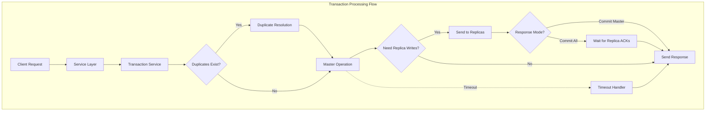
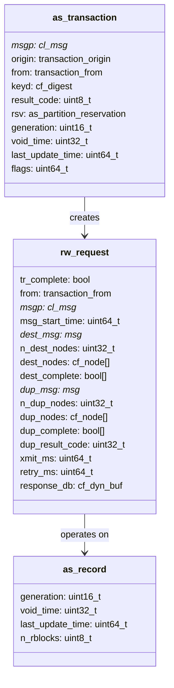
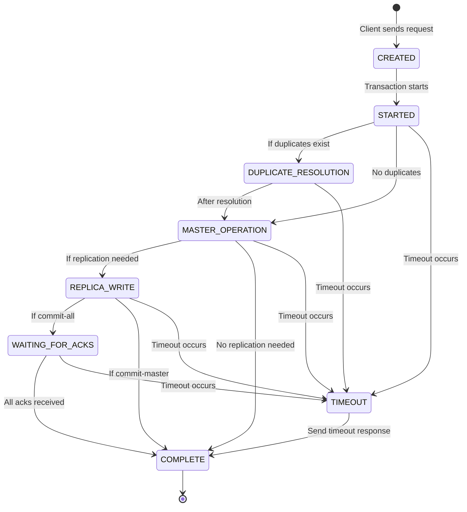

# Transaction Processing

<details>
<summary>Relevant source files</summary>

The following files were used as context for generating this wiki page:

- [as/include/transaction/rw_utils.h](https://github.com/aerospike/aerospike-server/blob/8311b29d/as/include/transaction/rw_utils.h)
- [as/src/base/record.c](https://github.com/aerospike/aerospike-server/blob/8311b29d/as/src/base/record.c)
- [as/src/base/record_ce.c](https://github.com/aerospike/aerospike-server/blob/8311b29d/as/src/base/record_ce.c)
- [as/src/transaction/rw_utils.c](https://github.com/aerospike/aerospike-server/blob/8311b29d/as/src/transaction/rw_utils.c)
- [as/src/transaction/rw_utils_ce.c](https://github.com/aerospike/aerospike-server/blob/8311b29d/as/src/transaction/rw_utils_ce.c)
- [as/src/transaction/udf.c](https://github.com/aerospike/aerospike-server/blob/8311b29d/as/src/transaction/udf.c)
- [as/src/transaction/write.c](https://github.com/aerospike/aerospike-server/blob/8311b29d/as/src/transaction/write.c)

</details>


This document details how Aerospike processes transactions from client requests through to completion. It covers the core transaction flow, phases of processing, and important components involved. For information about specific transaction types like write transactions or UDF transactions, see [Write Pipeline](#5.1) and [UDF Transactions](#5.2) respectively.

## Overview

The transaction processing system in Aerospike is responsible for handling all record operations, including reads, writes, and user defined functions (UDFs). It ensures that operations are performed atomically, consistently, and with proper synchronization across a distributed cluster.

The system handles:
- Transaction flow control and state management
- Record locking and access
- Duplicate resolution for consistency
- Master node operations
- Replica synchronization
- Response generation



Sources: [as/src/transaction/write.c:227-314](https://github.com/aerospike/aerospike-server/blob/8311b29d/as/src/transaction/write.c#L227-L314), [as/src/transaction/udf.c:344-437](https://github.com/aerospike/aerospike-server/blob/8311b29d/as/src/transaction/udf.c#L344-L437)

## Transaction Components

The transaction processing system consists of several key components that work together to process client requests:



Sources: [as/src/transaction/write.c:250-251](https://github.com/aerospike/aerospike-server/blob/8311b29d/as/src/transaction/write.c#L250-L251), [as/src/transaction/udf.c:372-374](https://github.com/aerospike/aerospike-server/blob/8311b29d/as/src/transaction/udf.c#L372-L374)

### Key Structures

1. **as_transaction**: Represents a client request and contains all information needed to process it, including:
   - Message pointer (`msgp`)
   - Transaction origin (client, proxy, batch, etc.)
   - Source information (`from`)
   - Record digest (`keyd`)
   - Result code and metadata

2. **rw_request**: Tracks the state of the transaction through its lifecycle:
   - Source information (copied from transaction)
   - Destination nodes for replication
   - Duplicate resolution nodes
   - Timing information for retries and timeouts
   - Response buffer

3. **as_record**: Represents the actual record being operated on, containing:
   - Generation (for concurrency control)
   - Expiration time (`void_time`)
   - Last update time
   - Storage information

Sources: [as/src/transaction/rw_request.h](https://github.com/aerospike/aerospike-server/blob/8311b29d/as/src/transaction/rw_request.h), [as/src/base/datamodel.h](https://github.com/aerospike/aerospike-server/blob/8311b29d/as/src/base/datamodel.h)

## Transaction Lifecycle

All transactions in Aerospike follow a common lifecycle, regardless of their type:



Sources: [as/src/transaction/write.c:227-314](https://github.com/aerospike/aerospike-server/blob/8311b29d/as/src/transaction/write.c#L227-L314), [as/src/transaction/udf.c:344-437](https://github.com/aerospike/aerospike-server/blob/8311b29d/as/src/transaction/udf.c#L344-L437)

### Transaction State Transitions

1. **Creation**: A client sends a request, and an `as_transaction` is created.

2. **Start**: The transaction processing begins with `as_write_start()` or `as_udf_start()`.
   - XDR filtering is applied
   - Storage overload is checked
   - An `rw_request` is created and added to the hash table

3. **Duplicate Resolution** (if needed):
   - If duplicates exist, the `dup_res_start()` function is called
   - Duplicate nodes are determined and messages are sent
   - Resolution callbacks process responses

4. **Master Operation**:
   - The record is locked
   - Policies and filters are applied
   - The operation is executed on the record
   - Storage is updated
   - Secondary indexes are updated

5. **Replica Write** (if needed):
   - Destination nodes are determined
   - Messages are created and sent
   - For commit-all, wait for acknowledgments

6. **Completion**:
   - Response is sent to the client
   - Resources are cleaned up

Sources: [as/src/transaction/write.c:227-314](https://github.com/aerospike/aerospike-server/blob/8311b29d/as/src/transaction/write.c#L227-L314), [as/src/transaction/udf.c:344-437](https://github.com/aerospike/aerospike-server/blob/8311b29d/as/src/transaction/udf.c#L344-L437)

## Transaction Start

All transactions begin with a call to the appropriate start function: `as_write_start()` for writes or `as_udf_start()` for UDFs. These functions follow a similar pattern:

1. They first apply filters and checks:
   - XDR filtering to determine if the write is allowed
   - Storage overload checking to prevent overloading the system

2. They then create an `rw_request` and add it to a hash table:
   ```c
   rw_request_hkey hkey = { tr->rsv.ns->ix, tr->keyd };
   rw_request* rw = rw_request_create(&tr->keyd);
   transaction_status status = rw_request_hash_insert(&hkey, rw, tr);
   ```

3. If the insertion into the hash table fails, the transaction is finished:
   ```c
   if (status != TRANS_IN_PROGRESS) {
       rw_request_release(rw);
       if (status != TRANS_WAITING) {
           send_write_response(tr, NULL);
       }
       return status;
   }
   ```

4. They then check for duplicates and proceed accordingly:
   ```c
   if (tr->rsv.n_dupl != 0 && dup_res_start(rw, tr, write_dup_res_start_cb)) {
       return TRANS_IN_PROGRESS; // started duplicate resolution
   }
   // else - no duplicate resolution phase, apply operation to master.
   ```

Sources: [as/src/transaction/write.c:227-314](https://github.com/aerospike/aerospike-server/blob/8311b29d/as/src/transaction/write.c#L227-L314), [as/src/transaction/udf.c:344-437](https://github.com/aerospike/aerospike-server/blob/8311b29d/as/src/transaction/udf.c#L344-L437)

## Record Access and Locking

Aerospike uses a two-phase locking mechanism to ensure atomicity of operations. The `as_record` functions provide the locking mechanism:

1. **Getting or Creating a Record**:
   ```c
   int
   as_record_get_create(as_index_tree* tree, const cf_digest* keyd,
           as_index_ref* r_ref, as_namespace* ns)
   {
       int rv = as_index_get_insert_vlock(tree, keyd, r_ref);

       if (rv == 1) {
           as_incr_uint64(&ns->n_objects);
       }

       return rv;
   }
   ```

2. **Getting an Existing Record**:
   ```c
   int
   as_record_get(as_index_tree* tree, const cf_digest* keyd, as_index_ref* r_ref)
   {
       return as_index_get_vlock(tree, keyd, r_ref);
   }
   ```

3. **Unlocking and Releasing a Record**:
   ```c
   void
   as_record_done(as_index_ref* r_ref, as_namespace* ns)
   {
       as_record* r = r_ref->r;

       if (! as_index_is_valid_record(r)) {
           // ...handle destroyed record...
       }

       cf_mutex_unlock(r_ref->olock);
   }
   ```

These functions ensure that only one transaction can operate on a record at a time, providing isolation between concurrent transactions.

Sources: [as/src/base/record.c:80-129](https://github.com/aerospike/aerospike-server/blob/8311b29d/as/src/base/record.c#L80-L129)

## Duplicate Resolution

In a distributed system, the same operation might arrive at multiple nodes. Aerospike uses a duplicate resolution mechanism to ensure consistency:

1. **Starting Duplicate Resolution**:
   ```c
   static void
   write_dup_res_start_cb(rw_request* rw, as_transaction* tr, as_record* r)
   {
       dup_res_make_message(rw, tr, r);
       cf_mutex_lock(&rw->lock);
       dup_res_setup_rw(rw, tr, write_dup_res_cb, write_timeout_cb);
       send_rw_messages(rw);
       cf_mutex_unlock(&rw->lock);
   }
   ```

2. **Duplicate Resolution Callback**:
   ```c
   static bool
   write_dup_res_cb(rw_request* rw)
   {
       as_transaction tr;
       as_transaction_init_from_rw(&tr, rw);

       if (tr.result_code != AS_OK) {
           send_write_response(&tr, NULL);
           return true;
       }

       // Continue with master operation...
   }
   ```

The duplicate resolution process ensures that all nodes agree on the outcome of the transaction, maintaining consistency across the cluster.

Sources: [as/src/transaction/write.c:321-411](https://github.com/aerospike/aerospike-server/blob/8311b29d/as/src/transaction/write.c#L321-L411), [as/src/transaction/udf.c:469-563](https://github.com/aerospike/aerospike-server/blob/8311b29d/as/src/transaction/udf.c#L469-L563)

## Master Operation

The master operation is the core of the transaction, where the actual work is performed. The specific operation depends on the transaction type:

### Write Master Operation

```c
static transaction_status
write_master(rw_request* rw, as_transaction* tr)
{
    // Preprocessing checks
    if (! write_master_preprocessing(tr)) {
        return TRANS_DONE;
    }

    // Set policy flags
    bool must_not_create;
    bool is_replace;
    int result = write_master_policies(tr, &must_not_create, &is_replace);
    if (result != 0) {
        write_master_failed(tr, NULL, NULL, NULL, result);
        return TRANS_DONE;
    }

    // Find or create record and lock it
    as_index_ref r_ref = { 0 };
    // ... (record creation/retrieval) ...

    // Open storage record
    as_storage_rd rd;
    // ... (storage record handling) ...

    // Apply bin operations
    bool is_delete = false;
    result = write_master_apply(tr, &r_ref, &rd, is_replace, rw, &is_delete);
    if (result != 0) {
        write_master_failed(tr, &r_ref, tree, &rd, result);
        return TRANS_DONE;
    }

    // Finish up
    // ... (metadata updates, unlock, cleanup) ...

    return TRANS_IN_PROGRESS;
}
```

### UDF Master Operation

```c
static transaction_status
udf_master(rw_request* rw, as_transaction* tr)
{
    udf_def def;
    udf_call call = { .def = &def, .tr = tr };

    // Initialize UDF definition
    if (tr->origin == FROM_IUDF) {
        call.def = &tr->from.iudf_orig->def;
    }
    else if (! udf_def_init_from_msg(call.def, tr)) {
        tr->result_code = AS_ERR_PARAMETER;
        return TRANS_DONE;
    }

    // Apply the UDF
    udf_optype optype = udf_master_apply(&call, rw);

    // Clean up and determine result
    if (tr->origin != FROM_IUDF && call.def->arglist != NULL) {
        as_list_destroy(call.def->arglist);
    }

    if (optype == UDF_OPTYPE_READ || optype == UDF_OPTYPE_NONE) {
        return TRANS_DONE;
    }

    return optype == UDF_OPTYPE_WAITING ? TRANS_WAITING : TRANS_IN_PROGRESS;
}
```

The master operation ensures that the requested changes are applied to the record, handling all the necessary checks, locks, and storage operations.

Sources: [as/src/transaction/write.c:592-932](https://github.com/aerospike/aerospike-server/blob/8311b29d/as/src/transaction/write.c#L592-L932), [as/src/transaction/udf.c:737-768](https://github.com/aerospike/aerospike-server/blob/8311b29d/as/src/transaction/udf.c#L737-L768)

## Replica Writes

For write operations that need to be replicated, Aerospike performs replica writes to ensure consistency across the cluster:

1. **Setting Replica Destinations**:
   ```c
   bool
   set_replica_destinations(as_transaction* tr, rw_request* rw)
   {
       rw->n_dest_nodes = as_partition_get_other_replicas(tr->rsv.p,
               rw->dest_nodes);
       return true;
   }
   ```

2. **Starting Replica Writes**:
   ```c
   static void
   start_write_repl_write(rw_request* rw, as_transaction* tr)
   {
       repl_write_make_message(rw, tr);
       cf_mutex_lock(&rw->lock);
       repl_write_setup_rw(rw, tr, write_repl_write_cb, write_timeout_cb);
       send_rw_messages(rw);
       cf_mutex_unlock(&rw->lock);
   }
   ```

3. **Sending Messages to Replicas**:
   ```c
   void
   send_rw_messages(rw_request* rw)
   {
       for (uint32_t i = 0; i < rw->n_dest_nodes; i++) {
           if (rw->dest_complete[i]) {
               continue;
           }
           msg_incr_ref(rw->dest_msg);
           if (as_fabric_send(rw->dest_nodes[i], rw->dest_msg,
                   AS_FABRIC_CHANNEL_RW) != AS_FABRIC_SUCCESS) {
               as_fabric_msg_put(rw->dest_msg);
               rw->xmit_ms = 0; // force a retransmit on next cycle
           }
       }
   }
   ```

4. **Fire and Forget Mode** (respond after master complete):
   ```c
   static void
   start_write_repl_write_forget(rw_request* rw, as_transaction* tr)
   {
       repl_write_make_message(rw, tr);
       send_rw_messages_forget(rw);
   }
   ```

The replica write process ensures that changes are propagated to all necessary replicas, maintaining consistency across the cluster.

Sources: [as/src/transaction/write.c:336-358](https://github.com/aerospike/aerospike-server/blob/8311b29d/as/src/transaction/write.c#L336-L358), [as/src/transaction/udf.c:488-510](https://github.com/aerospike/aerospike-server/blob/8311b29d/as/src/transaction/udf.c#L488-L510), [as/src/transaction/rw_utils.c:82-110](https://github.com/aerospike/aerospike-server/blob/8311b29d/as/src/transaction/rw_utils.c#L82-L110)

## Transaction Completion

When a transaction completes, whether successfully or with an error, Aerospike sends a response to the client and cleans up resources:

1. **Sending Write Response**:
   ```c
   static void
   send_write_response(as_transaction* tr, cf_dyn_buf* db)
   {
       // Ensure we have a valid origin
       if (! tr->from.any) {
           cf_warning(AS_RW, "transaction origin %u has null 'from'", tr->origin);
           return;
       }

       clear_delete_response_metadata(tr);

       // Send response based on origin type
       switch (tr->origin) {
       case FROM_CLIENT:
           // Send response to client
           break;
       case FROM_PROXY:
           // Send response to proxy
           break;
       case FROM_BATCH:
           // Handle batch response
           break;
       case FROM_IOPS:
           // Handle internal ops
           break;
       // ...other cases...
       }

       tr->from.any = NULL; // pattern, not needed
   }
   ```

2. **Timeout Handling**:
   ```c
   static void
   write_timeout_cb(rw_request* rw)
   {
       if (! rw->from.any) {
           return; // lost race against dup-res or repl-write callback
       }

       finished_not_replicated(rw);

       // Send timeout response based on origin type
       switch (rw->origin) {
       // ...handle different origin types...
       }

       rw->from.any = NULL; // inform other callback it lost the race
   }
   ```

The completion process ensures that the client receives an appropriate response and that all resources are properly cleaned up.

Sources: [as/src/transaction/write.c:455-585](https://github.com/aerospike/aerospike-server/blob/8311b29d/as/src/transaction/write.c#L455-L585), [as/src/transaction/udf.c:607-730](https://github.com/aerospike/aerospike-server/blob/8311b29d/as/src/transaction/udf.c#L607-L730)

## Conflict Resolution and Consistency

Aerospike handles conflicts that may arise in distributed operations through several mechanisms:

1. **Generation Checking**:
   ```c
   bool
   generation_check(const as_record* r, const as_msg* m, const as_namespace* ns)
   {
       if ((m->info2 & AS_MSG_INFO2_GENERATION) != 0) {
           return m->generation == r->generation;
       }

       if ((m->info2 & AS_MSG_INFO2_GENERATION_GT) != 0) {
           return m->generation > r->generation;
       }

       return true; // no generation requirement
   }
   ```

2. **Conflict Resolution for Record Replacement**:
   ```c
   int
   as_record_resolve_conflict(conflict_resolution_pol policy, uint16_t left_gen,
           uint64_t left_lut, uint16_t right_gen, uint64_t right_lut)
   {
       int result = 0;

       switch (policy) {
       case AS_NAMESPACE_CONFLICT_RESOLUTION_POLICY_GENERATION:
           // Use generation for conflict resolution
           break;
       case AS_NAMESPACE_CONFLICT_RESOLUTION_POLICY_LAST_UPDATE_TIME:
           // Use last update time for conflict resolution
           break;
       // ...other policies...
       }

       return result;
   }
   ```

These mechanisms ensure that operations are applied consistently and that conflicts are resolved appropriately.

Sources: [as/src/transaction/rw_utils_ce.c:118-130](https://github.com/aerospike/aerospike-server/blob/8311b29d/as/src/transaction/rw_utils_ce.c#L118-L130), [as/src/base/record.c:447-479](https://github.com/aerospike/aerospike-server/blob/8311b29d/as/src/base/record.c#L447-L479)

## Performance Optimizations

Aerospike includes several optimizations to improve transaction performance:

1. **Fire and Forget Mode**: 
   For write transactions, Aerospike can respond to the client immediately after the master operation completes, without waiting for replica acknowledgments:

   ```c
   // If we don't need to wait for replica write acks, fire and forget.
   if (respond_on_master_complete(tr)) {
       start_write_repl_write_forget(rw, tr);
       send_write_response(tr, &rw->response_db);
       rw_request_hash_delete(&hkey, rw);
       return TRANS_DONE;
   }
   ```

2. **Fabric Overload Check**:
   To prevent overloading the fabric communication layer:

   ```c
   // Fire and forget can overload the fabric send queues - check.
   if (respond_on_master_complete(tr) &&
           as_fabric_is_overloaded(rw->dest_nodes, rw->n_dest_nodes,
                   AS_FABRIC_CHANNEL_RW, 0)) {
       tr->flags |= AS_TRANSACTION_FLAG_SWITCH_TO_COMMIT_ALL;
   }
   ```

These optimizations help Aerospike maintain high performance while ensuring data consistency.

Sources: [as/src/transaction/write.c:302-308](https://github.com/aerospike/aerospike-server/blob/8311b29d/as/src/transaction/write.c#L302-L308), [as/src/transaction/udf.c:426-431](https://github.com/aerospike/aerospike-server/blob/8311b29d/as/src/transaction/udf.c#L426-L431), [as/src/transaction/write.c:872-876](https://github.com/aerospike/aerospike-server/blob/8311b29d/as/src/transaction/write.c#L872-L876)

## Transaction Statistics

Aerospike maintains detailed statistics for different types of transactions to monitor system performance:

```c
static inline void
client_write_update_stats(as_namespace* ns, uint8_t result_code, bool is_xdr_op)
{
    switch (result_code) {
    case AS_OK:
        as_incr_uint64(&ns->n_client_write_success);
        if (is_xdr_op) {
            as_incr_uint64(&ns->n_xdr_client_write_success);
        }
        break;
    default:
        as_incr_uint64(&ns->n_client_write_error);
        if (is_xdr_op) {
            as_incr_uint64(&ns->n_xdr_client_write_error);
        }
        break;
    case AS_ERR_TIMEOUT:
        as_incr_uint64(&ns->n_client_write_timeout);
        if (is_xdr_op) {
            as_incr_uint64(&ns->n_xdr_client_write_timeout);
        }
        break;
    case AS_ERR_FILTERED_OUT:
        // Can't be an XDR write.
        as_incr_uint64(&ns->n_client_write_filtered_out);
        break;
    }
}
```

These statistics help operators monitor the health and performance of the Aerospike cluster.

Sources: [as/src/transaction/write.c:104-131](https://github.com/aerospike/aerospike-server/blob/8311b29d/as/src/transaction/write.c#L104-L131), [as/src/transaction/udf.c:154-171](https://github.com/aerospike/aerospike-server/blob/8311b29d/as/src/transaction/udf.c#L154-L171)

## Summary

The transaction processing system in Aerospike provides a robust framework for handling client requests with atomicity, consistency, and high performance. It manages the entire lifecycle of a transaction, from receiving the client request to sending the response, with support for duplicate resolution, master operations, and replica synchronization.

The system's key features include:
- Efficient record locking and access
- Strong consistency through duplicate resolution
- Flexible conflict resolution policies
- Optimized replica writing with "fire and forget" support
- Comprehensive error handling and timeout management
- Detailed statistics for monitoring