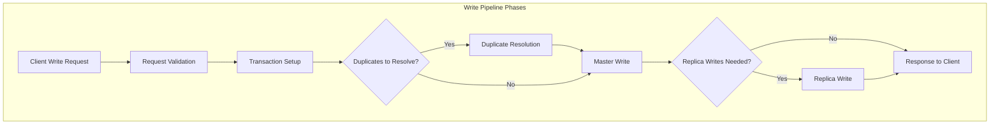
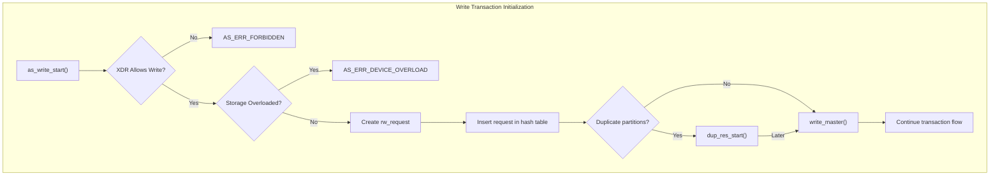
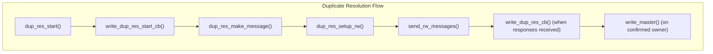
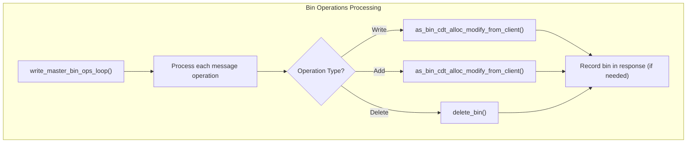
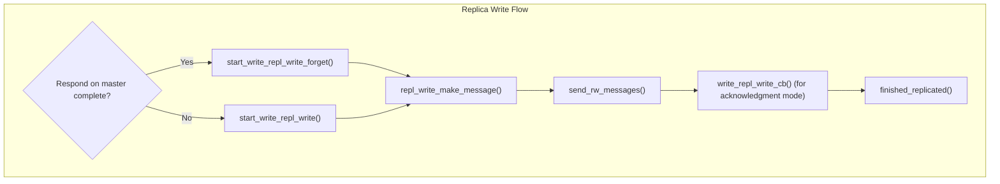
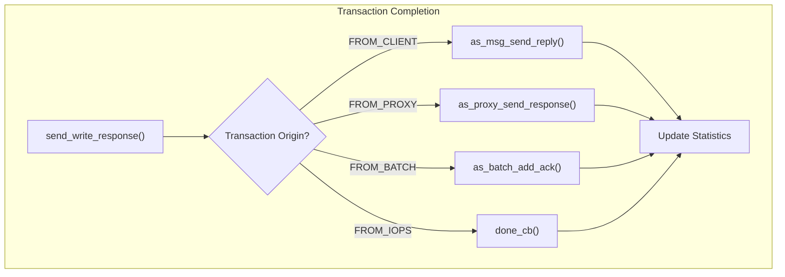

# Write Pipeline

<details>
<summary>Relevant source files</summary>

The following files were used as context for generating this wiki page:

- [as/include/transaction/rw_utils.h](https://github.com/aerospike/aerospike-server/blob/8311b29d/as/include/transaction/rw_utils.h)
- [as/src/base/record.c](https://github.com/aerospike/aerospike-server/blob/8311b29d/as/src/base/record.c)
- [as/src/base/record_ce.c](https://github.com/aerospike/aerospike-server/blob/8311b29d/as/src/base/record_ce.c)
- [as/src/transaction/rw_utils.c](https://github.com/aerospike/aerospike-server/blob/8311b29d/as/src/transaction/rw_utils.c)
- [as/src/transaction/rw_utils_ce.c](https://github.com/aerospike/aerospike-server/blob/8311b29d/as/src/transaction/rw_utils_ce.c)
- [as/src/transaction/udf.c](https://github.com/aerospike/aerospike-server/blob/8311b29d/as/src/transaction/udf.c)
- [as/src/transaction/write.c](https://github.com/aerospike/aerospike-server/blob/8311b29d/as/src/transaction/write.c)

</details>


The Write Pipeline in Aerospike Server defines the path a write transaction takes from client request to storage completion. This document explains the end-to-end process of how data is written to Aerospike, including preprocessing, master operations, and replication flows. For information about read operations, see the Read Pipeline documentation, and for information about User-Defined Functions that can modify data, see [UDF Transactions](#5.2).

## Overview

The Write Pipeline handles all write transactions in Aerospike, providing atomic, consistent updates to data across the distributed database system. When a client sends a write request, the server processes it through several stages before responding to the client.



Sources: [as/src/transaction/write.c:227-314](https://github.com/aerospike/aerospike-server/blob/8311b29d/as/src/transaction/write.c#L227-L314)

## Write Transaction Initialization

A write transaction begins with the client sending a write request to an Aerospike node. The server processes this request through the Protocol Layer and Service Layer before it reaches the Transaction Service, which hands it off to the Write Pipeline.

The entry point for the Write Pipeline is `as_write_start()` in `write.c`, which:

1. Performs initial validation (XDR filtering, storage overload check)
2. Creates a read-write request (`rw_request`) structure
3. Adds the request to a hash table for tracking
4. Determines whether duplicate resolution is needed
5. Initiates either duplicate resolution or the master write process



Sources: [as/src/transaction/write.c:227-276](https://github.com/aerospike/aerospike-server/blob/8311b29d/as/src/transaction/write.c#L227-L276)

## Duplicate Resolution

In a distributed system, multiple nodes may believe they own the same partition during transitions. The duplicate resolution phase resolves conflicting partition ownership to determine which node should process the write.

When duplicate resolution is needed:

1. The system prepares a message for each duplicate node
2. Sends the messages to gather partition ownership information
3. Processes responses to determine the correct owner
4. Proceeds with the master write operation on the confirmed owner



Sources: [as/src/transaction/write.c:321-411](https://github.com/aerospike/aerospike-server/blob/8311b29d/as/src/transaction/write.c#L321-L411)

## Master Write Operation

The master write operation (`write_master()`) is the core of the Write Pipeline, where the actual record update occurs. This function:

1. Performs preprocessing checks and policy validation
2. Finds or creates the record in the index
3. Applies metadata updates and bin operations
4. Writes the record to storage
5. Updates indexes and statistics

```mermaid
flowchart TD
    subgraph "Master Write Flow"
        A["write_master()"] --> B["write_master_preprocessing()"]
        B --> C["write_master_policies()"]
        C --> D{"find_or_create_record"}
        D -->|"Create"| E["as_record_get_create()"]
        D -->|"Existing"| F["as_record_get()"]
        E --> G["Prepare storage record"]
        F --> G
        G --> H["handle_msg_key()"]
        H --> I["set_replica_destinations()"]
        I --> J["write_master_apply()"]
        J --> K["advance_record_version()"]
        K --> L["as_storage_record_write()"]
        L --> M{"Is Delete?"}
        M -->|"Yes"| N["write_delete_record()"]
        M -->|"No"| O["as_setmax_uint32(max_void_time)"]
        N --> P["will_replicate()"]
        O --> P
    end
```



Sources: [as/src/transaction/write.c:592-932](https://github.com/aerospike/aerospike-server/blob/8311b29d/as/src/transaction/write.c#L592-L932)

## Record Processing Details

During record processing, several important operations occur:

1. Record Lock Acquisition: The record is locked for exclusive access
2. Generation Check: Validates write policies like "write if generation matches"
3. Set Assignment: Associates the record with a namespace set, if applicable
4. Bin Operations: Creates, updates, or deletes bins within the record
5. Secondary Index Updates: Maintains secondary indexes if configured

### Key Components for Record Updates

| Component | Purpose |
|-----------|---------|
| `as_index_ref` | Reference to the record in the primary index |
| `as_storage_rd` | Storage record descriptor for bin operations |
| `as_record` | The record data structure containing metadata |
| `as_bin` | Container for key-value data within records |

Sources: [as/src/transaction/write.c:625-824](https://github.com/aerospike/aerospike-server/blob/8311b29d/as/src/transaction/write.c#L625-L824)

## Bin Operations Processing

Bin operations are applied through a specialized loop that handles various operation types:



Sources: [as/src/transaction/write.c:1004-1307](https://github.com/aerospike/aerospike-server/blob/8311b29d/as/src/transaction/write.c#L1004-L1307)

## Record Version Management

Aerospike maintains record versioning using a generation count and last-update-time. When a record is updated:

1. The void time (TTL) is set according to the request or defaults
2. The last update time is set to the current timestamp
3. The generation number is incremented

```c
void
advance_record_version(as_transaction* tr, as_record* r)
{
    // Set void_time based on TTL
    // Set last_update_time
    // Increment generation
}
```

Sources: [as/src/transaction/rw_utils.c:372-411](https://github.com/aerospike/aerospike-server/blob/8311b29d/as/src/transaction/rw_utils.c#L372-L411)

## Replica Write Operations

After the master write completes successfully, the system may need to propagate the update to replica nodes for redundancy. There are two modes:

1. **Wait for Acknowledgment**: The system waits for confirmation from replica nodes before responding to the client.
2. **Fire and Forget**: The system sends the updates to replica nodes but doesn't wait for confirmation.



Sources: [as/src/transaction/write.c:336-448](https://github.com/aerospike/aerospike-server/blob/8311b29d/as/src/transaction/write.c#L336-L448)

### Replica Message Transport

Replica writes are transported using Aerospike's Fabric communication system:

1. A message containing the record pickle (serialized form) is created
2. The message is sent to each replica node through the fabric system
3. Replica nodes apply the update using similar logic to the master write

Sources: [as/src/transaction/rw_utils.c:82-110](https://github.com/aerospike/aerospike-server/blob/8311b29d/as/src/transaction/rw_utils.c#L82-L110)

## Error Handling and Response

At various points in the Write Pipeline, errors can occur. The system handles these errors and ensures proper responses:

1. During preprocessing (XDR checks, storage checks)
2. During record operations (generation mismatch, record too big)
3. During storage operations (device errors)

Each error sets a result code and sends an appropriate response to the client.

```c
static void
write_master_failed(as_transaction* tr, as_index_ref* r_ref,
        as_index_tree* tree, as_storage_rd* rd, int result_code)
{
    // Clean up resources
    // Update statistics
    // Set transaction result code
}
```

Sources: [as/src/transaction/write.c:934-969](https://github.com/aerospike/aerospike-server/blob/8311b29d/as/src/transaction/write.c#L934-L969)

## Transaction Completion

Once all write operations are complete (including any required replica writes), the system completes the transaction:

1. Updates XDR (Cross-Datacenter Replication) information if needed
2. Sends a response to the client with the result code and metadata
3. Updates statistical counters for monitoring



Sources: [as/src/transaction/write.c:455-537](https://github.com/aerospike/aerospike-server/blob/8311b29d/as/src/transaction/write.c#L455-L537)

## Special Write Cases

### Delete Operations

Delete operations follow the same pipeline but have special handling:

1. They can be executed explicitly or as a result of a bin operation that empties a record
2. The function `write_delete_record()` is called to remove the record from the index
3. Special statistics and metadata are updated

Sources: [as/src/transaction/rw_utils_ce.c:244-247](https://github.com/aerospike/aerospike-server/blob/8311b29d/as/src/transaction/rw_utils_ce.c#L244-L247)

### User-Defined Functions

User-Defined Functions (UDFs) that modify data use a similar but separate pipeline in `udf.c`. They share many components with the standard Write Pipeline but have additional logic for executing the UDF code.

Sources: [as/src/transaction/udf.c:344-437](https://github.com/aerospike/aerospike-server/blob/8311b29d/as/src/transaction/udf.c#L344-L437)

## Performance Considerations

The Write Pipeline is designed for high performance:

1. Lock granularity is minimized to reduce contention
2. Record locks are held for the minimum necessary time
3. Asynchronous replica writes allow for optimized throughput
4. Response to client can happen before replica acknowledgment when configured

Sources: [as/src/transaction/write.c:302-314](https://github.com/aerospike/aerospike-server/blob/8311b29d/as/src/transaction/write.c#L302-L314)

## Summary