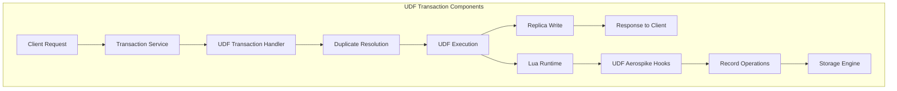
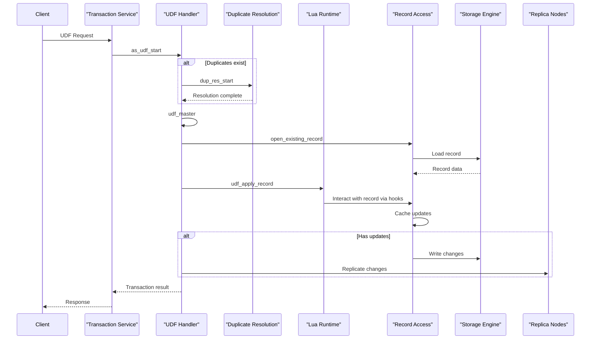
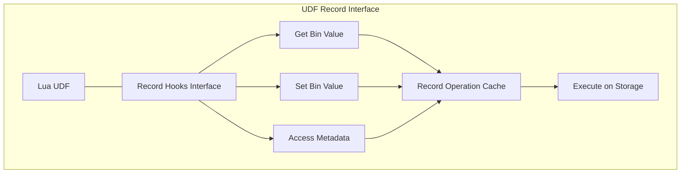

# UDF Transactions

Relevant source files

The following files were used as context for generating this wiki page:

- [as/include/base/udf_record.h](https://github.com/aerospike/aerospike-server/blob/8311b29d/as/include/base/udf_record.h)
- [as/src/base/udf_aerospike.c](https://github.com/aerospike/aerospike-server/blob/8311b29d/as/src/base/udf_aerospike.c)
- [as/src/base/udf_record.c](https://github.com/aerospike/aerospike-server/blob/8311b29d/as/src/base/udf_record.c)
- [as/src/transaction/udf.c](https://github.com/aerospike/aerospike-server/blob/8311b29d/as/src/transaction/udf.c)
- [as/src/transaction/write.c](https://github.com/aerospike/aerospike-server/blob/8311b29d/as/src/transaction/write.c)

This document explains how User Defined Functions (UDFs) are processed as transactions within the Aerospike database server. UDFs allow custom application logic to be executed directly on the database server, operating on records and returning results to the client. For information about UDF management and registration, see [UDF Management](#10.2).

## UDF Transaction Architecture

UDF transactions integrate with Aerospike's transaction processing system but follow a specialized flow for executing user-defined code against records.

Sources:
- [as/src/transaction/udf.c:344-437](https://github.com/aerospike/aerospike-server/blob/8311b29d/as/src/transaction/udf.c#L344-L437)
- [as/src/transaction/udf.c:737-765](https://github.com/aerospike/aerospike-server/blob/8311b29d/as/src/transaction/udf.c#L737-L765)
- [as/src/base/udf_aerospike.c:98-105](https://github.com/aerospike/aerospike-server/blob/8311b29d/as/src/base/udf_aerospike.c#L98-L105)

### Key Components

The UDF transaction system consists of several key components:

1. **UDF Definition (`udf_def`)**: Metadata about the UDF to execute:
   - Filename of the Lua module
   - Function name to call
   - Arguments list
   - UDF operation type

2. **UDF Record (`udf_record`)**: A wrapper around database records that provides an interface for UDFs to interact with records.

3. **Operation Types (`udf_optype`)**: The possible outcomes of UDF execution:
   - `UDF_OPTYPE_NONE`: No operation performed
   - `UDF_OPTYPE_WAITING`: Waiting for another operation to complete
   - `UDF_OPTYPE_READ`: Read operation (no modification)
   - `UDF_OPTYPE_WRITE`: Write operation (record modified)
   - `UDF_OPTYPE_DELETE`: Delete operation (record removed)

Sources:
- [as/src/transaction/udf.c:83-89](https://github.com/aerospike/aerospike-server/blob/8311b29d/as/src/transaction/udf.c#L83-L89)
- [as/include/base/udf_record.h:66-88](https://github.com/aerospike/aerospike-server/blob/8311b29d/as/include/base/udf_record.h#L66-L88)
- [as/src/transaction/udf.c:91-94](https://github.com/aerospike/aerospike-server/blob/8311b29d/as/src/transaction/udf.c#L91-L94)

## UDF Transaction Flow

Sources:
- [as/src/transaction/udf.c:344-437](https://github.com/aerospike/aerospike-server/blob/8311b29d/as/src/transaction/udf.c#L344-L437)
- [as/src/transaction/udf.c:767-993](https://github.com/aerospike/aerospike-server/blob/8311b29d/as/src/transaction/udf.c#L767-L993)
- [as/src/transaction/udf.c:996-1053](https://github.com/aerospike/aerospike-server/blob/8311b29d/as/src/transaction/udf.c#L996-L1053)

### Transaction Initialization

UDF transactions begin with `as_udf_start()`, which:

1. Validates the UDF execution request
2. Creates and initializes a request object
3. Checks for duplicates that need resolution
4. Proceeds to execution on the master record

Sources:
- [as/src/transaction/udf.c:344-437](https://github.com/aerospike/aerospike-server/blob/8311b29d/as/src/transaction/udf.c#L344-L437)

### Duplicate Resolution

If duplicate records exist across the cluster, the system resolves them before applying the UDF:

1. `dup_res_start()` initiates the duplicate resolution process
2. Duplicate resolution callbacks handle completion
3. Upon resolution, the master record is selected and the UDF is applied

Sources:
- [as/src/transaction/udf.c:470-486](https://github.com/aerospike/aerospike-server/blob/8311b29d/as/src/transaction/udf.c#L470-L486)
- [as/src/transaction/udf.c:512-563](https://github.com/aerospike/aerospike-server/blob/8311b29d/as/src/transaction/udf.c#L512-L563)

### UDF Master Execution

The UDF is executed on the master record through:

1. `udf_master()`: Sets up the execution environment
2. `udf_master_apply()`: The core function that applies the UDF
3. `udf_apply_record()`: Invokes the Lua function with the record

Sources:
- [as/src/transaction/udf.c:737-765](https://github.com/aerospike/aerospike-server/blob/8311b29d/as/src/transaction/udf.c#L737-L765)
- [as/src/transaction/udf.c:767-993](https://github.com/aerospike/aerospike-server/blob/8311b29d/as/src/transaction/udf.c#L767-L993)
- [as/src/transaction/udf.c:1076-1095](https://github.com/aerospike/aerospike-server/blob/8311b29d/as/src/transaction/udf.c#L1076-L1095)

### Record Operations Through UDF Hooks

UDFs interact with records via a set of hooks:

Sources:
- [as/src/base/udf_record.c:99-115](https://github.com/aerospike/aerospike-server/blob/8311b29d/as/src/base/udf_record.c#L99-L115)
- [as/src/base/udf_record.c:352-363](https://github.com/aerospike/aerospike-server/blob/8311b29d/as/src/base/udf_record.c#L352-L363)
- [as/src/base/udf_record.c:412-451](https://github.com/aerospike/aerospike-server/blob/8311b29d/as/src/base/udf_record.c#L412-L451)

### Record Update Process

When a UDF modifies a record:

1. Changes are first cached in the `udf_record` object
2. `execute_updates()` applies the cached changes to the actual record
3. Record metadata (generation, TTL, etc.) is updated
4. Changes are written to storage
5. If successful, changes are replicated to other nodes

Sources:
- [as/src/base/udf_aerospike.c:321-398](https://github.com/aerospike/aerospike-server/blob/8311b29d/as/src/base/udf_aerospike.c#L321-L398)
- [as/src/transaction/udf.c:1123-1244](https://github.com/aerospike/aerospike-server/blob/8311b29d/as/src/transaction/udf.c#L1123-L1244)

### Replica Writing

If the UDF modified the record:

1. `start_udf_repl_write()` initiates the replication process
2. Changes are sent to replica nodes
3. Depending on the transaction's commit level, the system either:
   - Waits for acknowledgments from replicas before responding to the client
   - Responds to the client immediately ("fire and forget" replication)

Sources:
- [as/src/transaction/udf.c:489-501](https://github.com/aerospike/aerospike-server/blob/8311b29d/as/src/transaction/udf.c#L489-L501)
- [as/src/transaction/udf.c:504-510](https://github.com/aerospike/aerospike-server/blob/8311b29d/as/src/transaction/udf.c#L504-L510)
- [as/src/transaction/udf.c:586-601](https://github.com/aerospike/aerospike-server/blob/8311b29d/as/src/transaction/udf.c#L586-L601)

## Record Interface Implementation

The UDF record interface provides methods for records to interact with Lua UDFs:

| Operation | Description | Implementation |
|-----------|-------------|----------------|
| `set` | Set a bin value | `udf_record_set()` |
| `get` | Get a bin value | `udf_record_get()` |
| `set_ttl` | Set record TTL | `udf_record_set_ttl()` |
| `drop_key` | Remove record key | `udf_record_drop_key()` |
| `setname` | Get record set name | `udf_record_setname()` |
| `numbins` | Get number of bins | `udf_record_numbins()` |
| `key` | Get record key | `udf_record_key()` |
| `digest` | Get record digest | `udf_record_digest()` |
| `gen` | Get record generation | `udf_record_gen()` |
| `ttl` | Get record TTL | `udf_record_ttl()` |
| `size` | Get record size | `udf_record_size()` |

Sources:
- [as/src/base/udf_record.c:99-115](https://github.com/aerospike/aerospike-server/blob/8311b29d/as/src/base/udf_record.c#L99-L115)
- [as/src/base/udf_record.c:352-707](https://github.com/aerospike/aerospike-server/blob/8311b29d/as/src/base/udf_record.c#L352-L707)

## UDF Aerospike Integration Hooks

The UDF system integrates with Aerospike through a set of hooks:

| Hook | Description | Implementation |
|------|-------------|----------------|
| `rec_create` | Create a record | `udf_aerospike_rec_create()` |
| `rec_update` | Update a record | `udf_aerospike_rec_update()` |
| `rec_exists` | Check if record exists | `udf_aerospike_rec_exists()` |
| `rec_remove` | Remove a record | `udf_aerospike_rec_remove()` |
| `log` | Log messages | `udf_aerospike_log()` |
| `get_current_time` | Get current time | `udf_aerospike_get_current_time()` |

Sources:
- [as/src/base/udf_aerospike.c:98-105](https://github.com/aerospike/aerospike-server/blob/8311b29d/as/src/base/udf_aerospike.c#L98-L105)
- [as/src/base/udf_aerospike.c:116-314](https://github.com/aerospike/aerospike-server/blob/8311b29d/as/src/base/udf_aerospike.c#L116-L314)

## Error Handling and Limitations

UDF execution includes several safeguards and limitations:

### Timeouts

UDFs have execution time limits to prevent long-running operations:

1. The transaction has an overall timeout
2. Each UDF execution is monitored via `udf_timer_timedout()`
3. If a UDF exceeds its time slice, it's terminated with an error

Sources:
- [as/src/transaction/udf.c:1098-1121](https://github.com/aerospike/aerospike-server/blob/8311b29d/as/src/transaction/udf.c#L1098-L1121)

### Record Limitations

UDFs have constraints on record operations:

1. Maximum number of bins: `UDF_BIN_LIMIT` (512)
2. Maximum number of updates: `UDF_UPDATE_LIMIT` (1024)
3. Oversized records are rejected with `AS_ERR_RECORD_TOO_BIG`

Sources:
- [as/include/base/udf_record.h:55-58](https://github.com/aerospike/aerospike-server/blob/8311b29d/as/include/base/udf_record.h#L55-L58)
- [as/src/transaction/udf.c:1251-1305](https://github.com/aerospike/aerospike-server/blob/8311b29d/as/src/transaction/udf.c#L1251-L1305)

### Error Response Handling

When a UDF execution fails:

1. `udf_master_failed()` handles cleanup and error reporting
2. The transaction is rolled back (changes not applied)
3. Appropriate error codes are returned to the client
4. Statistics are updated for monitoring

Sources:
- [as/src/transaction/udf.c:1251-1305](https://github.com/aerospike/aerospike-server/blob/8311b29d/as/src/transaction/udf.c#L1251-L1305)
- [as/src/transaction/udf.c:607-685](https://github.com/aerospike/aerospike-server/blob/8311b29d/as/src/transaction/udf.c#L607-L685)
- [as/src/transaction/udf.c:154-228](https://github.com/aerospike/aerospike-server/blob/8311b29d/as/src/transaction/udf.c#L154-L228)

## Statistics and Monitoring

UDF transactions update various statistics for monitoring:

| Statistic | Description |
|-----------|-------------|
| `n_client_udf_complete` | Successful client UDF transactions |
| `n_client_udf_error` | Failed client UDF transactions |
| `n_client_udf_timeout` | Timed-out client UDF transactions |
| `n_client_udf_filtered_out` | Filtered-out client UDF transactions |
| `n_from_proxy_udf_complete` | Successful proxy UDF transactions |
| `n_batch_sub_udf_complete` | Successful batch sub UDF transactions |
| `n_udf_sub_udf_complete` | Successful UDF sub UDF transactions |

Sources:
- [as/src/transaction/udf.c:154-247](https://github.com/aerospike/aerospike-server/blob/8311b29d/as/src/transaction/udf.c#L154-L247)
- [as/src/transaction/udf.c:607-685](https://github.com/aerospike/aerospike-server/blob/8311b29d/as/src/transaction/udf.c#L607-L685)

## Conclusion